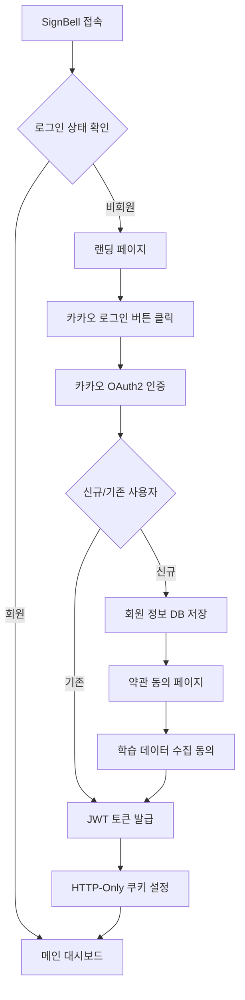
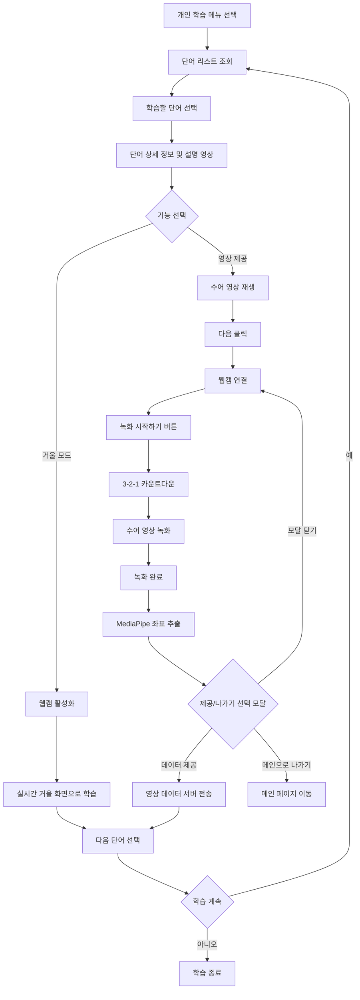
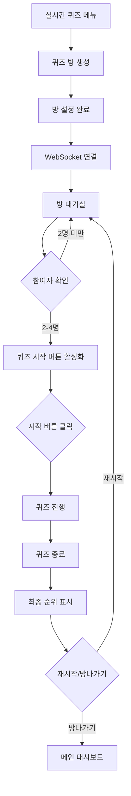
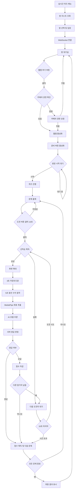

# SignBell 사용자 흐름도 명세서

본 문서는 SignBell 서비스의 사용자 흐름(User Flow)을 정의하여 개발팀과 디자인팀이 일관된 사용자 경험을 구현할 수 있도록 가이드를 제공합니다.

* **작성자**: [강관주](https://github.com/Kanggwanju)
* **작성일**: 2025-10-08
* **최종 수정일**: 2025-10-21
* **문서 버전**: v1.0.3

**대상 독자:**

* **기획자 / PM**: 사용자 여정과 서비스 흐름을 이해하고 기획 방향성을 검증하는 담당자
* **백엔드 개발자**: WebSocket 시그널링 서버, AI 모델 서빙 API, 실시간 퀴즈 로직, 사용자 인증 및 데이터베이스 등을 구현·유지보수하는 개발자
* **프론트엔드 개발자**: 실시간 캠 영상 처리, WebSocket 기반 화상 퀴즈 UI, 거울 모드, 사용자 인터페이스 기능을 설계·구현하는 개발자
* **디자이너 (UX/UI)**: 사용자 흐름에 기반한 화면 설계, 인터랙션 디자인, 사용자 경험을 구체화하는 담당자
* **DevOps / 인프라 엔지니어**: WebSocket 서버 및 AI 모델 서빙 환경 구축, CI/CD 파이프라인 운영, 보안 설정을 관리하는 담당자
* **QA / 테스트 엔지니어**: 사용자 시나리오별 테스트 케이스 작성, AI 모델 정확도 검증, WebSocket 다중 사용자 환경 테스트를 수행하는 담당자
* **신규 합류자**: SignBell 서비스의 사용자 여정과 주요 기능 흐름을 빠르게 파악해야 하는 팀 신규 인원

---

## 1. 개요

### 1.1 서비스 개념
AI 기술과 WebSocket 기반 실시간 화상통신을 활용하여 한국수어(KSL)를 학습하는 플랫폼. 개인 학습 모드와 실시간 퀴즈 모드를 통해 재미있고 효과적인 수어 학습 경험을 제공한다.

### 1.2 타겟 사용자
- **주 타겟**: 수어를 배우고자 하는 일반인 (가족, 친구, 동료 중 농인이 있는 경우)
- **부 타겟**: 수어에 관심 있는 학생, 사회복지사, 교육 관계자

---

## 2. 사용자 정의 및 권한

### 2.1 사용자 유형

| 사용자 유형 | 설명 | 주요 권한 |
|------------|------|----------|
| **비회원** | 서비스 접속 후 로그인하지 않은 사용자 | 서비스 소개 페이지만 조회 가능 |
| **회원** | 카카오 OAuth2로 로그인한 사용자 | 모든 학습 기능 이용 가능 |
| **방장** | 퀴즈 방을 생성한 회원 | 퀴즈 시작 권한 |

### 2.2 권한 매트릭스

| 기능 | 비회원 | 회원 | 방장 |
|------|--------|------|---------|
| 서비스 소개 조회 | ✅ | ✅ | ✅ |
| 개인 수어 학습 | ❌ | ✅ | ✅ |
| 거울 모드 사용 | ❌ | ✅ | ✅ |
| 퀴즈 방 입장 | ❌ | ✅ | ✅ |
| 퀴즈 방 생성 | ❌ | ✅ | ✅ |
| 퀴즈 시작 | ❌ | ❌ | ✅ (본인 방만) |
| 학습 데이터 제공 동의 | ❌ | ✅ | ✅ |

---

## 3. 화면 구조 정의

### 3.1 전체 레이아웃 구조 (웹 앱)

SignBell은 단일 페이지 애플리케이션(SPA) 구조로, 고정 헤더와 중앙 정렬된 컨텐츠 영역으로 구성됩니다.
```
┌─────────────────────────────────────────────────┐
│  Header: SignBell 로고 │             마이페이지  │
├─────────────────────────────────────────────────┤
│                                                 │
│                  Main Content                   │
│            (개인 학습 / 실시간 퀴즈)              │
│                                                 │
├─────────────────────────────────────────────────┤
│             Footer: © 2025 SignBell             │
└─────────────────────────────────────────────────┘
```

### 3.2 헤더 정의

#### 3.2.1 비회원 헤더
```
┌─────────────────────────────────────────────────┐
│   SignBell 로고 │                                │
└─────────────────────────────────────────────────┘
```

#### 3.2.2 회원 헤더
```
┌─────────────────────────────────────────────────┐
│   SignBell 로고 │           마이페이지 │ 로그아웃 │
└─────────────────────────────────────────────────┘
```

### 3.3 랜딩 페이지 (진입점)

로그인 전 사용자가 처음 접하는 화면으로, 서비스 소개와 로그인 유도로 구성됩니다.
```
┌─────────────────────────────────────────────────────────────┐
│                                                             │
│  ┌────────────────────────────┐      ┌──────────────┐       │
│  │                            │      │  로그인       │      │
│  │        SignBell 로고       │      │              │       │
│  │                            │      │ 소셜 계정으로 │       │
│  │[개인 수어 학습] [실시간 퀴즈]│      │ 로그인        │      │
│  │                            │      │              │       │
│  └────────────────────────────┘      │ [카카오로     │       │
│                                      │  시작하기]    │       │
│                                      └──────────────┘       │
│                                                             │
└─────────────────────────────────────────────────────────────┘
```

### 3.4 메인 페이지 구조

```
┌────────────────────────────────────────────────────────────────────┐
│                                                                    │
│  ┌──────────┐          ┌─────────────┐          ┌──────────────┐   │
│  │          │          │             │          │  전체 랭킹    │   │
│  │ 개인 학습 │          │   프로필    │          │              │   │
│  └──────────┘          │             │          │              │   │
│                        │   홍길동     │          │ 🥇 홍길동 80 │  │
│  ┌──────────┐          │   개인점수   │          │ 🥈 김철수 60 │  │
│  │          │          │             │          │              │  │
│  │실시간 퀴즈│          └─────────────┘          └──────────────┘  │
│  └──────────┘                                                     │
│                                                                    │
└────────────────────────────────────────────────────────────────────┘
```

---

## 4. 핵심 User Flow

### 4.1 회원가입/로그인 Flow



### 4.2 개인 수어 학습 Flow



### 4.3 실시간 퀴즈 Flow (방장)



### 4.4 실시간 퀴즈 Flow (참여자)



---

## 5. 상세 화면 Flow

### 5.1 개인 학습 페이지 Flow

#### 5.1.1 개인 학습 - 단어 리스트 화면

**진입점**: 메인 대시보드 → 개인 학습 버튼 클릭

**주요 기능**:
- 우측에서 슬라이드 바 형태로 표시
- 단어 검색 또는 카테고리 선택으로 단어 리스트 조회
- **무한스크롤로 단어 리스트 제공** (페이지네이션 없이 스크롤 시 자동 로드)
- 단어 선택 시 상세 학습 화면으로 이동

**구성 요소**:
```
┌─────────────────────────────────────────────────────────────┐
│  [좌측 메인]               │  [우측 슬라이드 바]              │
│                           │                                 │
│                           │  개인 학습                  X   │
│  [개인 학습] 선택됨        │  ─────────────────              │
│                           │  [개인 학습] [실시간 퀴즈]       │
│  [실시간 퀴즈]             │                                 │
│                           │  [학습할 단어를 검색하세요] [검색] │
│                           │                                 │
│                           │   카테고리를 선택하세요           │
│                           │                                 │
│                           │   [전체]    [개념]               │
│                           │  [경제생활] [교육]               │
│                           │  [기타]    [나라명 및 지명]       │
│                           │  [동식물]  [문화]                │
│                           │  [사회생활] [삶]                 │
│                           │  [식생활]  [의생활]              │
│                           │  ...                            │
└─────────────────────────────────────────────────────────────┘

```

**검색 화면**:
```
┌─────────────────────────────────────┐
│  개인 학습                       X   │
│  ────────────────────────────────── │
│  [개인 학습] [실시간 퀴즈]           │
│                                     │
│  [미국            ✕] [검색]          │
│                                     │
│  ← 카테고리로 돌아가기                │
│                                     │
│  "미국" 검색 결과                    │
│                                     │
│  • 미국                             │
│  • 미국                             │
│  • 미군,미국군                       │
│  • 아메리카,미국,미합중국             │
│                                     │
│  모든 단어를 불러왔습니다             │
└─────────────────────────────────────┘
```

**카테고리 선택 후 단어 리스트**:
```
┌─────────────────────────────────────┐
│  개인 학습                        X  │
│  ────────────────────────────────── │
│  [개인 학습] [실시간 퀴즈]           │
│                                     │
│  [학습할 단어를 검색하세요] [검색]    │
│                                     │
│  ← 카테고리로 돌아가기                │
│                                     │
│  경제생활                            │
│                                     │
│  • 가난,곤궁,궁핍,빈곤,궁색하다       │
│  • 간호사                           │
│  • 값,대금,가격,금액,돈,금전,화폐     │
│  • 값다,상당,배상                   │
│  • 가게                             │
│  • 가게,주관판다,무역                │
│  • ...                              │
│                                     │
└─────────────────────────────────────┘
```

**Flow**:
1. 메인 대시보드에서 좌측 **개인 학습** 버튼 클릭
2. 우측에서 **슬라이드 바** 형태로 화면 등장
3. 사용자 선택:
  - **검색**: 단어 입력 → 검색 결과 리스트 표시
  - **카테고리 선택**: 카테고리 버튼 클릭 → 해당 카테고리 단어 리스트 표시
4. 단어 리스트는 **무한스크롤** 방식으로 제공 (스크롤 시 자동으로 다음 페이지 로드)
5. 리스트에서 학습할 **단어 선택**
6. 선택한 단어의 **상세 학습 화면**으로 이동

---

#### 5.1.2 개인 학습 - 단어 상세 학습 화면

**진입점**: 단어 리스트에서 특정 단어 선택

**주요 기능**:
- 선택한 단어의 설명 영상 재생 (모달)
- 거울 모드를 통한 실시간 연습
- 영상 제공을 통한 학습 데이터 수집

**1단계: 단어 상세 모달 (메인 화면 중앙)**

```
┌─────────────────────────────────────────────┐
│            (가스불을)켜다              ✕     │
├─────────────────────────────────────────────┤
│                                             │
│         [ 설명 영상 영역 ]                   │
│    ┌─────────────────────────────────┐      │
│    │                                 │      │
│    │       영상 재생 화면             │      │
│    │                                 │      │
│    └─────────────────────────────────┘      │
│                                             │
│         수어 동작 설명                       │
│  1지 엄지에 5지 끝 바닥을 대고 친 오른       │
│  주먹을 오른쪽으로 약간 돌린다.              │
│                                             │
│  카테고리: 주생활                            │
│                                             │
│    [ 카메라로 연습하기 ▲ ]                   │
│                                             │
│    [ 영상 제공하고 포인트 받기 ]              │
│                                             │
└─────────────────────────────────────────────┘
```

**2단계: 거울 모드 (모달 내 확장)**

```
┌─────────────────────────────────────────────┐
│            (가스불을)켜다              ✕     │
├─────────────────────────────────────────────┤
│                                             │
│    [ 설명 영상 ] (작게 유지)                 │
│   ┌──────────────┐                          │
│   │ 영상 재생     │  ▶                      │
│   └──────────────┘                          │
│                                             │
│   수어 동작 설명 (작게 유지)                 │
│                                             │
│    🔴 CAM ON              [ 웹캠 끄기 ]      │
│   ┌─────────────────────────────────┐       │
│   │                                 │       │
│   │     실시간 거울 화면             │       │
│   │   (웹캠으로 사용자 미러링)        │       │
│   │                                 │       │
│   └─────────────────────────────────┘       │
│                                             │
│    [ 카메라로 연습하기 ▼ ]                   │
│                                             │
└─────────────────────────────────────────────┘
```

**3단계: 영상 제공 페이지 (별도 전체 화면)**

```
┌─────────────────────────────────────────────┐
│           수어 연습 영상 데이터 제공          │
├─────────────────────────────────────────────┤
│  제출된 영상은 더 나은 서비스를 위해          │
│  수어 AI 모델 학습에 이용됩니다.              │
│                                             │
│  (가스불을)켜다                              │
│  1지 엄지에 5지 끝 바닥을 대고 친 오른        │
│  주먹을 오른쪽으로 약간 돌린다.               │
│                                             │
│             ┌───────────────┐              │
│             │               │              │
│ [< Previous]│ 설명 영상 재생 │[Next >]      │
│             │               │              │
│             └───────────────┘              │
│                                             │
│                                             │
└─────────────────────────────────────────────┘
```

**4단계: 녹화 준비 화면**

```
┌─────────────────────────────────────────────┐
│           수어 연습 영상 데이터 제공          │
├─────────────────────────────────────────────┤
│  제출된 영상은 더 나은 서비스를 위해          │
│  수어 AI 모델 학습에 이용됩니다.              │
│                                             │
│  (가스불을)켜다                              │
│  1지 엄지에 5지 끝 바닥을 대고 친 오른        │
│  주먹을 오른쪽으로 약간 돌린다.               │
│                                             │
│    ┌───────────────────┐ '(가스불을)켜다'를  │
│    │                   │ 수어로 표현해 보세요 │
│    │  (웹캠 화면 표시)  │                    │
│    │                   │    [ 녹화 버튼 ]    │
│    └───────────────────┘                    │
│             나                              │
└─────────────────────────────────────────────┘
```

**5단계: 녹화 완료 후 제공 선택 모달**

```
┌─────────────────────────────────────────────┐
│       영상 촬영 데이터 제공 안내        ✕    │
├─────────────────────────────────────────────┤
│                                             │
│         녹화가 종료되었습니다.                │
│                                             │
│  수어 번역 AI 모델 개발에 도움을 주시려면      │
│  데이터 제공 버튼                            │
│  메인화면으로 가시려면 메인으로 버튼을         │
│  눌러주세요!                                 │
│                                             │
│   데이터 제공 시 10포인트 획득!               │
│                                             │
│   [ 데이터 제공 ]      [ 메인으로 ]          │
│                                             │
└─────────────────────────────────────────────┘
```

**Flow**:
1. 단어 리스트에서 학습할 단어 선택
2. **메인 화면 중앙에 모달** 형태로 단어 상세 화면 표시
3. 모달 내에서 선택 가능:

- **A. 거울 모드 연습**:
  - [카메라로 연습하기] 버튼 클릭
  - 웹캠 권한 요청 및 활성화
  - 모달 내에서 영상(상단)과 거울 화면(하단) 동시 표시
  - 사용자가 영상을 보며 실시간으로 연습
  - [웹캠 끄기] 버튼으로 거울 모드 종료

- **B. 영상 제공 프로세스**:
  - [영상 제공하고 포인트 받기] 버튼 클릭
  - **별도의 전체 화면 페이지**로 이동
  - 설명 영상 재생
  - [Next] 버튼 클릭 → 녹화 준비 화면
  - 웹캠 연결 및 화면 표시
  - [녹화 시작하기] 버튼 클릭
  - 3-2-1 카운트다운
  - 수어 동작 녹화
  - MediaPipe 좌표 추출
  - **제공 선택 모달** 표시:
    - [데이터 제공]: 좌표 데이터 서버 전송 (10포인트 획득)
    - [메인으로]: 메인 대시보드로 이동
    - [✕ 모달 닫기]: 녹화 준비 화면으로 복귀 (재촬영)

4. 모달 [✕] 버튼으로 단어 리스트로 복귀


### 5.2 실시간 퀴즈 대기실 Flow

**진입점**: 메인 대시보드 → 실시간 퀴즈 버튼 클릭

**주요 기능**:
- 우측에서 슬라이드 바 형태로 표시
- 방 만들기, 방 번호 입력, 방 목록 조회
- 방 입장 후 웹캠 설정 및 게임 준비

#### 5.2.1 실시간 퀴즈 - 방 목록 화면

**구성 요소**:
```
┌─────────────────────────────────────────────────────────────┐
│  [좌측 메인]              │  [우측 슬라이드 바]               │
│                           │                                 │
│                           │  [개인 학습]   [실시간 퀴즈] ✕   │
│  [개인 학습]              │  ───────────────────────────     │
│                           │                                 │
│  [실시간 퀴즈] 선택됨      │                                 │
│                           │  대기 중인 방이 0개 있습니다.     │
│                           │                                 │
│                           │  [ 방 번호 입력 ]  [ 방 만들기 ] │
│                           │                                 │
│                           │  대기 중인 방이 없습니다.         │
│                           │  새로운 방을 만들어보세요!        │
│                           │                                 │
│                           │                                 │
└─────────────────────────────────────────────────────────────┘
```

**방 목록 있는 경우 (무한스크롤)**:
```
┌─────────────────────────────────────┐
│  실시간 퀴즈                     ✕  │
│  ────────────────────────────────── │
│  [개인 학습] [실시간 퀴즈]           │
│                                     │
│  대기 중인 방이 1개 있습니다.         │
│                                     │
│  [ 방 번호 입력 ]  [ 방 만들기 ]     │
│                                     │
│  ┌─────────────────────────────┐    │
│  │ 87 [대기 중] 게임 퀴즈방 1/4 │    │
│  │                             │    │
│  └─────────────────────────────┘    │
│                                     │
│  (스크롤로 더보기)                   │
└─────────────────────────────────────┘
```

**방 만들기 모달 (화면 중앙)**:
```
┌─────────────────────────────────────┐
│           방 만들기              ✕  │
├─────────────────────────────────────┤
│                                     │
│  방 제목                   0/20     │
│  ┌─────────────────────────────┐    │
│  │ 방 제목을 입력하세요          │    │
│  └─────────────────────────────┘    │
│                                     │
│         [ 생성하기 ]                 │
│                                     │
└─────────────────────────────────────┘
```

**방 번호 입력 모달 (화면 중앙)**:
```
┌─────────────────────────────────────┐
│        방 번호 입력              ✕  │
├─────────────────────────────────────┤
│                                     │
│  방 번호                   0/5      │
│  ┌─────────────────────────────┐    │
│  │ 방 번호를 입력하세요          │    │
│  └─────────────────────────────┘    │
│                                     │
│         [ 검색하기 ]                 │
│                                     │
└─────────────────────────────────────┘
```

**Flow**:
1. 메인 대시보드에서 좌측 **실시간 퀴즈** 버튼 클릭
2. 우측에서 **슬라이드 바** 형태로 화면 등장
3. 방 목록을 **무한스크롤** 방식으로 확인
  - 각 카드 정보: 방 번호 / 방 상태(대기 중, 게임 중) / 방 제목 / 현재인원/최대인원
4. 사용자 선택:

   **A. 방 만들기**:
  - [방 만들기] 버튼 클릭
  - 화면 중앙에 **방 만들기 모달** 표시
  - 방 제목 입력 (최대 20자)
  - [생성하기] 버튼 클릭 → 방 생성 및 대기실로 이동

   **B. 방 번호로 입장**:
  - [방 번호 입력] 버튼 클릭
  - 화면 중앙에 **방 번호 입력 모달** 표시
  - 방 번호 입력 (최대 5자)
  - [검색하기] 버튼 클릭 → 해당 방 대기실로 이동

   **C. 방 목록에서 선택**:
  - 방 카드 클릭 → 해당 방 대기실로 이동

#### 5.2.2 실시간 퀴즈 - 대기실 화면

**구성 요소**:
```
┌─────────────────────────────────────────────────────────────────────────┐
│  방 번호 #87                                                  [ 나가기 ] │
│  개임 퀴즈방                                                             │
├─────────────────────────────────────────────────────────────────────────┤
│                                                                         │
│                          [ 웹캠 켜기 ]  ⚪ CAM OFF                      │
│                                                                         │
│                               [ WAITING... ]                            │
│                                                                         │
│                        웹캠을 켜야 게임을 시작할 수 있습니다               │
│                                                                         │
│  ┌──────────────┐  ┌──────────────┐  ┌──────────────┐ ┌──────────────┐  │
│  │     방장      │  │   대기 중    │  │   대기 중    │  │   대기 중    │  │
│  │              │  │              │  │              │  │             │  │
│  │              │  │              │  │              │  │             │  │
│  │  홍길동 (나)  │  │              │  │              │ │              │  │
│  │    270점     │  │              │  │              │  │             │  │
│  └──────────────┘  └──────────────┘  └──────────────┘ └──────────────┘  │
│                                                                         │
└─────────────────────────────────────────────────────────────────────────┘
```

**웹캠 활성화 후 (방장)**:
```
┌─────────────────────────────────────────────────────────────┐
│  방 번호 #87                                      [ 나가기 ] │
│  개임 퀴즈방                                                 │
├─────────────────────────────────────────────────────────────┤
│                                                             │
│                   [ 웹캠 끄기 ]  🔴 CAM ON                  │
│                                                             │
│                   [ 준비 완료 ]                             │
│                                                             │
│           모든 참가자가 준비되면 시작할 수 있습니다            │
│                                                             │
│  ┌──────────────┐  ┌──────────────┐  ┌──────────────┐      │
│  │     방장      │  │   준비 중    │  │   대기 중    │      │
│  │   (웹캠)     │  │   (웹캠)     │  │              │      │
│  │              │  │              │  │              │      │
│  │  김철수 (나)  │  │    홍길동    │  │              │      │
│  │    270점     │  │    180점     │  │              │      │
│  └──────────────┘  └──────────────┘  └──────────────┘      │
│                                                             │
└─────────────────────────────────────────────────────────────┘
```

**모든 참가자 준비 완료 (방장)**:
```
┌─────────────────────────────────────────────────────────────┐
│  방 번호 #87                                      [ 나가기 ] │
│  개임 퀴즈방                                                 │
├─────────────────────────────────────────────────────────────┤
│                                                             │
│                   [ 웹캠 끄기 ]  🔴 CAM ON                  │
│                                                             │
│                   [ 시작하기 ]                              │
│                                                             │
│                                                             │
│  ┌──────────────┐  ┌──────────────┐  ┌──────────────┐      │
│  │     방장      │  │    준비!     │  │    준비!     │      │
│  │   (웹캠)     │  │   (웹캠)     │  │   (웹캠)     │      │
│  │              │  │              │  │              │      │
│  │  강광주 (나)  │  │    홍길동    │  │    김철수    │      │
│  │    270점     │  │    180점     │  │    150점     │      │
│  └──────────────┘  └──────────────┘  └──────────────┘      │
│                                                             │
└─────────────────────────────────────────────────────────────┘
```

**Flow**:
1. 방 목록 또는 방 번호 입력을 통해 **대기실 입장**
2. WebSocket 연결 자동 수립
3. 화면 구성:
  - **헤더**: 방 번호 + 방 제목 (좌측), 나가기 버튼 (우측)
  - **중앙**: 웹캠 제어 및 준비 상태
  - **하단**: 참가자 카드 (최대 4명)

4. **웹캠 설정**:
  - [웹캠 켜기] 버튼 클릭
  - 카메라 권한 요청
  - 권한 허용 시 웹캠 활성화 및 화면 표시
  - 웹캠이 켜진 사용자만 [준비] 버튼 활성화

5. **준비 상태**:
  - 참가자: [준비] 버튼 클릭 → 준비 완료 상태
  - 방장: 모든 참가자가 준비 완료되어야 [시작하기] 버튼 활성화

6. **게임 시작**:
  - 방장이 [시작하기] 버튼 클릭
  - 퀴즈 게임 화면으로 전환

7. **나가기**:
  - [나가기] 버튼 클릭 → 메인 대시보드로 이동

### 5.3 퀴즈 진행 화면 Flow

**WebSocket 메시지**:
- 구독: `/topic/room/{roomId}/quiz/question` - 문제 출제
- 구독: `/topic/room/{roomId}/quiz/challenge` - 도전자 현황
- 발행: `/app/room/{roomId}/quiz/challenge` - 도전 신청
- 발행: `/app/room/{roomId}/quiz/answer` - 정답 제출

**퀴즈 화면 구성**:
```
┌─────────────────────────────────────┐
│     문제: "안녕하세요"를 표현하세요   │
│                                     │
│  ┌─────┐ ┌─────┐ ┌─────┐ ┌─────┐    │
│  │캠1  │ │캠2  │ │캠3  │ │캠4  │    │
│  │100점│ │50점 │ │-10점│ │0점  │    │
│  └─────┘ └─────┘ └─────┘ └─────┘    │
│                                     │
│         [ 정답 도전하기 ]            │
│     (모든 참여자에게 표시)            │
└─────────────────────────────────────┘
```

**정답 도전 화면** (선착순 획득자):
```
┌─────────────────────────────────────┐
│     문제: "안녕하세요"를 표현하세요   │
│                                     │
│  ┌───────────────────────────────┐  │
│  │                               │  │
│  │       확대된 캠 화면           │  │
│  │    (상체 프레임 가이드)        │  │
│  │                               │  │
│  │       카운트다운: 3...         │  │
│  └───────────────────────────────┘  │
│                                     │
│  다른 참여자 화면 (작게 표시)        │
│  ┌────┐ ┌────┐ ┌────┐             │
│  │캠2 │ │캠3 │ │캠4 │             │
│  └────┘ └────┘ └────┘             │
└─────────────────────────────────────┘
```

**Flow**:
1. 랜덤 단어 출제 → `/topic/room/{roomId}/quiz/question` 브로드캐스트
2. 모든 참여자에게 [정답 도전하기] 버튼 표시
3. 선착순으로 버튼 클릭 → `STOMP /app/room/{roomId}/quiz/challenge`
4. 선착순 4명까지 도전자 등록 → `/topic/room/{roomId}/quiz/challenge` 브로드캐스트
5. 첫 번째 도전자 화면 확대
6. 3초 카운트다운 (UI 표시)
7. 5초 동안 수어 동작 수행
    - 상체 프레임 가이드 표시
    - 타이머 UI 표시
8. 5초 후 자동으로 동작 캡처
9. MediaPipe로 좌표 추출
10. FastAPI AI 모델로 유사도 검사
11. `STOMP /app/room/{roomId}/quiz/answer` - 인식된 단어 제출
12. 정답/오답 판정 및 점수 부여
    - 정답: 순위별 점수 (1위 100점, 2위 90점, 3위 80점, 4위 70점)
    - 오답: -50점
13. 정답자 나오면 즉시 다음 문제
14. 전원 실패 시에도 다음 문제

### 5.4 퀴즈 결과 화면

**WebSocket 메시지**:
- 구독: `/topic/room/{roomId}/quiz/result` - 최종 결과
- 발행: `/app/room/{roomId}/quiz/return` - 방으로 돌아가기

**최종 결과 화면**:
```
┌─────────────────────────────────────┐
│         퀴즈 종료!                   │
│                                     │
│   🥇 1등: 사용자A (450점)           │
│   🥈 2등: 사용자B (380점)           │
│   🥉 3등: 사용자C (250점)           │
│       4등: 사용자D (150점)           │
│                                     │
│  [ 다시 하기 ]    [ 방 나가기 ]      │
└─────────────────────────────────────┘
```

---

## 6. 상태 관리

### 6.1 퀴즈 방 상태 정의

| 상태       | 설명                              | 가능한 액션               |
|----------|---------------------------------|----------------------|
| **WAITING**  | 참여자를 모집 중인 방                   | 입장, 퇴장               |
| **PLAYING**  | 퀴즈가 시작되어 진행 중인 방              | 문제 풀이, 중도 퇴장 불가     |
| **FINISHED**   | 퀴즈가 종료된 방                      | 결과 확인, 재시작, 방 나가기   |

### 6.2 퀴즈 점수 시스템

**점수 획득**:
- 정답 (순위별 차등):
    - 1순위: +100점
    - 2순위: +90점
    - 3순위: +80점
    - 4순위: +70점

**점수 차감**:
- 오답: -50점

**순위 결정**:
- 최종 누적 점수 기준
- 동점 시: 먼저 정답을 맞춘 횟수 우선

---

## 7. 기술적 요구사항

### 7.1 인증 시스템
- **OAuth2**: 카카오 소셜 로그인
- **JWT**: HTTP-Only 쿠키 기반 토큰 관리
- **토큰 갱신**: `/api/auth/refresh` 엔드포인트
- **로그아웃**: `/api/auth/logout` 엔드포인트

### 7.2 실시간 통신
- **WebSocket**: STOMP over WSS (WebSocket Secure) 프로토콜 사용
- **엔드포인트**: `/ws`
- **메시지 브로커**: `/topic`, `/queue`, `/user`
- **인증**: Secure 쿠키 기반 WebSocket 핸드셰이크

### 7.3 카메라 관련

**필수 요구사항**:
- 웹캠 접근 권한 필수
- 카메라 없는 사용자는 퀴즈 방 입장 불가
- MediaPipe를 통한 실시간 좌표 추출

**상체 프레임 가이드**:
- 사용자 상체가 화면에 잘 보이도록 가이드 제공
- 점선 프레임으로 포즈 표시

### 7.4 AI 모델 서빙

**요구사항**:
- MediaPipe로 추출한 좌표 데이터를 FastAPI로 전송
- 실시간 유사도 판정 (5초 이내)
- 정확도 기반 정답/오답 처리

### 7.5 데이터 수집 (거울 모드)

**프로세스**:
1. 사용자 동의 확인 (약관)
2. 동작 영상에서 좌표 추출
3. 좌표 데이터만 DB 저장 (영상 저장 안 함)
4. AI 모델 학습용 데이터로 활용

---

## 8. 예외 상황 처리

### 8.1 네트워크 오류
- 연결 끊김 감지 시 자동 재연결 시도
- 재연결 실패 시 퀴즈 방에서 자동 퇴장
- 오류 메시지 및 메인 화면 복귀 안내

### 8.2 카메라 권한 거부
- 카메라 권한 필요성 안내 팝업
- 권한 설정 방법 가이드 제공
- 권한 없이는 퀴즈 참여 불가 명시

### 8.3 AI 판정 오류
- 네트워크 타임아웃: 자동 오답 처리
- 모델 서빙 오류: 재시도 1회, 실패 시 오답 처리
- 좌표 추출 실패: 오답 처리 및 다음 문제로 진행

### 8.4 방장 퇴장
- 방장이 퇴장하면 다음 참여자가 자동으로 방장으로 승계
- 모든 참여자가 퇴장하면 방 자동 삭제

---

## 9. 개발 고려사항

### 9.1 성능 요구사항
- 웹캠 스트리밍: 30fps 이상
- AI 판정 응답: 3초 이내
- WebSocket 연결: 1초 이내

### 9.2 접근성
- 명확한 UI 가이드 및 안내 메시지
- 키보드 네비게이션 지원
- 색상 대비 WCAG 2.1 AA 준수

### 9.3 보안
- 카카오 OAuth2 토큰 안전 관리
- HTTPS 환경에서 Secure HTTP-Only 쿠키 기반 JWT 토큰
- 사용자 영상 데이터 비저장 (좌표만 저장)
- HTTPS/WSS 필수 적용 (모든 통신 암호화)
- Secure Cookie 플래그 (`Secure`, `HttpOnly`, `SameSite=Strict`)
- 개인정보 처리 약관 동의 절차

---

## 10. 변경 이력

| 버전     | 날짜         | 변경 내용                 | 작성자 |
|--------|------------|----------------------|-----|
| v1.0.0 | 2025.10.08 | 초기 문서 작성 및 사용자 흐름도 정의 | 강관주 |
| v1.0.1 | 2025.10.09 | 향후 확장 계획 제거           | 신동준 |
| v1.0.2 | 2025.10.21 | 백엔드 로직 반영 및 API 명세 추가 | 고동현 |
| v1.0.3 | 2025.10.21 | HTTPS/WSS 보안 요구사항 반영 | 고동현 |