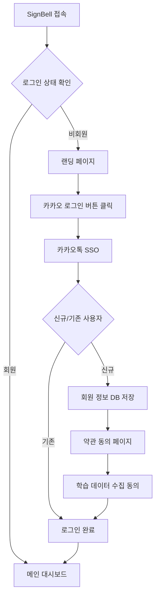
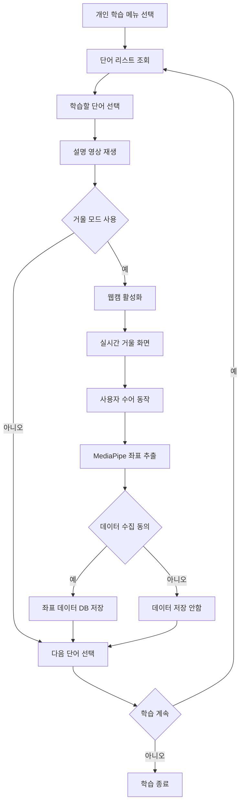
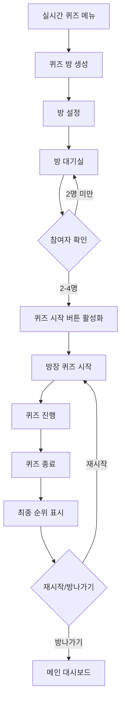
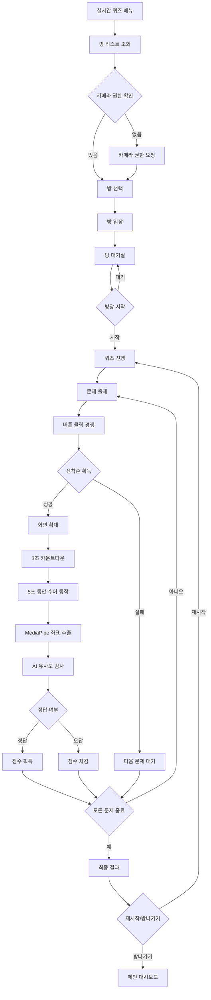

# SignBell 사용자 흐름도 명세서

본 문서는 SignBell 서비스의 사용자 흐름(User Flow)을 정의하여 개발팀과 디자인팀이 일관된 사용자 경험을 구현할 수 있도록 가이드를 제공합니다.

* **작성자**: [강관주](https://github.com/Kanggwanju)
* **작성일**: 2025-10-08
* **최종 수정일**: 2025-10-08
* **문서 버전**: v1.0.0

**대상 독자:**

* **기획자 / PM**: 사용자 여정과 서비스 흐름을 이해하고 기획 방향성을 검증하는 담당자
* **백엔드 개발자**: WebRTC 시그널링 서버, AI 모델 서빙 API, 실시간 퀴즈 로직, 사용자 인증 및 데이터베이스 등을 구현·유지보수하는 개발자
* **프론트엔드 개발자**: 실시간 캠 영상 처리, WebRTC 기반 화상 퀴즈 UI, 거울 모드, 사용자 인터페이스 기능을 설계·구현하는 개발자
* **디자이너 (UX/UI)**: 사용자 흐름에 기반한 화면 설계, 인터랙션 디자인, 사용자 경험을 구체화하는 담당자
* **DevOps / 인프라 엔지니어**: WebRTC 서버 및 AI 모델 서빙 환경 구축, CI/CD 파이프라인 운영, 보안 설정을 관리하는 담당자
* **QA / 테스트 엔지니어**: 사용자 시나리오별 테스트 케이스 작성, AI 모델 정확도 검증, WebRTC 다중 사용자 환경 테스트를 수행하는 담당자
* **신규 합류자**: SignBell 서비스의 사용자 여정과 주요 기능 흐름을 빠르게 파악해야 하는 팀 신규 인원

---

## 1. 개요

### 1.1 서비스 개념
AI 기술과 WebRTC 기반 실시간 화상통신을 활용하여 한국수어(KSL)를 학습하는 플랫폼. 개인 학습 모드와 실시간 퀴즈 모드를 통해 재미있고 효과적인 수어 학습 경험을 제공한다.

### 1.2 타겟 사용자
- **주 타겟**: 수어를 배우고자 하는 일반인 (가족, 친구, 동료 중 농인이 있는 경우)
- **부 타겟**: 수어에 관심 있는 학생, 사회복지사, 교육 관계자

---

## 2. 사용자 정의 및 권한

### 2.1 사용자 유형

| 사용자 유형 | 설명 | 주요 권한 |
|------------|------|----------|
| **비회원** | 서비스 접속 후 로그인하지 않은 사용자 | 서비스 소개 페이지만 조회 가능 |
| **회원** | 카카오 SSO로 로그인한 사용자 | 모든 학습 기능 이용 가능 |
| **방장** | 퀴즈 방을 생성한 회원 | 퀴즈 시작 권한 |

### 2.2 권한 매트릭스

| 기능 | 비회원 | 회원 | 방장 |
|------|--------|------|---------|
| 서비스 소개 조회 | ✅ | ✅ | ✅ |
| 개인 수어 학습 | ❌ | ✅ | ✅ |
| 거울 모드 사용 | ❌ | ✅ | ✅ |
| 퀴즈 방 입장 | ❌ | ✅ | ✅ |
| 퀴즈 방 생성 | ❌ | ✅ | ✅ |
| 퀴즈 시작 | ❌ | ❌ | ✅ (본인 방만) |
| 학습 데이터 제공 동의 | ❌ | ✅ | ✅ |

---

## 3. 화면 구조 정의

### 3.1 전체 레이아웃 구조 (웹 앱)

```
┌─────────────────────────────────────────────────┐
│               빈 공간 (여백)                     │
├─────────────────────────────────────────────────┤
│ ┌──────────────────────────────────────────┐    │
│ │ Header: SignBell 로고 │           로그인  │    │
│ ├──────────────────────────────────────────┤    │
│ │                                          │    │
│ │          Main Content                    │    │
│ │     (개인 학습 / 실시간 퀴즈)              │    │
│ │                                          │    │
│ └──────────────────────────────────────────┘    │
│               빈 공간 (여백)                     │
└─────────────────────────────────────────────────┘
```

### 3.2 헤더 정의

#### 3.2.1 비회원 헤더
```
┌─────────────────────────────────────────────────┐
│   SignBell 로고 │                       로그인   │
└─────────────────────────────────────────────────┘
```

#### 3.2.2 회원 헤더
```
┌─────────────────────────────────────────────────┐
│   SignBell 로고 │  개인학습 │ 실시간 퀴즈 │ 프로필 │
└─────────────────────────────────────────────────┘
```

### 3.3 메인 페이지 구조

```
┌─────────────────────────────────────┐
│        SignBell 로고 및 소개         │
│                                     │
│    AI 기반 실시간 수어 학습 플랫폼    │
│                                     │
│   [ 개인 학습 시작 ]  [ 실시간 퀴즈 ]  │
│                                     │
│   서비스 주요 특징                   │
│   • AI 실시간 피드백                 │
│   • 게이미피케이션 퀴즈               │
│   • 한국수어(KSL) 특화               │
└─────────────────────────────────────┘
```

---

## 4. 핵심 User Flow

### 4.1 회원가입/로그인 Flow



### 4.2 개인 수어 학습 Flow



### 4.3 실시간 퀴즈 Flow (방장)



### 4.4 실시간 퀴즈 Flow (참여자)



---

### 5.1 개인 학습 페이지 Flow

#### 5.1.1 개인 학습 - 단어 리스트 화면

**진입점**: 메인 대시보드 - 개인 학습 메뉴

**주요 기능**:
- 학습 가능한 단어 리스트 조회 (API 제공)
- 단어 선택 시 상세 학습 화면으로 이동

**구성 요소**:
```
┌─────────────────────────────────────┐
│      [ ← 뒤로가기 ]  개인 학습       │
├─────────────────────────────────────┤
│                                     │
│        [ 학습 단어 리스트 ]          │
│                                     │
│  ┌───────────────────────────────┐  │
│  │  단어 1: 안녕하세요       →    │  │
│  ├───────────────────────────────┤  │
│  │  단어 2: 감사합니다       →    │  │
│  ├───────────────────────────────┤  │
│  │  단어 3: 미안합니다       →    │  │
│  ├───────────────────────────────┤  │
│  │  단어 4: 사랑해요         →    │  │
│  ├───────────────────────────────┤  │
│  │  단어 5: 안녕히가세요     →    │  │
│  └───────────────────────────────┘  │
│                                     │
└─────────────────────────────────────┘
```

**Flow**:
1. API에서 단어 리스트 로딩
2. 스크롤 가능한 리스트 형태로 단어 목록 표시
3. 사용자가 학습할 단어 선택
4. 선택한 단어의 상세 학습 화면으로 이동

---

#### 5.1.2 개인 학습 - 단어 상세 학습 화면

**진입점**: 단어 리스트 화면에서 특정 단어 선택

**주요 기능**:
- 선택한 단어의 설명 영상 재생
- 거울 모드를 통한 실시간 실습 (영상과 동시에 볼 수 있음)
- 학습 데이터 수집

**구성 요소 - 거울 모드 비활성화 상태**:

```
┌─────────────────────────────────────┐
│   [ ← 뒤로가기 ]  단어: 안녕하세요   │
├─────────────────────────────────────┤
│                                     │
│        [ 설명 영상 영역 ]            │
│  ┌───────────────────────────────┐  │
│  │                               │  │
│  │      영상 재생 화면            │  │
│  │                               │  │
│  │      ▶ 재생/일시정지           │  │
│  └───────────────────────────────┘  │
│                                     │
│        [ 수어 동작 설명 ]            │
│  오른손을 들어 인사하는 동작입니다.   │
│                                     │
├─────────────────────────────────────┤
│                                     │
│      [ 거울 모드로 연습하기 ]        │
│                                     │
└─────────────────────────────────────┘
```

**구성 요소 - 거울 모드 활성화 상태** (화면 분할):

```
┌─────────────────────────────────────┐
│   [ ← 뒤로가기 ]  단어: 안녕하세요    │
├─────────────────────────────────────┤
│                                     │
│    [ 설명 영상 ] (작게 표시)         │
│  ┌─────────────────────┐            │
│  │   영상 재생 화면     │  ▶        │
│  └─────────────────────┘            │
│                                     │
│  오른손을 들어 인사하는 동작입니다.    │
│                                     │
├─────────────────────────────────────┤
│                                     │
│   [ 거울 모드 ] (크게 표시) 🔴실행중  │
│  ┌───────────────────────────────┐  │
│  │                               │  │
│  │    실시간 웹캠 화면            │  │
│  │  (상체 프레임 가이드 표시)      │  │
│  │                               │  │
│  │    사용자 동작 미러링          │  │
│  └───────────────────────────────┘  │
│                                     │
│   💡 좌표 데이터가 수집 중입니다      │
│                                     │
│        [ 거울 모드 종료하기 ]         │
│                                     │
└─────────────────────────────────────┘
```

**Flow**:
1. 화면 진입 시 설명 영상 자동 재생
2. 영상 시청 및 수어 동작 설명 확인
3. [거울 모드로 연습하기] 버튼 클릭 (선택)
4. 거울 모드 활성화 시:
    - 웹캠 권한 요청 및 활성화
    - **화면이 상하 분할됨**:
        - **상단**: 설명 영상이 작게 계속 재생 (반복 재생 가능)
        - **하단**: 거울 모드 화면이 크게 표시
    - 사용자는 **영상을 보면서 동시에 따라할 수 있음**
    - 실시간 화면에 상체 프레임 가이드 표시
    - 사용자 동작 실시간 미러링
    - MediaPipe로 좌표 추출
    - 동의한 경우 좌표 데이터만 DB 저장
5. [거울 모드 종료하기] 버튼으로 거울 모드 비활성화
    - 다시 원래 화면으로 복귀 (영상이 크게 표시)
6. [← 뒤로가기] 버튼으로 단어 리스트로 복귀

**거울 모드 사용 시나리오**:
- 사용자가 영상을 보면서 동작을 익힌 후 거울 모드 활성화
- 거울 모드 활성화 후에도 상단의 영상을 참고하며 따라하기 가능
- 영상은 반복 재생되어 여러 번 참고 가능
- 충분히 연습한 후 거울 모드 종료 또는 다음 단어로 이동

### 5.2 실시간 퀴즈 대기실 Flow

**진입점**: 메인 대시보드 - 실시간 퀴즈 메뉴

**방 생성 화면**:
```
┌─────────────────────────────────────┐
│        [ 퀴즈 방 생성 ]              │
│  방 제목: [__________________]      │
│  최대 인원: 2~4명                   │
│                                     │
│         [ 방 만들기 ]                │
└─────────────────────────────────────┘
```

**방 리스트 화면**:
```
┌─────────────────────────────────────┐
│        [ 진행중인 방 목록 ]          │
│  ┌───────────────────────────────┐  │
│  │ 방1: 수어 마스터 (2/4명)       │  │
│  │ 방2: 초보 환영 (3/4명)         │  │
│  │ 방3: 실력자 모임 (4/4명) 만석  │  │
│  └───────────────────────────────┘  │
│                                     │
│        [ + 새 방 만들기 ]            │
└─────────────────────────────────────┘
```

**대기실 화면**:
```
┌─────────────────────────────────────┐
│        [ 방 대기실 ]                 │
│ ┌──────┐ ┌──────┐ ┌──────┐ ┌──────┐ │
│ │캠1   │ │캠2   │ │캠3   │ │캠4    │ │
│ │(방장)│ │참여자 │ │참여자│ │비어있음│ │
│ └──────┘ └──────┘ └──────┘ └──────┘ │
│                                     │
│      대기 중... (2/4명)              │
│                                     │
│  [방장만]  [ 퀴즈 시작 ]             │
│  [모두]    [ 방 나가기 ]             │
└─────────────────────────────────────┘
```

**Flow**:
1. 방 생성 or 방 리스트에서 방 선택
2. 카메라 권한 확인 (없으면 입장 불가)
3. 방 입장 → 대기실
4. WebRTC 연결 → 모든 참여자 화면 표시
5. 방장이 시작 버튼 클릭 → 퀴즈 시작

### 5.3 퀴즈 진행 화면 Flow

**퀴즈 화면 구성**:
```
┌─────────────────────────────────────┐
│     문제: "안녕하세요"를 표현하세요   │
│                                     │
│  ┌─────┐ ┌─────┐ ┌─────┐ ┌─────┐    │
│  │캠1  │ │캠2  │ │캠3  │ │캠4  │    │
│  │100점│ │50점 │ │-10점│ │0점  │    │
│  └─────┘ └─────┘ └─────┘ └─────┘    │
│                                     │
│         [ 정답 도전하기 ]            │
│     (모든 참여자에게 표시)            │
└─────────────────────────────────────┘
```

**정답 도전 화면** (선착순 획득자):
```
┌─────────────────────────────────────┐
│     문제: "안녕하세요"를 표현하세요   │
│                                     │
│  ┌───────────────────────────────┐  │
│  │                               │  │
│  │       확대된 캠 화면           │  │
│  │    (상체 프레임 가이드)        │  │
│  │                               │  │
│  │       카운트다운: 3...         │  │
│  └───────────────────────────────┘  │
│                                     │
│  다른 참여자 화면 (작게 표시)        │
│  ┌────┐ ┌────┐ ┌────┐             │
│  │캠2 │ │캠3 │ │캠4 │             │
│  └────┘ └────┘ └────┘             │
└─────────────────────────────────────┘
```

**Flow**:
1. 랜덤 단어 출제
2. 모든 참여자에게 [정답 도전하기] 버튼 표시
3. 선착순으로 버튼 클릭한 사용자 화면 확대
4. 3초 카운트다운 (UI 표시)
5. 5초 동안 수어 동작 수행
    - 상체 프레임 가이드 표시
    - 타이머 UI 표시
6. 5초 후 자동으로 동작 캡처
7. MediaPipe로 좌표 추출
8. AI 모델로 유사도 검사
9. 정답/오답 판정 및 점수 부여
    - 정답: 순위별 점수 (1위 100점, 2위 90점, 3위 80점, 4위 70점)
    - 오답: -50점
10. 정답자 나오면 즉시 다음 문제
11. 전원 실패 시에도 다음 문제

### 5.4 퀴즈 결과 화면

**최종 결과 화면**:
```
┌─────────────────────────────────────┐
│         퀴즈 종료!                   │
│                                     │
│   🥇 1등: 사용자A (450점)           │
│   🥈 2등: 사용자B (380점)           │
│   🥉 3등: 사용자C (250점)           │
│       4등: 사용자D (150점)           │
│                                     │
│  [ 다시 하기 ]    [ 방 나가기 ]      │
└─────────────────────────────────────┘
```

---

## 6. 상태 관리

### 6.1 퀴즈 방 상태 정의

| 상태       | 설명                              | 가능한 액션               |
|----------|---------------------------------|----------------------|
| **대기중**  | 참여자를 모집 중인 방                   | 입장, 퇴장               |
| **진행중**  | 퀴즈가 시작되어 진행 중인 방              | 문제 풀이, 중도 퇴장 불가     |
| **완료**   | 퀴즈가 종료된 방                      | 결과 확인, 재시작, 방 나가기   |

### 6.2 퀴즈 점수 시스템

**점수 획득**:
- 정답 (순위별 차등):
    - 1순위: +100점
    - 2순위: +90점
    - 3순위: +80점
    - 4순위: +70점

**점수 차감**:
- 오답: -50점

**순위 결정**:
- 최종 누적 점수 기준
- 동점 시: 먼저 정답을 맞춘 횟수 우선

---

## 7. 기술적 요구사항

### 7.1 카메라 관련

**필수 요구사항**:
- 웹캠 접근 권한 필수
- 카메라 없는 사용자는 퀴즈 방 입장 불가
- MediaPipe를 통한 실시간 좌표 추출

**상체 프레임 가이드**:
- 사용자 상체가 화면에 잘 보이도록 가이드 제공
- 점선 프레임으로 포즈 표시

### 7.2 WebRTC 연결

**요구사항**:
- 최소 2명 ~ 최대 4명 동시 연결
- 실시간 영상 송수신
- 저지연 통신 보장

### 7.3 AI 모델 서빙

**요구사항**:
- MediaPipe로 추출한 좌표 데이터를 AI 모델로 전송
- 실시간 유사도 판정 (5초 이내)
- 정확도 기반 정답/오답 처리

### 7.4 데이터 수집 (거울 모드)

**프로세스**:
1. 사용자 동의 확인 (약관)
2. 동작 영상에서 좌표 추출
3. 좌표 데이터만 DB 저장 (영상 저장 안 함)
4. AI 모델 학습용 데이터로 활용

---

## 8. 예외 상황 처리

### 8.1 네트워크 오류
- 연결 끊김 감지 시 자동 재연결 시도
- 재연결 실패 시 퀴즈 방에서 자동 퇴장
- 오류 메시지 및 메인 화면 복귀 안내

### 8.2 카메라 권한 거부
- 카메라 권한 필요성 안내 팝업
- 권한 설정 방법 가이드 제공
- 권한 없이는 퀴즈 참여 불가 명시

### 8.3 AI 판정 오류
- 네트워크 타임아웃: 자동 오답 처리
- 모델 서빙 오류: 재시도 1회, 실패 시 오답 처리
- 좌표 추출 실패: 오답 처리 및 다음 문제로 진행

### 8.4 방장 퇴장
- 방장이 퇴장하면 다음 참여자가 자동으로 방장으로 승계
- 모든 참여자가 퇴장하면 방 자동 삭제

---

## 9. 향후 확장 계획 (Should Have / Could Have)

### 9.1 개인 학습 확장 기능
- **개인 학습 퀴즈**: 랜덤 단어 퀴즈 모드
- **튜토리얼**: 수어 기본 동작 연습
- **유사도 체크**: 캠으로 연습 시 AI 피드백 제공
    - 버튼 클릭 → 3초 카운트다운 → 5초 동작 → 유사도 결과
- **모의고사**: 여러 단어를 연속으로 테스트
- **오답노트**: 틀린 단어 복습 기능

### 9.2 기타 확장 기능
- 학습 진도율 추적
- 일일/주간 학습 통계
- 배지 및 업적 시스템
- 친구 초대 및 함께 학습 기능

---

## 10. 개발 고려사항

### 10.1 성능 요구사항
- 웹캠 스트리밍: 30fps 이상
- AI 판정 응답: 3초 이내
- WebRTC 연결: 1초 이내

### 10.2 접근성
- 명확한 UI 가이드 및 안내 메시지
- 키보드 네비게이션 지원
- 색상 대비 WCAG 2.1 AA 준수

### 10.3 보안
- 카카오 SSO 토큰 안전 관리
- 사용자 영상 데이터 비저장 (좌표만 저장)
- HTTPS 필수 적용
- 개인정보 처리 약관 동의 절차

---

## 11. 변경 이력

| 버전     | 날짜         | 변경 내용                 | 작성자   |
|--------|------------|-----------------------|-------|
| v1.0.0 | 2025.10.08 | 초기 문서 작성 및 사용자 흐름도 정의 | 강관주 |
