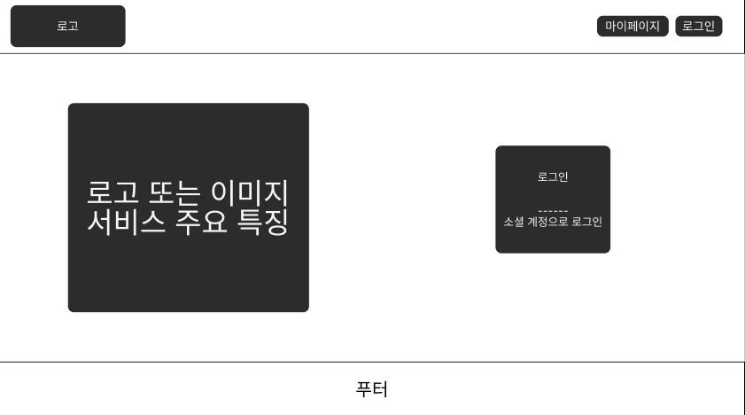
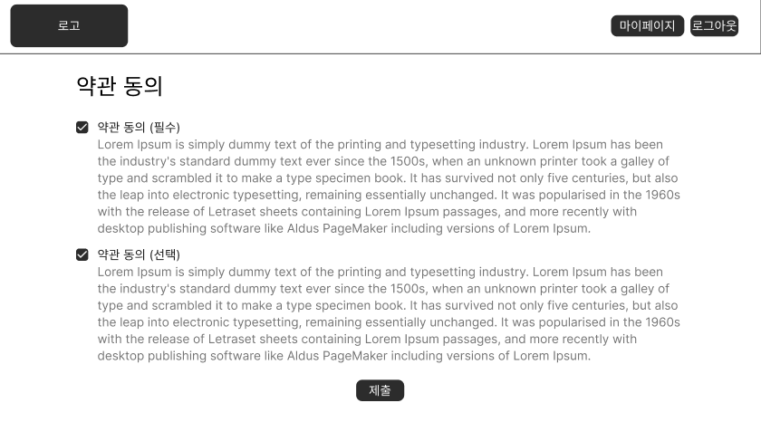

# 1. 사용자 인증 및 온보딩 화면 명세서

## 문서 정보

- **문서명**: 사용자 인증 및 온보딩 화면 명세서
- **버전**: v1.0.0
- **작성일**: 2025.10.15
- **작성자**: [신동준](https://github.com/sdj3959)
- **최종 수정일**: 2025.10.15

-----

## 1. 개요 (Overview)

본 문서는 사용자가 서비스에 처음 진입하는 랜딩 페이지부터 소셜 로그인을 통해 인증을 완료하고,
신규 사용자의 경우 서비스 약관에 동의하기까지의 전체 화면 흐름과 기능적 요구사항을 정의합니다.
사용자가 직관적으로 서비스를 시작하고, 신규 사용자의 경우 필수 약관 동의를 통해 원활하게 온보딩될 수 있도록 하는 것을 목표로 합니다.

## 2. 사용자 흐름 (User Flow)

사용자는 랜딩 페이지에서 '소셜 계정으로 시작하기' 버튼을 통해 인증을 시작하며, 서버에서 신규/기존 사용자를 판별하여 각기 다른 흐름을 따릅니다.

> **✅ 기존 사용자**: `랜딩 페이지` → `[AUTH-001] 소셜 계정으로 시작하기` → (소셜 인증) → `(로그인 성공)` → `메인 페이지`

> **✅ 신규 사용자**: `랜딩 페이지` → `[AUTH-001] 소셜 계정으로 시작하기` → (소셜 인증) → `(서버에서 신규 회원 감지 및 임시 회원으로 로그인)` → `[AUTH-002] 약관 동의 페이지` → `(필수 약관 동의 후 제출)` → `(정회원 전환)` → `메인 페이지`

- 보다 자세한 전체 사용자 흐름은 아래 링크를 참고해주세요.
- [유저 플로우 전체 흐름 보러가기](../SignBell_사용자%20흐름도%20명세서.md)

-----

## 3. 화면 상세 명세 (Screen Specifications)

### 3.1. [AUTH-000] 랜딩 페이지

- **화면 설명**: 서비스의 첫인상을 제공하고, 사용자에게 로그인을 유도하는 시작 페이지입니다.

- **진입 조건**: 사용자가 서비스 URL에 접속했을 때.

- **와이어프레임**:
- 

- **레이아웃 및 구성 요소**

| ID  | 구분 | 요소명          | 설명                                      |
|:----| :--- |:-------------|:----------------------------------------|
| 0-1 | 헤더 | 서비스 로고       | 서비스의 로고가 표시됩니다.                         |
| 0-2 | 메인 | 서비스 로고/이미지   | 서비스의 핵심 가치를 전달하는 로고 또는 대표 이미지가 표시됩니다.   |
| 0-3 | 메인 | 서비스 개요 텍스트   | 서비스의 간략한 소개 또는 슬로건이 표시됩니다.              |
| 0-4 | 버튼 | 소셜 계정으로 시작하기 | 클릭 시 소셜 인증 절차를 시작합니다. (현재는 카카오 로그인만 지원) |
| 0-5 | 푸터 | 푸터 영역        | 저작권 정보, 회사 정보 등 일반적인 푸터 내용이 포함됩니다.      |

- **상호작용 및 정책**
    1.  **'소셜 계정으로 시작하기' 버튼 클릭 시**: 즉시 소셜 인증 절차를 시작하며, `[AUTH-001] 소셜 로그인 페이지`의 서버 로직을 따릅니다.

-----

### 3.2. [AUTH-001] 소셜 로그인 처리 (내부 로직)

- **화면 설명**: 사용자가 랜딩 페이지에서 '소셜 계정으로 시작하기' 버튼을 클릭했을 때, 실제 소셜 인증 및 서버 연동이 이루어지는 내부 처리 과정입니다. (사용자에게 직접적으로 보이는 화면은 아니며, 소셜 인증 팝업/리다이렉션이 발생할 수 있습니다.)

- **진입 조건**: `[AUTH-000] 랜딩 페이지`에서 '소셜 계정으로 시작하기' 버튼 클릭 시.

- **와이어프레임**: (사용자에게 직접 노출되는 와이어프레임은 없으며, 소셜 인증 화면으로 리다이렉트됩니다.)

- **상호작용 및 정책**
    1.  **소셜 인증 절차 시작**: 프론트엔드는 소셜 인증 서버로 사용자를 리다이렉트하거나 팝업을 띄워 인증을 요청합니다.
    2.  **소셜 인증 후 서버 로직**:
        - 소셜로그인으로부터 `인가 코드`를 받은 후, 프론트엔드는 이를 백엔드 서버로 전송합니다.
        - 서버는 `인가 코드`로 사용자 정보를 조회 후, 우리 DB와 대조합니다.
            - **[CASE 1: 기존 회원]**: 즉시 **로그인 성공** 처리. JWT 토큰을 발급하고, 프론트엔드는 `메인 페이지`로 이동합니다.
            - **[CASE 2: 신규 회원]**: 사용자를 **'임시 회원'** 상태로 DB에 생성하고 로그인 처리합니다. JWT 토큰 발급 후, 프론트엔드는 `[AUTH-002] 약관 동의 페이지`로 이동합니다.

-----

### 3.3. [AUTH-002] 약관 동의 페이지

- **화면 설명**: 신규 가입자가 서비스의 정식 이용을 위해 필수 약관에 동의하는 페이지입니다.

- **진입 조건**: 신규 회원이 소셜 로그인을 마치고 서버에서 '임시 회원'으로 판별되었을 때.

- **와이어프레임**:
- 

- **레이아웃 및 구성 요소**

| ID  | 구분 | 요소명            | 설명                                                               |
|:----| :--- |:-----------------|:-------------------------------------------------------------------|
| 2-1 | 헤더 | 로그아웃 버튼     | 동의를 원치 않을 경우 서비스를 즉시 로그아웃하고 이탈합니다.       |
| 2-2 | 타이틀 | 페이지 타이틀     | "서비스 이용 약관 동의"                                            |
| 2-3 | 체크박스 | 전체 동의         | 모든 하위 약관을 한번에 선택/해제합니다.                           |
| 2-4 | 체크박스 | 서비스 이용약관 (필수) | 서비스 이용에 대한 필수 약관입니다.                                |
| 2-5 | 텍스트 | 서비스 이용약관 내용 | 서비스 이용약관의 상세 내용이 스크롤 가능한 영역으로 표시됩니다.   |
| 2-6 | 체크박스 | 개인정보 수집 동의 (필수) | 개인정보 수집 및 이용에 대한 필수 약관입니다.                      |
| 2-7 | 텍스트 | 개인정보 수집 동의 내용 | 개인정보 수집 동의의 상세 내용이 스크롤 가능한 영역으로 표시됩니다. |
| 2-8 | 체크박스 | 마케팅 정보 수신 동의 (선택) | 마케팅 정보 수신에 대한 선택 약관입니다.                           |
| 2-9 | 텍스트 | 마케팅 정보 수신 동의 내용 | 마케팅 정보 수신 동의의 상세 내용이 스크롤 가능한 영역으로 표시됩니다. |
| 2-10 | 버튼 | 제출              | 모든 필수 약관에 동의했을 때 활성화됩니다.                         |

- **상호작용 및 정책**
    - 이 페이지는 **강제적**이며, 필수 약관 동의 없이는 서비스 이용이 불가능합니다.
    - `제출` 버튼은 **모든 필수 약관(2-4, 2-6)이 체크되기 전까지 비활성화** 상태를 유지합니다.
    - `제출` 버튼 클릭 시, 서버로 약관 동의 정보가 전송되고 사용자는 '정회원'으로 상태가 업데이트됩니다. 이후 `메인 페이지`로 이동하여 모든 서비스를 정상적으로 이용할 수 있습니다.
    - 헤더의 `로그아웃` 버튼 클릭 시, 즉시 세션이 종료되고 `[AUTH-000] 랜딩 페이지`로 돌아갑니다.

-----

> 이제 사용자가 로그인 후 마주할 첫 화면인 메인 페이지의 명세서로 이동합니다. 

> [메인 화면 및 모임 탐색 화면 명세서](wireframe-main-page.md)

## 변경 이력

| 버전 | 날짜         | 변경 내용 | 작성자 |
| ------ |------------| -------------- |-----|
| v1.0.0 | 2023.10.15 | 초기 문서 작성, 랜딩 페이지 및 약관 동의 페이지 추가 | 신동준 |