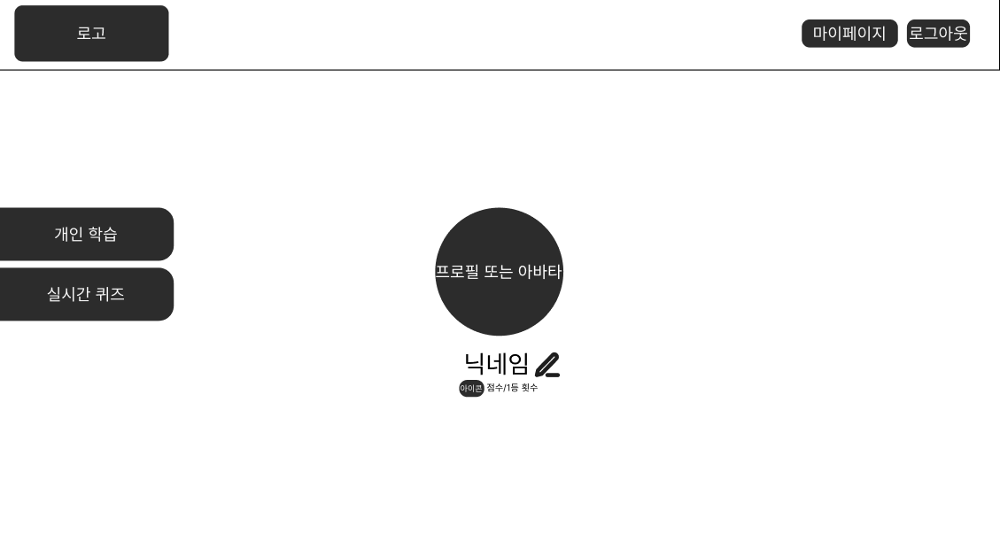

# 2. 메인 화면 및 모임 탐색 화면 명세서

## 문서 정보

- **문서명**: 메인 화면 및 모임 탐색 화면 명세서
- **버전**: v1.0.0
- **작성일**: 2025.10.15
- **작성자**: [신동준](https://github.com/sdj3959)
- **최종 수정일**: 2025.10.15

-----

## 1. 개요 (Overview)

본 문서는 사용자가 로그인 후 처음 마주하는 메인 페이지의 화면 구성과 기능적 요구사항을 정의합니다.
사용자는 이 페이지에서 자신의 프로필을 확인하고, 개인 학습 및 실시간 퀴즈 기능으로의 접근 경로를 제공받습니다.
직관적인 UI를 통해 주요 기능으로의 빠른 이동을 지원하고, 사용자에게 개인화된 경험을 제공하는 것을 목표로 합니다.

## 2. 사용자 흐름 (User Flow)

기존 사용자 또는 신규 사용자가 로그인 및 온보딩 과정을 완료한 후 메인 페이지로 진입합니다.

> **✅ 메인 페이지 진입**: `로그인 성공` → `메인 페이지 로드`

- 보다 자세한 전체 사용자 흐름은 아래 링크를 참고해주세요.
- [유저 플로우 전체 흐름 보러가기](../SignBell_사용자%20흐름도%20명세서.md)

-----

## 3. 화면 상세 명세 (Screen Specifications)

### 3.1. [MAIN-001] 메인 페이지

- **화면 설명**: 로그인한 사용자가 서비스의 주요 기능을 탐색하고 자신의 정보를 확인할 수 있는 허브 페이지입니다.

- **진입 조건**: 사용자가 로그인 과정을 성공적으로 완료했을 때.

- **와이어프레임**:
- 

- **레이아웃 및 구성 요소**

| ID  | 구분 | 요소명            | 설명                                                                                                                    |
|:----| :--- |:-----------------|:----------------------------------------------------------------------------------------------------------------------|
| 1-1 | 헤더 | 서비스 로고       | 서비스의 로고가 표시됩니다. 클릭 시 `메인페이지`로 이동합니다.                                                                                  |
| 1-2 | 헤더 | 마이페이지 버튼   | 클릭 시 `마이페이지`로 이동합니다.                                                                                                  |
| 1-3 | 헤더 | 로그아웃 버튼     | 클릭 시 현재 세션을 종료하고 `랜딩 페이지`로 이동합니다.                                                                                     |
| 1-4 | 버튼 | 개인 학습 버튼    | 클릭 시 오른쪽에서 `개인 학습 사이드바`가 열립니다. (자세한 내용은 [wireframe-personal-study.md](../wireframes/wireframe-personal-study.md) 참고)  |
| 1-5 | 버튼 | 실시간 퀴즈 버튼  | 클릭 시 오른쪽에서 `실시간 퀴즈 사이드바`가 열립니다. (자세한 내용은 [wireframe-real-time-quiz.md](../wireframes/wireframe-real-time-quiz.md) 참고) |
| 1-6 | 프로필 | 사용자 프로필 이미지 | 사용자의 프로필 이미지가 표시됩니다.                                                                                                  |
| 1-7 | 텍스트 | 사용자 닉네임     | 현재 로그인한 사용자의 닉네임이 표시됩니다.                                                                                              |
| 1-8 | 아이콘 | 코인 아이콘       | 사용자가 퀴즈를 통해 획득한 점수를 나타내는 코인 아이콘입니다.                                                                                   |
| 1-9 | 텍스트 | 사용자 점수       | 사용자가 퀴즈를 통해 획득한 총 점수가 표시됩니다.                                                                                          |
| 1-10 | 버튼 | 닉네임 수정 아이콘 | 클릭 시 `마이페이지`로 이동합니다. (1-2 마이페이지 버튼과 동일한 기능)                                                                           |

- **상호작용 및 정책**
    - **'개인 학습' 버튼 클릭 시**: 화면 오른쪽에 `개인 학습 사이드바`가 부드럽게 나타납니다.
    - **'실시간 퀴즈' 버튼 클릭 시**: 화면 오른쪽에 `실시간 퀴즈 사이드바`가 부드럽게 나타납니다.
    - **'마이페이지' 버튼 (1-2) 클릭 시**: `마이페이지`로 화면이 전환됩니다.
    - **'로그아웃' 버튼 (1-3) 클릭 시**: 사용자 세션이 종료되고 `[AUTH-000] 랜딩 페이지`로 이동합니다.
    - **'닉네임 수정 아이콘' (1-10) 클릭 시**: `마이페이지`로 화면이 전환됩니다. (1-2 마이페이지 버튼과 동일한 기능)

-----

## 변경 이력

| 버전 | 날짜         | 변경 내용 | 작성자 |
| ------ |------------| -------------- |-----|
| v1.0.0 | 2025.10.15 | 초기 문서 작성, 메인 페이지 구성 | 신동준 |