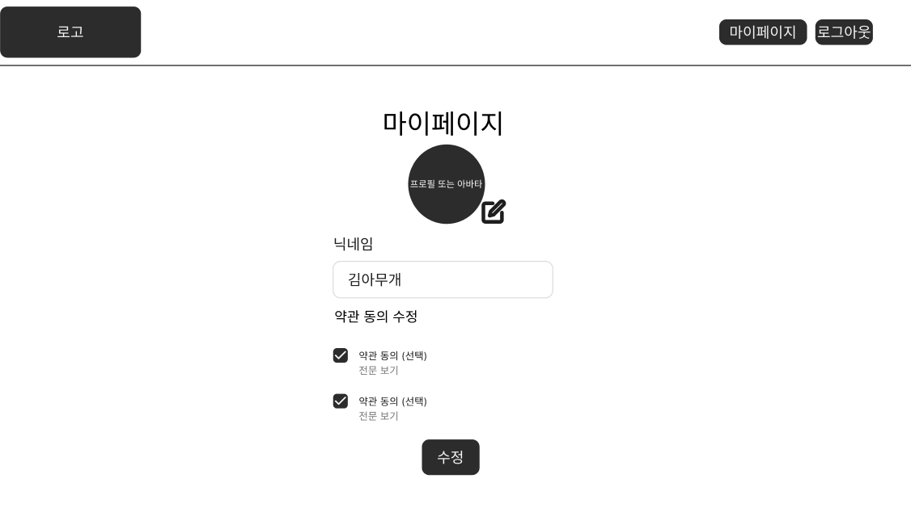

# 3. 마이페이지 화면 명세서

## 문서 정보

- **문서명**: 마이페이지 화면 명세서
- **버전**: v1.0.0
- **작성일**: 2025.10.15
- **작성자**: [신동준](https://github.com/sdj3959)
- **최종 수정일**: 2025.10.15

-----

## 1. 개요 (Overview)

본 문서는 사용자가 자신의 프로필 정보를 확인하고 수정하며, 선택적 약관 동의 여부를 변경할 수 있는 마이페이지의 화면 구성과 기능적 요구사항을 정의합니다.
사용자에게 개인화된 설정 관리 기능을 제공하고, 정보 수정의 편의성을 높이는 것을 목표로 합니다.

## 2. 사용자 흐름 (User Flow)

사용자는 메인 페이지 또는 다른 경로를 통해 마이페이지로 진입합니다.

> **✅ 마이페이지 진입**: `메인 페이지 (마이페이지 버튼 또는 닉네임 수정 아이콘 클릭)` → `마이페이지 로드`

- 보다 자세한 전체 사용자 흐름은 아래 링크를 참고해주세요.
- [유저 플로우 전체 흐름 보러가기](../SignBell_사용자%20흐름도%20명세서.md)

-----

## 3. 화면 상세 명세 (Screen Specifications)

### 3.1. [MY-001] 마이페이지

- **화면 설명**: 사용자가 자신의 프로필 정보(닉네임, 프로필 사진)를 수정하고, 선택적 약관 동의 여부를 관리할 수 있는 페이지입니다.

- **진입 조건**: `[MAIN-001] 메인 페이지`에서 '마이페이지' 버튼(1-2) 또는 '닉네임 수정 아이콘'(1-10) 클릭 시.

- **와이어프레임**:
- 

- **레이아웃 및 구성 요소**

| ID  | 구분 | 요소명            | 설명                                                                                                      |
|:----| :--- |:-----------------|:--------------------------------------------------------------------------------------------------------|
| 1-1 | 헤더 | 서비스 로고       | 서비스의 로고가 표시됩니다. 클릭 시 `메인페이지`로 이동합니다.                                                                    |
| 1-2 | 헤더 | 마이페이지 버튼   | 현재 페이지를 나타냅니다. (클릭 비활성화 또는 강조 표시)                                                                         |
| 1-3 | 헤더 | 로그아웃 버튼     | 클릭 시 현재 세션을 종료하고 `랜딩 페이지`로 이동합니다.                                                                       |
| 1-4 | 텍스트 | 마이페이지 타이틀 | "마이페이지" 텍스트가 표시됩니다.                                                                         |
| 1-5 | 프로필 | 사용자 프로필 이미지 | 현재 사용자의 프로필 이미지가 표시됩니다.                                                                                |
| 1-6 | 버튼 | 프로필 사진 수정 아이콘 | 클릭 시 프로필 사진을 변경할 수 있는 기능을 제공합니다.                                                                  |
| 1-7 | 입력 필드 | 닉네임 입력 칸    | 현재 사용자의 닉네임이 표시되며, 수정 가능합니다.                                                                        |
| 1-8 | 툴팁 | 닉네임 유효성 툴팁 | "닉네임은 한글, 영문, 숫자로 10자까지 가능합니다." 라는 안내 메시지가 표시됩니다.                                          |
| 1-9 | 체크박스 | 마케팅 정보 수신 동의 (선택) | 마케팅 정보 수신에 대한 선택 약관 동의 여부를 변경할 수 있습니다.                                                        |
| 1-10 | 버튼 | 수정 버튼         | 닉네임 또는 선택 약관 동의 여부 변경 후 클릭 시 변경 사항을 저장합니다.                                                    |

- **상호작용 및 정책**
    - **'프로필 사진 수정 아이콘' (1-6) 클릭 시**: 프로필 사진 업로드 또는 변경 기능을 활성화합니다.
    - **'닉네임 입력 칸' (1-7) 수정 시**: 입력된 닉네임이 툴팁(1-8)의 유효성 검사 규칙을 따르는지 실시간으로 확인합니다. 유효하지 않을 경우 '수정' 버튼(1-10)이 비활성화될 수 있습니다.
    - **'마케팅 정보 수신 동의' 체크박스 (1-9) 변경 시**: 체크 상태에 따라 마케팅 정보 수신 여부가 변경됩니다.
    - **'수정' 버튼 (1-10) 클릭 시**: 변경된 닉네임 및 선택 약관 동의 정보가 서버로 전송되어 저장됩니다. 변경 완료 후 성공 메시지가 표시될 수 있습니다.
    - **'로그아웃' 버튼 (1-3) 클릭 시**: 사용자 세션이 종료되고 `[AUTH-000] 랜딩 페이지`로 이동합니다.
    - **'서비스 로고' (1-1) 클릭 시**: `[MAIN-001] 메인 페이지`로 이동합니다.

-----

## 변경 이력

| 버전 | 날짜         | 변경 내용 | 작성자 |
| ------ |------------| -------------- |--|
| v1.0.0 | 2025.10.15 | 초기 문서 작성, 마이페이지 구성 | 신동준 |