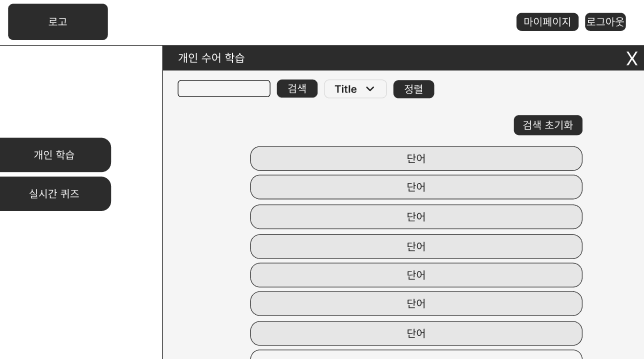
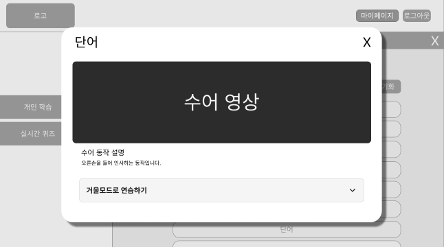
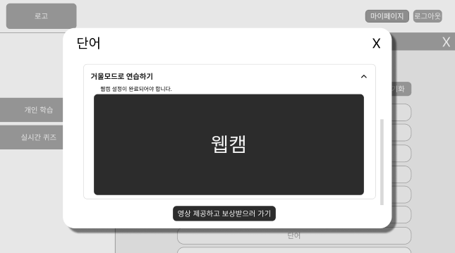
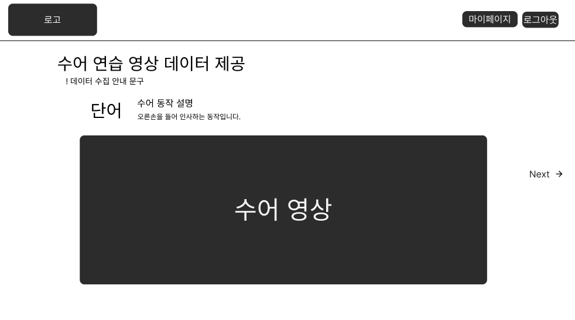
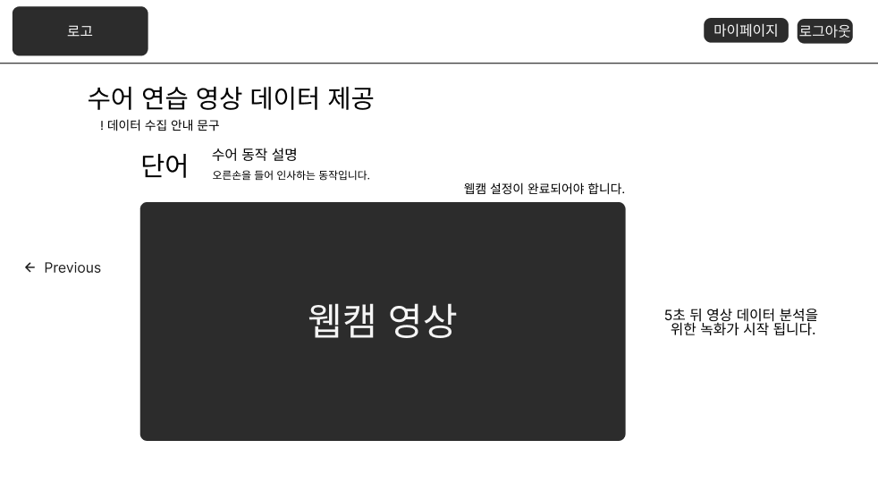
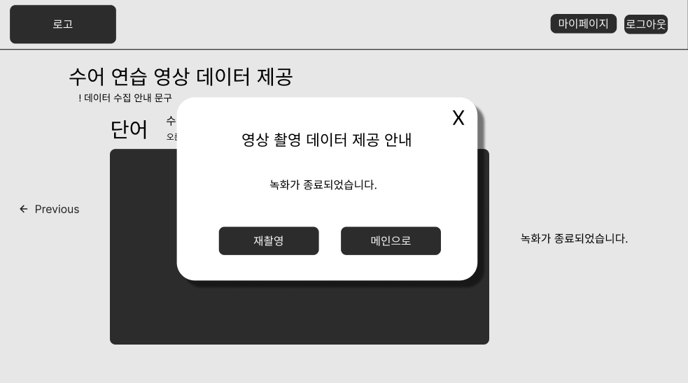

# 4. 개인 학습 화면 명세서

## 문서 정보

- **문서명**: 개인 학습 화면 명세서
- **버전**: v1.0.0
- **작성일**: 2025.10.15
- **작성자**: [신동준](https://github.com/sdj3959)
- **최종 수정일**: 2025.10.15

-----

## 1. 개요 (Overview)

본 문서는 사용자가 개인 학습 기능을 통해 특정 단어의 수어 영상을 검색하고 학습하며,
직접 수어 연습 영상을 촬영하여 데이터로 제공하는 일련의 화면 흐름과 기능적 요구사항을 정의합니다.
사용자가 개별 단어를 효과적으로 학습하고, 자발적인 데이터 제공을 통해 서비스 개선에 기여할 수 있도록 지원하는 것을 목표로 합니다.

## 2. 사용자 흐름 (User Flow)

사용자는 메인 페이지에서 '개인 학습' 버튼을 클릭하여 개인 학습 사이드바를 열고, 단어 검색 및 학습, 그리고 영상 데이터 제공 과정을 진행합니다.

> **✅ 개인 학습 시작**: `메인 페이지 (개인 학습 버튼 클릭)` → `[STUDY-001] 개인 학습 사이드바`
> **✅ 단어 학습**: `[STUDY-001] 개인 학습 사이드바 (단어 클릭)` → `[STUDY-002] 단어 상세 모달`
> **✅ 영상 데이터 제공**: `[STUDY-002] 단어 상세 모달 (영상 제공 버튼 클릭)` → `[STUDY-003] 수어 연습 영상 데이터 제공 페이지 (1단계)` → `[STUDY-004] 수어 연습 영상 데이터 제공 페이지 (2단계)` → `[STUDY-005] 영상 촬영 데이터 제공 안내 모달`

- 보다 자세한 전체 사용자 흐름은 아래 링크를 참고해주세요.
- [유저 플로우 전체 흐름 보러가기](../SignBell_사용자%20흐름도%20명세서.md)

-----

## 3. 화면 상세 명세 (Screen Specifications)

### 3.1. [STUDY-001] 개인 학습 사이드바

- **화면 설명**: 사용자가 학습할 단어를 검색하고 정렬하여 목록을 탐색할 수 있는 사이드바입니다.

- **진입 조건**: `[MAIN-001] 메인 페이지`에서 '개인 학습' 버튼 클릭 시.

- **와이어프레임**:
- 

- **레이아웃 및 구성 요소**

| ID  | 구분 | 요소명            | 설명                                                               |
|:----| :--- |:-----------------|:-------------------------------------------------------------------|
| 1-1 | 입력 필드 | 단어 검색 입력 칸 | 학습할 단어를 검색할 수 있는 입력 필드입니다.                      |
| 1-2 | 콤보박스 | 정렬 조건 선택    | 단어 리스트의 정렬 조건을 선택할 수 있는 드롭다운 메뉴입니다.      |
| 1-3 | 버튼 | 검색 조건 초기화 버튼 | 검색 입력 및 정렬 조건을 초기 상태로 되돌립니다.                   |
| 1-4 | 리스트 | 단어 리스트       | 검색 조건에 맞는 단어들이 카드 형태로 표시되는 목록입니다. (무한 스크롤) |
| 1-5 | 카드 | 개별 단어 카드    | 단어 하나를 나타내는 가로로 긴 카드 디자인입니다. 단어 텍스트만 포함됩니다. |

- **상호작용 및 정책**
    - **'단어 검색 입력 칸' (1-1) 입력 시**: 입력된 단어를 포함하는 단어 리스트(1-4)를 필터링하여 표시합니다.
    - **'정렬 조건 선택' 콤보박스 (1-2) 선택 시**: 단어 리스트(1-4)를 선택된 조건에 따라 정렬하여 표시합니다.
    - **'검색 조건 초기화' 버튼 (1-3) 클릭 시**: 단어 검색 입력 칸(1-1)과 정렬 조건(1-2)을 초기화하고 전체 단어 리스트를 표시합니다.
    - **'개별 단어 카드' (1-5) 클릭 시**: 해당 단어의 상세 정보를 보여주는 `[STUDY-002] 단어 상세 모달`이 화면 중앙에 나타납니다.

-----

### 3.2. [STUDY-002] 단어 상세 모달

- **화면 설명**: 선택한 단어의 수어 영상과 동작 설명을 제공하며, 사용자가 직접 수어 연습을 할 수 있는 기능을 포함하는 모달 창입니다.

- **진입 조건**: `[STUDY-001] 개인 학습 사이드바`에서 개별 단어 카드 클릭 시.

- **와이어프레임**:
- 
- 

- **레이아웃 및 구성 요소**

| ID  | 구분 | 요소명            | 설명                                                              |
|:----| :--- |:-----------------|:----------------------------------------------------------------|
| 2-1 | 타이틀 | 모달 제목         | 선택한 단어의 이름이 표시됩니다.                                              |
| 2-2 | 버튼 | 모달 닫기 버튼    | 클릭 시 모달을 닫고 `[STUDY-001] 개인 학습 사이드바`로 돌아갑니다.                    |
| 2-3 | 영상 | 수어 영상         | 해당 단어의 수어 동작을 보여주는 영상 플레이어입니다.                                  |
| 2-4 | 텍스트 | 수어 동작 설명 타이틀 | "수어 동작 설명" 텍스트가 표시됩니다.                                          |
| 2-5 | 텍스트 | 수어 동작 설명 내용 | 수어 동작에 대한 상세 설명 텍스트가 표시됩니다.                                     |
| 2-6 | 영역 | 거울모드로 연습하기 펼치기 바 | 클릭 시 하위 내용이 펼쳐지거나 접힙니다.                                         |
| 2-7 | 툴팁 | 웹캠 설정 안내 툴팁 | "웹캠 설정이 완료되어야 합니다" 텍스트가 표시됩니다. (펼치기 바 내부)                       |
| 2-8 | 영상 | 웹캠 화면         | 사용자의 웹캠 영상이 실시간으로 표시됩니다. (펼치기 바 내부)                             |
| 2-9 | 버튼 | 영상 제공하고 보상받으러 가기 | 클릭 시 `[STUDY-003] 수어 연습 영상 데이터 제공 페이지 (1단계)`로 이동합니다. (펼치기 바 외부) |

- **상호작용 및 정책**
    - **'모달 닫기 버튼' (2-2) 클릭 시**: 모달이 닫힙니다.
    - **'거울모드로 연습하기 펼치기 바' (2-6) 클릭 시**: 툴팁(2-7), 웹캠 화면(2-8), 영상 제공 버튼(2-9)이 나타나거나 숨겨집니다.
    - **'영상 제공하고 보상받으러 가기' 버튼 (2-9) 클릭 시**: `[STUDY-003] 수어 연습 영상 데이터 제공 페이지 (1단계)`로 이동합니다.

-----

### 3.3. [STUDY-003] 수어 연습 영상 데이터 제공 페이지 (1단계)

- **화면 설명**: 사용자가 특정 단어의 수어 영상을 참고하여 자신의 수어 연습 영상을 촬영하기 전, 참고 영상을 제공하는 페이지입니다.

- **진입 조건**: `[STUDY-002] 단어 상세 모달`에서 '영상 제공하고 보상받으러 가기' 버튼 클릭 시.

- **와이어프레임**:
- 

- **레이아웃 및 구성 요소**

| ID  | 구분 | 요소명            | 설명                                                               |
|:----| :--- |:-----------------|:-------------------------------------------------------------------|
| 3-1 | 헤더 | 서비스 로고       | 서비스의 로고가 표시됩니다. 클릭 시 `메인페이지`로 이동합니다.     |
| 3-2 | 헤더 | 마이페이지 버튼   | 클릭 시 `마이페이지`로 이동합니다.                                 |
| 3-3 | 헤더 | 로그아웃 버튼     | 클릭 시 현재 세션을 종료하고 `랜딩 페이지`로 이동합니다.           |
| 3-4 | 타이틀 | 수어 영상 데이터 제공 제목 | "수어 영상 데이터 제공" 텍스트가 표시됩니다.                     |
| 3-5 | 툴팁 | 데이터 제공 안내 툴팁 | 데이터 제공의 목적 및 유의사항에 대한 안내 메시지입니다.         |
| 3-6 | 텍스트 | 단어              | 현재 학습 중인 단어가 표시됩니다.                                  |
| 3-7 | 텍스트 | 수어 동작 설명 타이틀 | "수어 동작 설명" 텍스트가 표시됩니다.                              |
| 3-8 | 텍스트 | 수어 동작 설명 내용 | 수어 동작에 대한 상세 설명 텍스트가 표시됩니다.                    |
| 3-9 | 영상 | 수어 영상         | 해당 단어의 수어 동작을 보여주는 참고 영상 플레이어입니다.         |
| 3-10 | 버튼 | Next 버튼         | 클릭 시 `[STUDY-004] 수어 연습 영상 데이터 제공 페이지 (2단계)`로 이동합니다. |

- **상호작용 및 정책**
    - **'Next' 버튼 (3-10) 클릭 시**: `[STUDY-004] 수어 연습 영상 데이터 제공 페이지 (2단계)`로 이동합니다.
    - 헤더의 버튼들은 `[MAIN-001] 메인 페이지`와 동일하게 작동합니다.

-----

### 3.4. [STUDY-004] 수어 연습 영상 데이터 제공 페이지 (2단계)

- **화면 설명**: 사용자가 자신의 수어 연습 영상을 웹캠을 통해 촬영하고 제출할 수 있는 페이지입니다.

- **진입 조건**: `[STUDY-003] 수어 연습 영상 데이터 제공 페이지 (1단계)`에서 'Next' 버튼 클릭 시.

- **와이어프레임**:
- 

- **레이아웃 및 구성 요소**

| ID  | 구분 | 요소명            | 설명                                                               |
|:----| :--- |:-----------------|:-------------------------------------------------------------------|
| 4-1 | 헤더 | 서비스 로고       | 서비스의 로고가 표시됩니다. 클릭 시 `메인페이지`로 이동합니다.     |
| 4-2 | 헤더 | 마이페이지 버튼   | 클릭 시 `마이페이지`로 이동합니다.                                 |
| 4-3 | 헤더 | 로그아웃 버튼     | 클릭 시 현재 세션을 종료하고 `랜딩 페이지`로 이동합니다.           |
| 4-4 | 타이틀 | 수어 영상 데이터 제공 제목 | "수어 영상 데이터 제공" 텍스트가 표시됩니다.                     |
| 4-5 | 툴팁 | 데이터 제공 안내 툴팁 | 데이터 제공의 목적 및 유의사항에 대한 안내 메시지입니다.         |
| 4-6 | 텍스트 | 단어              | 현재 학습 중인 단어가 표시됩니다.                                  |
| 4-7 | 텍스트 | 수어 동작 설명 타이틀 | "수어 동작 설명" 텍스트가 표시됩니다.                              |
| 4-8 | 텍스트 | 수어 동작 설명 내용 | 수어 동작에 대한 상세 설명 텍스트가 표시됩니다.                    |
| 4-9 | 툴팁 | 웹캠 설정 안내 툴팁 | "웹캠 설정이 완료되어야 합니다" 텍스트가 표시됩니다.               |
| 4-10 | 영상 | 웹캠 영상         | 사용자의 웹캠 영상이 실시간으로 표시되며, 녹화가 진행됩니다.       |
| 4-11 | 텍스트 | 녹화 상태 메시지  | "N초 뒤 영상 녹화가 시작됩니다", "녹화중입니다 N초 뒤 종료됩니다", "녹화가 종료되었습니다" 등 단계별 메시지가 표시됩니다. |
| 4-12 | 버튼 | Prev 버튼         | 클릭 시 `[STUDY-003] 수어 연습 영상 데이터 제공 페이지 (1단계)`로 돌아갑니다. |

- **상호작용 및 정책**
    - 페이지 진입 시 자동으로 웹캠이 활성화되고, 카운트다운 후 영상 녹화가 시작됩니다.
    - 녹화 상태 메시지(4-11)는 카운트다운 및 녹화 진행 상황에 따라 변경됩니다.
    - 녹화가 종료되면 `[STUDY-005] 영상 촬영 데이터 제공 안내 모달`이 자동으로 나타납니다.
    - **'Prev' 버튼 (4-12) 클릭 시**: `[STUDY-003] 수어 연습 영상 데이터 제공 페이지 (1단계)`로 이동합니다.
    - 헤더의 버튼들은 `[MAIN-001] 메인 페이지`와 동일하게 작동합니다.

-----

### 3.5. [STUDY-005] 영상 촬영 데이터 제공 안내 모달

- **화면 설명**: 영상 촬영이 완료된 후, 사용자에게 영상 데이터 제공 여부를 확인하고 다음 행동을 안내하는 모달 창입니다.

- **진입 조건**: `[STUDY-004] 수어 연습 영상 데이터 제공 페이지 (2단계)`에서 영상 녹화가 종료되었을 때.

- **와이어프레임**:
- 

- **레이아웃 및 구성 요소**

| ID  | 구분 | 요소명            | 설명                                                               |
|:----| :--- |:-----------------|:-------------------------------------------------------------------|
| 5-1 | 타이틀 | 모달 제목         | "영상 촬영 데이터 제공 안내" 텍스트가 표시됩니다.                  |
| 5-2 | 텍스트 | 안내 메시지       | "녹화가 종료되었습니다." 및 "영상 제공을 원하지 않으시면 X를, 영상을 제출하려면 메인으로 버튼을 클릭해주세요." 텍스트가 표시됩니다. |
| 5-3 | 버튼 | 재촬영 버튼       | 클릭 시 `[STUDY-004] 수어 연습 영상 데이터 제공 페이지 (2단계)`로 돌아가 영상 촬영 과정을 다시 시작합니다. |
| 5-4 | 버튼 | 메인으로 버튼     | 클릭 시 녹화된 영상을 서버에 제출하고 `[MAIN-001] 메인 페이지`로 이동합니다. |

- **상호작용 및 정책**
    - **'재촬영' 버튼 (5-3) 클릭 시**: `[STUDY-004] 수어 연습 영상 데이터 제공 페이지 (2단계)`로 돌아가 웹캠 설정부터 녹화 과정을 다시 시작합니다.
    - **'메인으로' 버튼 (5-4) 클릭 시**: 녹화된 영상 데이터를 서버에 제출하고 `[MAIN-001] 메인 페이지`로 이동합니다.

-----

## 변경 이력

| 버전 | 날짜         | 변경 내용 | 작성자 |
| ------ |------------| -------------- |-----|
| v1.0.0 | 2025.10.15 | 초기 문서 작성, 개인 학습 기능 구성 | 신동준 |