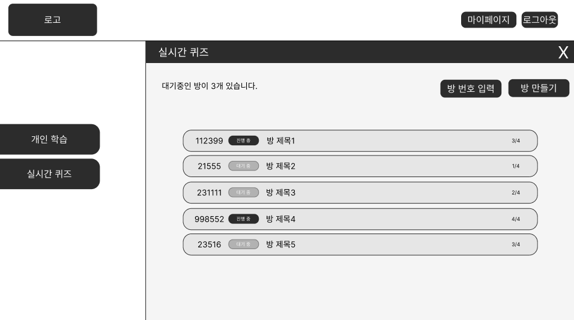
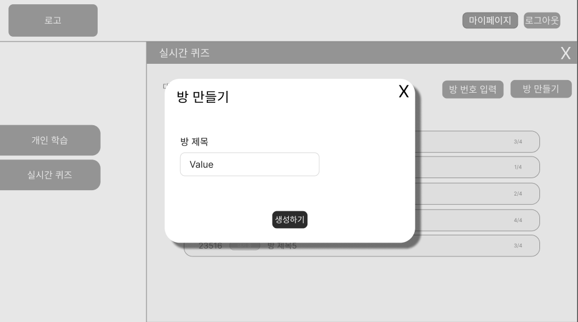
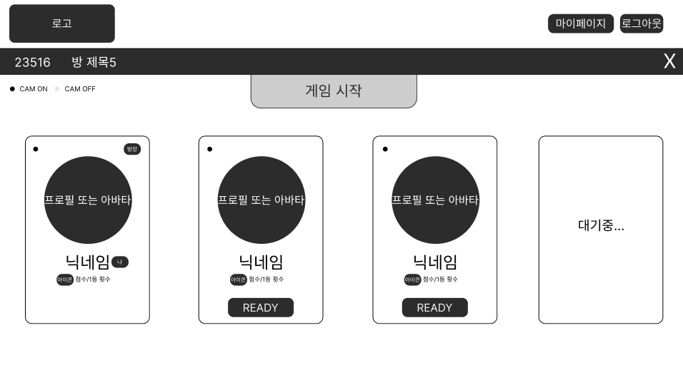
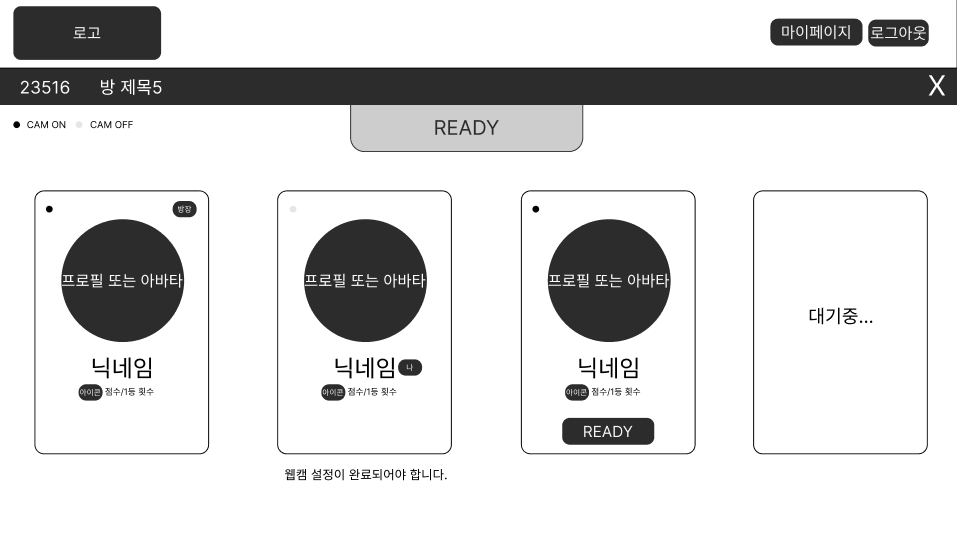
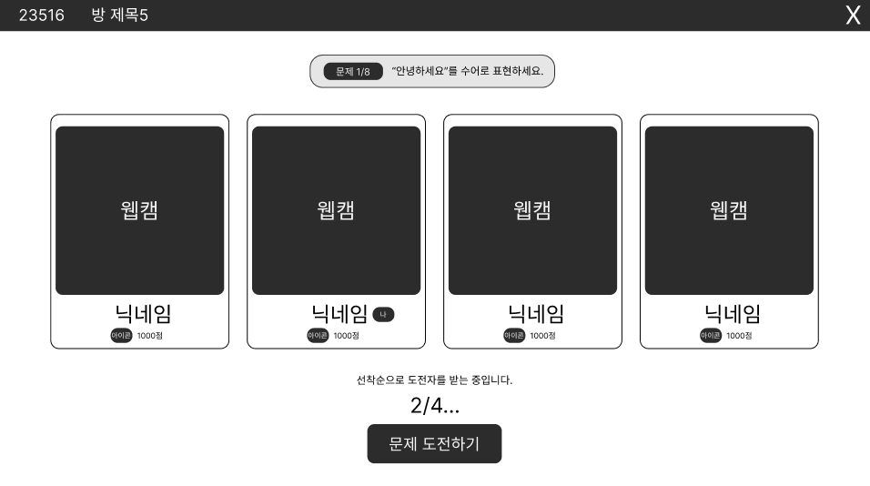
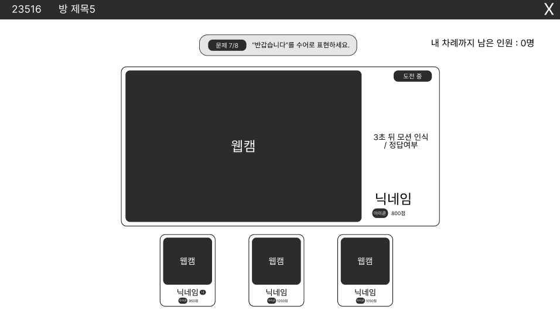
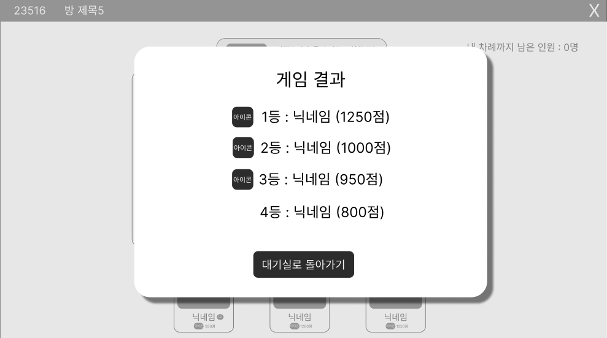

# 5. 실시간 수어 퀴즈 화면 명세서

## 문서 정보

- **문서명**: 실시간 수어 퀴즈 화면 명세서
- **버전**: v1.0.0
- **작성일**: 2025.10.15
- **작성자**: [신동준](https://github.com/sdj3959)
- **최종 수정일**: 2025.10.15

-----

## 1. 개요 (Overview)

본 문서는 사용자가 실시간으로 다른 참여자들과 수어 퀴즈를 즐길 수 있는 기능의 화면 구성과 기능적 요구사항을 정의합니다.
WebRTC 및 WebSocket 기술을 기반으로 미디어파이프를 활용한 수어 손 모양 좌표 추출 및 파이썬 모델을 통한 수어 추론 기능을 포함하며,
방 생성, 참여, 퀴즈 진행, 결과 확인에 이르는 전 과정을 다룹니다. 사용자 간의 상호작용을 통해 학습 효과를 높이고 즐거운 수어 퀴즈 경험을 제공하는 것을 목표로 합니다.

## 2. 사용자 흐름 (User Flow)

사용자는 메인 페이지에서 '실시간 퀴즈' 버튼을 클릭하여 실시간 퀴즈 사이드바를 열고, 방을 탐색하거나 생성하여 퀴즈에 참여합니다.

> **✅ 실시간 퀴즈 시작**: `메인 페이지 (실시간 퀴즈 버튼 클릭)` → `[QUIZ-001] 실시간 퀴즈 사이드바`
> **✅ 방 생성**: `[QUIZ-001] 실시간 퀴즈 사이드바 (방 만들기 버튼 클릭)` → `[QUIZ-002] 방 만들기 모달` → `[QUIZ-003] 퀴즈 대기방 (호스트)`
> **✅ 방 참여**: `[QUIZ-001] 실시간 퀴즈 사이드바 (방 목록 카드 클릭 또는 검색 후 참여)` → `[QUIZ-003] 퀴즈 대기방 (참여자)`
> **✅ 퀴즈 진행**: `[QUIZ-003] 퀴즈 대기방 (START 버튼 클릭)` → `[QUIZ-004] 퀴즈 진행 페이지 (문제 제시)` → `[QUIZ-005] 퀴즈 진행 페이지 (도전자 차례)`
> **✅ 퀴즈 종료**: `[QUIZ-005] 퀴즈 진행 페이지 (모든 문제 완료)` → `[QUIZ-006] 게임 결과 모달` → `[QUIZ-003] 퀴즈 대기방`

- 보다 자세한 전체 사용자 흐름은 아래 링크를 참고해주세요.
- [유저 플로우 전체 흐름 보러가기](../SignBell_사용자%20흐름도%20명세서.md)

-----

## 3. 화면 상세 명세 (Screen Specifications)

### 3.1. [QUIZ-001] 실시간 퀴즈 사이드바

- **화면 설명**: 사용자가 참여할 퀴즈 방을 탐색하거나 새로운 방을 생성할 수 있는 사이드바입니다.

- **진입 조건**: `[MAIN-001] 메인 페이지`에서 '실시간 퀴즈' 버튼 클릭 시.

- **와이어프레임**:
- 

- **레이아웃 및 구성 요소**

| ID  | 구분 | 요소명            | 설명                                                               |
|:----| :--- |:-----------------|:-------------------------------------------------------------------|
| 1-1 | 텍스트 | 대기 중인 방 개수 | "대기중인 방이 N개 있습니다." 텍스트가 표시됩니다.                 |
| 1-2 | 입력 필드 | 방 번호 검색 입력 칸 | 특정 방 번호를 검색할 수 있는 입력 필드입니다.                     |
| 1-3 | 버튼 | 방 번호 검색 버튼 | 입력된 방 번호로 방을 검색합니다.                                  |
| 1-4 | 버튼 | 방 만들기 버튼    | 클릭 시 `[QUIZ-002] 방 만들기 모달`이 나타납니다.                  |
| 1-5 | 리스트 | 방 목록           | 현재 생성된 퀴즈 방 목록이 카드 형태로 표시됩니다. (무한 스크롤)   |
| 1-6 | 카드 | 개별 방 카드      | 방 번호, 진행 상태(진행 중/대기 중), 방 제목, 현재 인원수(N/4)가 표시됩니다. |

- **상호작용 및 정책**
    - **'방 번호 검색 입력 칸' (1-2) 및 '방 번호 검색 버튼' (1-3) 클릭 시**: 입력된 방 번호와 일치하는 방만 방 목록(1-5)에 표시됩니다.
    - **'방 만들기' 버튼 (1-4) 클릭 시**: `[QUIZ-002] 방 만들기 모달`이 화면 중앙에 나타납니다.
    - **'개별 방 카드' (1-6) 클릭 시**: 해당 방에 참여자로서 `[QUIZ-003] 퀴즈 대기방`으로 입장합니다.

-----

### 3.2. [QUIZ-002] 방 만들기 모달

- **화면 설명**: 새로운 퀴즈 방을 생성하기 위한 정보를 입력받는 모달 창입니다.

- **진입 조건**: `[QUIZ-001] 실시간 퀴즈 사이드바`에서 '방 만들기' 버튼 클릭 시.

- **와이어프레임**:
- 

- **레이아웃 및 구성 요소**

| ID  | 구분 | 요소명            | 설명                                                               |
|:----| :--- |:-----------------|:-------------------------------------------------------------------|
| 2-1 | 타이틀 | 모달 제목         | "방 만들기" 텍스트가 표시됩니다.                                   |
| 2-2 | 버튼 | 모달 닫기 버튼    | 클릭 시 모달을 닫고 `[QUIZ-001] 실시간 퀴즈 사이드바`로 돌아갑니다. |
| 2-3 | 텍스트 | 방 제목 텍스트    | "방 제목" 텍스트가 표시됩니다.                                     |
| 2-4 | 입력 필드 | 방 제목 입력 칸   | 생성할 방의 제목을 입력하는 필드입니다.                            |
| 2-5 | 버튼 | 생성하기 버튼     | 입력된 방 제목으로 새로운 방을 생성하고 호스트로서 `[QUIZ-003] 퀴즈 대기방`으로 입장합니다. |

- **상호작용 및 정책**
    - **'모달 닫기 버튼' (2-2) 클릭 시**: 모달이 닫힙니다.
    - **'생성하기' 버튼 (2-5) 클릭 시**: 새로운 퀴즈 방이 생성되고, 사용자는 호스트로서 `[QUIZ-003] 퀴즈 대기방`으로 입장합니다.

-----

### 3.3. [QUIZ-003] 퀴즈 대기방

- **화면 설명**: 퀴즈 시작 전 참여자들이 모여 대기하고, 준비 상태를 확인하며, 방장이 퀴즈를 시작할 수 있는 페이지입니다.

- **진입 조건**: `[QUIZ-001] 실시간 퀴즈 사이드바`에서 방 참여 또는 `[QUIZ-002] 방 만들기 모달`에서 방 생성 시.

- **와이어프레임**:
- 
- 

- **레이아웃 및 구성 요소**

| ID  | 구분 | 요소명            | 설명                                                         |
|:----| :--- |:-----------------|:-----------------------------------------------------------|
| 3-1 | 헤더 | 서비스 로고       | 서비스의 로고가 표시됩니다. 클릭 시 `[MAIN-001] 메인페이지`로 이동합니다. (확인 모달 포함) |
| 3-2 | 헤더 | 마이페이지 버튼   | 클릭 시 `마이페이지`로 이동합니다.    (확인 모달 포함)              |
| 3-3 | 헤더 | 로그아웃 버튼     | 클릭 시 현재 세션을 종료하고 `랜딩 페이지`로 이동합니다.  (확인 모달 포함)              |
| 3-4 | 섹션 | 방 정보 섹션      | 방 번호, 방 제목, 나가기 버튼이 포함된 얇은 섹션입니다.                          |
| 3-5 | 텍스트 | 방 번호           | 현재 방의 고유 번호가 표시됩니다.                                        |
| 3-6 | 텍스트 | 방 제목           | 현재 방의 제목이 표시됩니다.                                           |
| 3-7 | 버튼 | 나가기 버튼       | 클릭 시 `[MAIN-001] 메인 페이지`로 돌아갑니다. (확인 모달 포함)                |
| 3-8 | 툴팁 | 캠 상태 툴팁      | "CAM ON" 또는 "CAM OFF"가 표시되며, 웹캠 활성화 여부를 나타냅니다.             |
| 3-9 | 버튼 | 준비/시작 버튼    | 참여자는 "READY", 방장은 "START" 버튼이 표시됩니다.                       |
| 3-10 | 리스트 | 참여자 정보 카드  | 4개의 카드가 가로로 배치되며, 각 참여자의 정보가 표시됩니다.                        |
| 3-11 | 아이콘 | 캠 상태 점 아이콘 | 참여자의 카메라 활성화 여부를 나타내는 작은 점 아이콘입니다.                         |
| 3-12 | 텍스트 | 방장 표시         | 해당 카드의 참여자가 방장일 경우 "방장" 텍스트 또는 아이콘이 표시됩니다.                 |
| 3-13 | 프로필 | 사용자 프로필 이미지 | 참여자의 프로필 이미지가 표시됩니다.                                       |
| 3-14 | 텍스트 | 닉네임            | 참여자의 닉네임이 표시됩니다. (본인일 경우 "나" 텍스트가 옆에 붙습니다.)                |
| 3-15 | 아이콘 | 코인 아이콘       | 계정 통합 점수를 나타내는 코인 아이콘입니다.                                  |
| 3-16 | 텍스트 | 계정 통합 점수    | 참여자의 현재 계정 통합 점수가 표시됩니다.                                   |
| 3-17 | 텍스트 | READY 표시        | 해당 참여자가 준비 완료 상태일 경우 카드 하단에 "READY" 텍스트가 표시됩니다.            |
| 3-18 | 텍스트 | 대기 중 표시      | 빈 자리일 경우 카드 테두리 안에 "대기중" 텍스트가 표시됩니다.                       |
| 3-19 | 툴팁 | 웹캠 설정 안내 툴팁 | 웹캠이 꺼져있을 경우 카드 외부 하단에 "웹캠 설정이 완료되어야 합니다." 텍스트가 표시됩니다.      |

- **상호작용 및 정책**
    - **'준비/시작' 버튼 (3-9) 클릭 시**:
        - 참여자는 'READY' 상태로 전환됩니다. 웹캠이 꺼져있으면 버튼이 비활성화됩니다.
        - 방장은 모든 참여자가 'READY' 상태이고 본인 웹캠이 켜져있을 경우 'START' 버튼이 활성화됩니다. 클릭 시 `[QUIZ-004] 퀴즈 진행 페이지 (문제 제시)`로 이동합니다.
    - **'나가기' 버튼 (3-1, 3-2, 3-3, 3-7) 클릭 시**: "정말로 나가시겠습니까?" 확인 모달이 뜨며, 확인 시 `[MAIN-001] 메인 페이지`로 돌아갑니다.
    - **방장이 나갈 경우**: 모든 참여자는 강제로 `[MAIN-001] 메인 페이지`로 이동합니다.
    - 헤더의 버튼들은 `[MAIN-001] 메인 페이지`와 동일하게 작동합니다. (단, 퀴즈 대기방/진행 중 마이페이지/로그아웃 버튼 클릭 시 "정말로 나가시겠습니까?" 확인 모달이 뜹니다.)

-----

### 3.4. [QUIZ-004] 퀴즈 진행 페이지 (문제 제시)

- **화면 설명**: 퀴즈가 시작된 후, 문제가 제시되고 참여자들이 도전을 신청할 수 있는 페이지입니다.

- **진입 조건**: `[QUIZ-003] 퀴즈 대기방`에서 방장이 'START' 버튼 클릭 시.

- **와이어프레임**:
- 

- **레이아웃 및 구성 요소**

| ID  | 구분 | 요소명            | 설명                                                            |
|:----| :--- |:-----------------|:--------------------------------------------------------------|
| 4-1 | 헤더 | 방 정보 섹션      | `[QUIZ-003] 퀴즈 대기방`의 방 정보 섹션(방 번호, 방 제목, 나가기 버튼)이 헤더 역할을 합니다. |
| 4-2 | 섹션 | 문제 제시 섹션    | "(문제 N/총 문제수) '단어'를 수어로 표현하세요." 텍스트가 중앙 상단에 표시됩니다.            |
| 4-3 | 리스트 | 플레이어 카드     | 참여자들의 웹캠 영상과 정보가 담긴 카드들이 가로로 배치됩니다.                           |
| 4-4 | 영상 | 웹캠 영상         | 참여자의 실시간 웹캠 영상이 카드 내부에 크게 표시됩니다.                              |
| 4-5 | 텍스트 | 닉네임            | 참여자의 닉네임이 표시됩니다.                                              |
| 4-6 | 아이콘 | 코인 아이콘       | 현재 게임에서 획득한 점수를 나타내는 코인 아이콘입니다.                               |
| 4-7 | 텍스트 | 게임 내 점수      | 현재 게임에서 획득한 점수가 표시됩니다.                                        |
| 4-8 | 툴팁 | 도전자 모집 툴팁  | "선착순으로 도전자를 받는중입니다." 텍스트가 표시됩니다.                              |
| 4-9 | 텍스트 | 도전 신청 인원    | "N/4" 형식으로 현재 도전 신청 인원이 표시됩니다.                                |
| 4-10 | 버튼 | 문제 도전하기 버튼 | 클릭 시 문제 도전 신청을 합니다. (클릭 후 비활성화)                               |

- **상호작용 및 정책**
    - **'문제 도전하기' 버튼 (4-10) 클릭 시**: 사용자는 도전자 목록에 추가되고, 버튼은 비활성화됩니다.
    - 선착순으로 도전 신청 인원(4-9)이 모두 차면, `[QUIZ-005] 퀴즈 진행 페이지 (도전자 차례)`로 자동 전환됩니다.
    - 헤더의 '나가기' 버튼 클릭 시 "정말로 나가시겠습니까?" 확인 모달이 뜹니다.

-----

### 3.5. [QUIZ-005] 퀴즈 진행 페이지 (도전자 차례)

- **화면 설명**: 도전자가 문제를 풀고, 다른 참여자들은 이를 관전하는 페이지입니다.

- **진입 조건**: `[QUIZ-004] 퀴즈 진행 페이지 (문제 제시)`에서 선착순 도전자 모집이 완료되었을 때.

- **와이어프레임**:
- 

- **레이아웃 및 구성 요소**

| ID  | 구분 | 요소명            | 설명                                                               |
|:----| :--- |:-----------------|:-------------------------------------------------------------------|
| 5-1 | 헤더 | 방 정보 섹션      | `[QUIZ-003] 퀴즈 대기방`의 방 정보 섹션(방 번호, 방 제목, 나가기 버튼)이 헤더 역할을 합니다. |
| 5-2 | 섹션 | 문제 제시 섹션    | "(문제 N/총 문제수) '단어'를 수어로 표현하세요." 텍스트가 중앙 상단에 표시됩니다. |
| 5-3 | 텍스트 | 남은 인원 표시    | "내 차례까지 남은 인원: N명" 텍스트가 문제 제시 섹션 오른쪽에 표시됩니다. |
| 5-4 | 카드 | 도전자 메인 카드  | 현재 도전 중인 사용자의 웹캠 영상과 정보가 화면 중앙을 크게 채웁니다. |
| 5-5 | 영상 | 도전자 웹캠       | 도전자의 실시간 웹캠 영상이 크게 표시됩니다.                       |
| 5-6 | 텍스트 | 도전 중 표시      | "도전 중" 텍스트가 카드 오른쪽 상단에 표시됩니다.                  |
| 5-7 | 섹션 | 모션 인식/정답 안내 | "N초 뒤 모션 인식" 또는 "정답 여부"를 알려주는 메시지가 표시됩니다. |
| 5-8 | 텍스트 | 닉네임            | 도전자의 닉네임이 표시됩니다.                                      |
| 5-9 | 아이콘 | 코인 아이콘       | 현재 게임에서 획득한 점수를 나타내는 코인 아이콘입니다.            |
| 5-10 | 텍스트 | 게임 내 점수      | 현재 게임에서 획득한 점수가 표시됩니다.                            |
| 5-11 | 리스트 | 관전자 카드       | 도전자를 제외한 나머지 참여자들의 정보가 담긴 카드들이 가로로 배치됩니다. (2~3개) |
| 5-12 | 영상 | 관전자 웹캠       | 관전자의 실시간 웹캠 영상이 카드 내부에 표시됩니다.                |
| 5-13 | 텍스트 | 닉네임            | 관전자의 닉네임이 표시됩니다. (본인일 경우 "나" 텍스트가 옆에 붙습니다.) |
| 5-14 | 아이콘 | 코인 아이콘       | 현재 게임에서 획득한 점수를 나타내는 코인 아이콘입니다.            |
| 5-15 | 텍스트 | 게임 내 점수      | 현재 게임에서 획득한 점수가 표시됩니다.                            |

- **상호작용 및 정책**
    - 도전자의 모션 인식 결과 또는 정답 여부가 실시간으로 처리되어 모션 인식/정답 안내 섹션(5-7)에 표시됩니다.
    - 한 명이라도 정답을 맞추거나, 모든 도전자가 정답을 맞추지 못했을 경우 다음 문제로 자동 전환됩니다.(다음 문제로 넘어갈 경우 [QUIZ-004] 퀴즈 진행 페이지로 자동 전환됩니다.)
    - 모든 문제가 끝나면 `[QUIZ-006] 게임 결과 모달`이 자동으로 나타납니다.
    - 헤더의 '나가기' 버튼 클릭 시 "정말로 나가시겠습니까?" 확인 모달이 뜹니다.

-----

### 3.6. [QUIZ-006] 게임 결과 모달

- **화면 설명**: 모든 퀴즈가 종료된 후, 게임 결과를 요약하여 보여주고 대기실로 돌아갈 수 있도록 안내하는 모달 창입니다.

- **진입 조건**: `[QUIZ-005] 퀴즈 진행 페이지 (도전자 차례)`에서 모든 문제가 완료되었을 때.

- **와이어프레임**:
- 

- **레이아웃 및 구성 요소**

| ID  | 구분 | 요소명          | 설명                                                                 |
|:----| :--- |:-------------|:-------------------------------------------------------------------|
| 6-1 | 타이틀 | 모달 제목        | "게임 결과" 텍스트가 표시됩니다.                                                |
| 6-2 | 아이콘 | 1~3등 아이콘     | 1~3등 참여자를 나타내는 아이콘입니다.                                             |
| 6-3 | 텍스트 | 1등 결과        | "1~3등 : [닉네임] ([해당 게임에서 얻은 점수])" 형식으로 표시됩니다.                       |
| 6-4 | 텍스트 | 4등 결과        | 아이콘 없이 4등의 닉네임과 점수가 표시되고 1~4등의 결과가 세로로 표시됩니다.                      |
| 6-5 | 버튼 | 대기실로 돌아가기 버튼 | 클릭 시 `[QUIZ-003] 퀴즈 대기방`으로 이동합니다. (모달 닫기 버튼 없음 및 모달 밖 클릭으로 나가기 불가) |

- **상호작용 및 정책**
    - **'대기실로 돌아가기' 버튼 (6-5) 클릭 시**: `[QUIZ-003] 퀴즈 대기방`으로 이동합니다.

-----

### 3.7. [COMMON-001] 나가기 확인 모달

- **화면 설명**: 퀴즈 대기방 또는 퀴즈 진행 중 페이지에서 나가기, 마이페이지, 로그아웃 버튼 클릭 시 사용자에게 정말로 나갈 것인지 확인하는 작은 모달 창입니다.

- **진입 조건**: `[QUIZ-003] 퀴즈 대기방`, `[QUIZ-004] 퀴즈 진행 페이지`, `[QUIZ-005] 퀴즈 진행 페이지`에서 페이지 이탈을 유도하는 버튼 클릭 시.

- **와이어프레임**: (별도의 와이어프레임 이미지 없이 텍스트로 처리)

- **레이아웃 및 구성 요소**
    - **모달 제목**: "알림"
    - **내용 텍스트**: "정말로 나가시겠습니까?"
    - **버튼 1**: "취소" (클릭 시 모달 닫고 현재 페이지 유지)
    - **버튼 2**: "나가기" (클릭 시 해당 기능에 따라 페이지 이탈)

- **상호작용 및 정책**
    - **'취소' 버튼 클릭 시**: 모달이 닫히고 현재 페이지에 머무릅니다.
    - **'나가기' 버튼 클릭 시**:
        - '나가기' 버튼(3-7)을 통해 진입했다면 `[MAIN-001] 메인 페이지`로 이동합니다.
        - 헤더의 '마이페이지' 버튼(3-2, 4-2, 5-1)을 통해 진입했다면 `[MY-001] 마이페이지`로 이동합니다.
        - 헤더의 '로그아웃' 버튼(3-3, 4-3, 5-1)을 통해 진입했다면 `[AUTH-000] 랜딩 페이지`로 이동합니다.

-----

## 변경 이력

| 버전 | 날짜         | 변경 내용 | 작성자 |
| ------ |------------| -------------- |-----|
| v1.0.0 | 2025.10.15 | 초기 문서 작성, 실시간 퀴즈 기능 구성 | 신동준 |