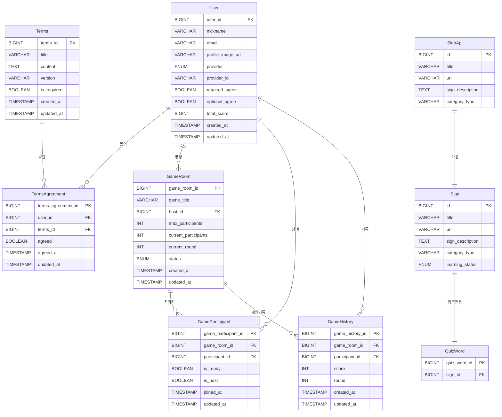
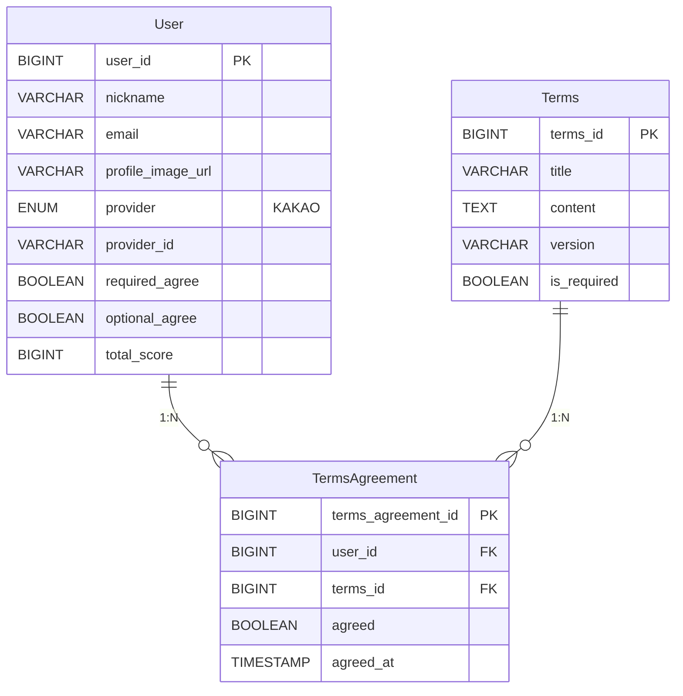
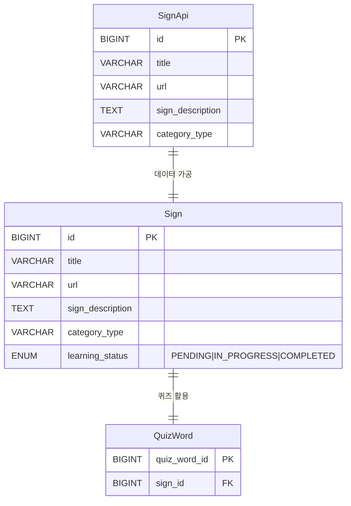
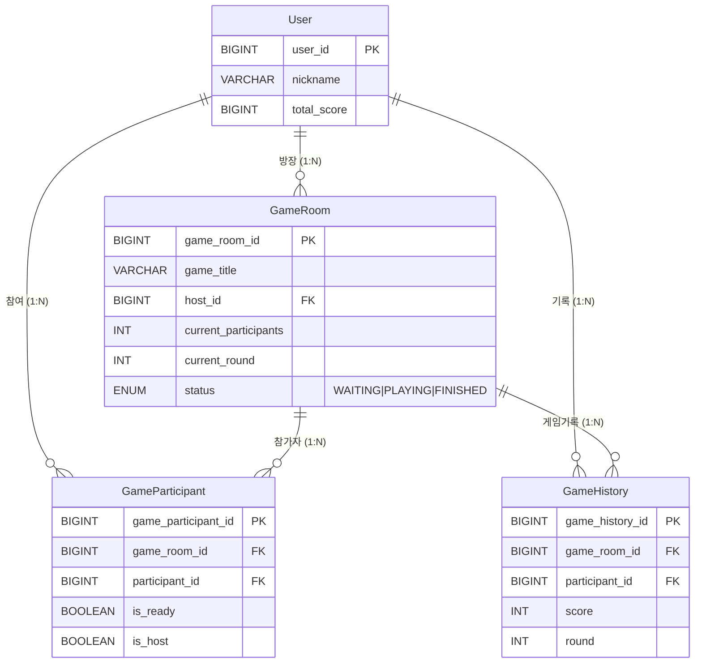

# SignBell 개념 ERD 명세서

본 문서는 **SignBell 플랫폼**의 비즈니스 요구사항을 엔티티와 관계로 표현한 **개념적 데이터 모델 명세서**입니다.

* **작성자:** [고동현](https://github.com/rhehdgus8831)
* **문서 버전:** v1.0.0
* **최종 수정일:** 2025.10.21

**대상 독자:**
- **기획자/PM**: 비즈니스 요구사항과 데이터 구조의 일치성 검토
- **개발자**: 시스템 설계 시 비즈니스 도메인 이해
- **QA**: 테스트 시나리오 설계를 위한 도메인 이해
- **신규 합류자**: SignBell 플랫폼의 비즈니스 모델 이해

---

## 1. 개요

### 1.1. 문서 목적
본 명세서는 SignBell 플랫폼의 핵심 비즈니스 개념과 이들 간의 관계를 정의하여, 모든 이해관계자가 동일한 관점에서 시스템을 이해할 수 있도록 합니다.

### 1.2. SignBell 플랫폼 개요
SignBell은 AI 기술과 WebSocket 기반 실시간 화상통신을 활용한 한국수어(KSL) 학습 플랫폼입니다. 개인 학습 모드와 실시간 퀴즈 모드를 통해 효과적인 수어 학습 경험을 제공합니다.


---

## 2. 핵심 도메인 개념

### 2.1. 주요 엔티티 개요

| 엔티티                        | 비즈니스 개념    | 핵심 역할         |
|----------------------------|------------|---------------|
| **User (사용자)**             | 서비스 이용자    | OAuth2 기반 인증, 학습 진행, 게임 참여 |
| **Sign (수어 데이터)**         | 수어 단어 정보   | AI 학습 상태 관리, 개인 학습 콘텐츠 제공 |
| **GameRoom (게임방)**         | 실시간 퀴즈 공간  | 다중 사용자 퀴즈 게임 진행 |
| **QuizWord (퀴즈 단어)**       | 퀴즈용 수어 단어  | 학습 완료된 단어로 퀴즈 출제 |

### 2.2. 지원 엔티티

| 엔티티                        | 역할          | 관련 도메인  |
|----------------------------|-------------|---------|
| **SignApi (원본 수어 데이터)**   | 외부 API 데이터 저장소 | 수어 학습 |
| **GameParticipant (게임 참가자)** | 게임방 참여 관리 | 실시간 퀴즈 |
| **GameHistory (게임 기록)**    | 게임 결과 저장 | 실시간 퀴즈 |
| **Terms (약관)**             | 서비스 약관 관리 | 사용자 인증 |
| **TermsAgreement (약관 동의)** | 사용자별 약관 동의 이력 | 사용자 인증 |

---

## 3. 엔티티 상세 명세

### 3.1. 사용자(User)
**비즈니스 정의:** SignBell 서비스를 이용하는 개인 사용자

**핵심 속성:**
- 닉네임, 이메일, 프로필 이미지
- OAuth2 공급자 정보 (provider, provider_id)
- 약관 동의 상태 (필수/선택)
- 누적 점수

**비즈니스 규칙:**
- 카카오 OAuth2를 통한 소셜 로그인만 지원
- 필수 약관 동의 없이는 서비스 이용 불가
- 게임 참여를 통해 누적 점수 획득

### 3.2. 수어 데이터(Sign)
**비즈니스 정의:** AI 모델 학습 상태가 관리되는 수어 단어 정보

**핵심 속성:**
- 단어 제목, 영상 URL, 수어 설명
- 카테고리 분류
- AI 모델 학습 상태 (PENDING, IN_PROGRESS, COMPLETED)

**비즈니스 규칙:**
- 외부 API(SignApi)에서 가공되어 생성
- COMPLETED 상태인 데이터만 퀴즈용으로 활용 가능
- 개인 학습에서는 모든 상태의 데이터 활용 가능

### 3.3. 게임방(GameRoom)
**비즈니스 정의:** 실시간 수어 퀴즈가 진행되는 가상 공간

**핵심 속성:**
- 방 제목, 방장, 참여자 수 (최대 4명)
- 게임 상태 (WAITING, PLAYING, FINISHED)
- 현재 라운드

**비즈니스 규칙:**
- 최소 2명 이상 참여 시 게임 시작 가능
- 방장만 게임 시작 권한 보유
- 방장 퇴장 시 방 자동 종료

### 3.4. 퀴즈 단어(QuizWord)
**비즈니스 정의:** AI 학습이 완료되어 퀴즈에 활용 가능한 수어 단어

**핵심 속성:**
- 연결된 Sign 데이터 참조

**비즈니스 규칙:**
- Sign 데이터가 COMPLETED 상태일 때만 생성
- 하나의 Sign 데이터는 하나의 QuizWord만 가질 수 있음
- 실시간 퀴즈에서 문제 출제 시 활용

### 3.5. 원본 수어 데이터(SignApi)
**비즈니스 정의:** 외부 API에서 받은 가공되지 않은 원본 수어 데이터

**핵심 속성:**
- 원본 제목, URL, 설명, 카테고리

**비즈니스 규칙:**
- 외부 API 데이터를 가공 없이 저장 (Staging Table)
- Sign 데이터 생성의 원본 소스 역할

---

## 4. 개념 ERD 다이어그램

### 4.1. 전체 ERD 구조



### 4.2. 도메인별 ERD

#### 4.2.1. 사용자 인증 도메인


#### 4.2.2. 수어 데이터 도메인


#### 4.2.3. 실시간 게임 도메인


### 5.1. 핵심 관계

#### 사용자 중심 관계
- **User ↔ GameRoom**: 1:N (한 사용자는 여러 게임방 생성 가능 - 방장 관계)
- **User ↔ GameParticipant**: 1:N (한 사용자는 여러 게임에 참여 가능)
- **User ↔ GameHistory**: 1:N (한 사용자는 여러 게임 기록 보유)
- **User ↔ TermsAgreement**: 1:N (한 사용자는 여러 약관에 동의)

#### 게임 관련 관계
- **GameRoom ↔ GameParticipant**: 1:N (한 게임방에 여러 참가자)
- **GameRoom ↔ GameHistory**: 1:N (한 게임방에서 여러 게임 기록 생성)

#### 수어 데이터 파이프라인 관계
- **SignApi → Sign**: 1:1 (원본 데이터에서 가공 데이터 생성)
- **Sign ↔ QuizWord**: 1:1 (학습 완료된 수어 데이터만 퀴즈용으로 활용)

#### 인증 및 동의 관계
- **Terms ↔ TermsAgreement**: 1:N (하나의 약관에 여러 사용자 동의)

### 4.2. 참조 관계
- **GameParticipant → User**: N:1 (여러 참가 기록이 하나의 사용자 참조)
- **GameParticipant → GameRoom**: N:1 (여러 참가자가 하나의 게임방 참조)
- **GameHistory → User**: N:1 (여러 게임 기록이 하나의 사용자 참조)
- **GameHistory → GameRoom**: N:1 (여러 게임 기록이 하나의 게임방 참조)
- **TermsAgreement → User**: N:1 (여러 동의 기록이 하나의 사용자 참조)
- **TermsAgreement → Terms**: N:1 (여러 동의 기록이 하나의 약관 참조)

---

## 5. 비즈니스 프로세스 흐름

### 5.1. 사용자 여정
```
카카오 로그인 → 약관 동의 → 개인 학습 or 실시간 퀴즈 선택
    ↓                    ↓                    ↓
회원 정보 저장      개인 수어 학습        실시간 퀴즈 참여
    ↓                    ↓                    ↓
JWT 토큰 발급      거울 모드 연습        게임 결과 저장
```

### 5.2. 수어 데이터 파이프라인 흐름
```
외부 API 데이터 → SignApi (원본 저장) → Sign (가공 + AI 학습 상태)
                                              ↓
                                    COMPLETED 상태 확인
                                              ↓
                                    QuizWord 생성 → 퀴즈 출제
```

### 5.3. 실시간 퀴즈 게임 흐름
```
방 생성 → 참가자 입장 → 준비 완료 → 게임 시작
   ↓           ↓           ↓          ↓
방장 권한   WebSocket 연결  모든 참가자   문제 출제
   ↓           ↓         준비 상태      ↓
방 설정    실시간 화상     확인      선착순 도전
   ↓        통신 연결        ↓          ↓
대기실      참가자 화면    게임 진행   AI 정답 판정
                          ↓          ↓
                      점수 계산   최종 순위 발표
```

### 5.4. AI 모델 학습 상태 관리 흐름
```
SignApi 데이터 → Sign 생성 (PENDING)
                    ↓
              AI 모델 학습 시작 (IN_PROGRESS)
                    ↓
              학습 완료 (COMPLETED)
                    ↓
              QuizWord 생성 → 퀴즈 활용 가능
```

---

## 6. 비즈니스 규칙 요약

### 6.1. 사용자 인증 및 권한
- 카카오 OAuth2만을 통한 소셜 로그인 지원
- 필수 약관 동의 없이는 서비스 이용 불가
- JWT 토큰 기반 인증, HTTP-Only 쿠키로 보안 강화

### 6.2. 게임 참여 규칙
- 실시간 퀴즈는 최소 2명, 최대 4명 참여 가능
- 방장만 게임 시작 권한 보유
- 방장 퇴장 시 방 자동 종료 및 참가자 정리
- 카메라 권한 필수 (수어 동작 인식을 위해)

### 6.3. 수어 데이터 관리
- 외부 API 데이터는 원본 그대로 SignApi에 저장
- AI 학습 상태가 COMPLETED인 데이터만 퀴즈 활용
- 사용자 동작 데이터는 좌표만 저장 (영상 저장 안함)

### 6.4. 점수 및 순위 시스템
- 정답 시 순위별 차등 점수 (1위 100점, 2위 90점, 3위 80점, 4위 70점)
- 오답 시 -50점 차감
- 누적 점수는 사용자 프로필에 저장

---

## 7. 향후 확장 고려사항

### 7.1. Should Have (차기 업데이트) - 엔티티 확장

#### 개인 학습 확장
- **PersonalQuiz (개인 퀴즈)**: 개인 학습 퀴즈 모드 지원
- **LearningProgress (학습 진도)**: 사용자별 학습 진행 상황 추적
- **StudyStatistics (학습 통계)**: 일일/주간 학습량, 정확도 통계
- **WrongAnswerNote (오답노트)**: 틀린 단어 기록 및 복습 관리
- **AIFeedback (AI 피드백)**: 개인 연습 시 AI 유사도 체크 결과 저장

#### 관계 확장
- **User ↔ PersonalQuiz**: 1:N (개인 퀴즈 기록)
- **User ↔ LearningProgress**: 1:N (학습 진도 추적)
- **User ↔ StudyStatistics**: 1:N (학습 통계)
- **User ↔ WrongAnswerNote**: 1:N (오답 기록)

### 7.2. Could Have (중장기 확장) - 새로운 도메인

#### 커뮤니티 기능
- **Community (커뮤니티)**: 학습자 간 소통 공간
- **Post (게시글)**: 팁 공유, 질문 답변 게시글
- **Comment (댓글)**: 게시글 댓글 시스템
- **Friend (친구)**: 친구 관계 및 함께 학습 기능

#### 수익화 모델
- **Subscription (구독)**: 프리미엄 기능 구독 관리
- **Premium Content (프리미엄 콘텐츠)**: 유료 학습 콘텐츠
- **Advertisement (광고)**: 광고 노출 및 수익 관리

#### 게이미피케이션
- **Badge (배지)**: 학습 성취 배지 시스템
- **Achievement (업적)**: 다양한 학습 업적 관리
- **Leaderboard (리더보드)**: 전체 사용자 순위 시스템

#### AI 고도화
- **AIModel (AI 모델)**: 다양한 AI 모델 버전 관리
- **LearningPath (학습 경로)**: 개인화된 학습 경로 추천
- **Chatbot (챗봇)**: 수어 관련 질문 답변 시스템

### 7.3. 다국어 지원 확장
- **Language (언어)**: 다양한 수어 언어 지원 (ASL, JSL 등)
- **LocalizedSign (현지화 수어)**: 언어별 수어 데이터 관리
- **UserLanguagePreference (언어 설정)**: 사용자별 선호 언어 설정

### 7.4. 데이터 구조 확장성 고려사항

#### 현재 설계의 확장 용이성
1. **User 엔티티**: 추가 프로필 정보, 구독 상태, 친구 관계 등 확장 가능
2. **Sign 데이터**: 다국어 버전, 난이도 레벨, 카테고리 세분화 가능
3. **GameRoom**: 다양한 게임 모드, 토너먼트, 리그전 등 확장 가능
4. **점수 시스템**: 전역 랭킹, 시즌별 점수, 배지 연동 등 확장 가능

#### 확장 시 주의사항
- 기존 MVP 구조를 유지하면서 점진적 확장
- 새로운 기능은 기존 사용자 경험을 해치지 않는 선에서 추가
- 데이터 마이그레이션 계획 수립 필요
- 성능 최적화를 위한 인덱스 및 캐싱 전략 고려

---


###  자세한 다이어그램은 다음을 참고해주세요.
* 참고 문서 : [논리 ERD 명세서](SignBell-%20논리%20ERD%20명세서.md)

---

## 8. 변경 이력

| 버전     | 날짜         | 변경 내용                        | 작성자 |
|--------|------------|------------------------------|-----|
| v1.0.0 | 2025.10.21 | 백엔드 엔티티 기반 ERD, 향후 확장 계획 상세화 | 고동현 |
| v1.0.1 | 2025.10.28 | 프론트엔드/백엔드 코드 검증 완료 | 고동현 |

---

이 개념 ERD는 SignBell 플랫폼의 비즈니스 본질을 담고 있으며, 향후 기능 확장 시에도 일관된 도메인 모델 기반으로 발전할 수 있는 기초를 제공합니다. MVP에서 시작하여 단계적으로 확장 가능한 구조로 설계되어 있어, 사용자 피드백과 비즈니스 요구사항에 따라 유연하게 발전시킬 수 있습니다.