# SignBell 플랫폼 - 시스템 아키텍처

본 문서는 SignBell 플랫폼의 **전체 시스템 아키텍처**를 정의합니다.
플랫폼의 핵심 구성 요소(프론트엔드, 백엔드, 데이터베이스, 외부 연동 등)와 그 상호작용 방식을 설명합니다.

**작성자:** [고동현](https://github.com/rhehdgus8831)

**문서 버전**: v1.0.0

**대상 독자:**

*   **프론트엔드 개발자**: API 호출 및 UI 흐름 이해
*   **백엔드 개발자**: 서비스/도메인/DB 계층 아키텍처 파악
*   **운영자/PM**: 시스템 구성과 데이터 흐름 이해
*   **QA/테스터**: 아키텍처 기반 시나리오 테스트 설계
*   **투자자/신규 합류자**: 플랫폼의 기술 구조 한눈에 이해

---

## 1. 전체 아키텍처 개요

SignBell은 **수어 학습 및 실시간 퀴즈 게임 플랫폼**으로, 주요 아키텍처는 다음과 같이 구성됩니다.

*   **Frontend (React 19 + Vite)**
    - React 19.1.1 기반 SPA (Single Page Application)
    - Vite 빌드 도구를 통한 빠른 개발 환경
    - React Router DOM을 통한 클라이언트 사이드 라우팅
    - Zustand를 활용한 전역 상태 관리
    - STOMP.js를 통한 WebSocket 실시간 통신
    - Axios 기반 REST API 통신
    - SASS를 활용한 스타일링
    - Framer Motion을 통한 애니메이션 효과

*   **Backend (Spring Boot 3.5.6)**
    - Java 17 기반 RESTful API 서버
    - Spring Security + JWT 기반 인증/인가
    - OAuth2 소셜 로그인 (카카오, 구글)
    - WebSocket + STOMP를 통한 실시간 양방향 통신
    - Spring Data JPA + QueryDSL을 통한 데이터 접근
    - Lombok을 활용한 코드 간소화
    - P6Spy를 통한 SQL 쿼리 로깅

*   **Database (MariaDB)**
    - 사용자 정보 (User, 소셜 로그인 정보)
    - 게임방 정보 (GameRoom, GameParticipant, GameHistory)
    - 수어 데이터 (Sign, SignApi, QuizWord)
    - 약관 동의 정보 (Terms, TermsAgreement)

*   **Real-time Communication**
    - **WebSocket (Spring STOMP)**: 퀴즈 게임방 실시간 통신 (입장/퇴장/준비/게임 진행)
    - **FastAPI WebSocket**: AI 기반 수어 인식 및 퀴즈 정답 처리
    - **Janus WebRTC Gateway**: 실시간 영상 통신 (수어 학습 및 퀴즈 게임)

*   **External Service (외부 서비스 연동)**
    - **카카오 소셜 로그인**: OAuth2 기반 간편 회원가입/로그인
    - **구글 소셜 로그인**: OAuth2 기반 간편 회원가입/로그인
    - **한국정보화진흥원 수어 API**: 수어 데이터 수집 및 동기화

*   **Infra / Cloud**
    - HTTPS 기반 보안 통신 (SSL/TLS)
    - HTTP-Only 쿠키를 통한 토큰 관리
    - 개발 환경: localhost (Backend: 8443, Frontend: 5173, FastAPI: 8000)

---

## 2. 아키텍처 다이어그램 (Mermaid)

```mermaid
graph TB
    subgraph "Client Layer"
        FE[React Frontend<br/>Vite + React 19]
    end

    subgraph "API Gateway Layer"
        BE[Spring Boot Backend<br/>Port 8443]
        FAST[FastAPI Server<br/>Port 8000]
    end

    subgraph "Real-time Communication"
        WS[WebSocket/STOMP<br/>게임방 실시간 통신]
        FAST_WS[FastAPI WebSocket<br/>수어 인식]
        JANUS[Janus WebRTC<br/>영상 통신]
    end

    subgraph "Data Layer"
        DB[(MariaDB<br/>사용자/게임/수어 데이터)]
    end

    subgraph "External Services"
        KAKAO[카카오 OAuth2]
        GOOGLE[구글 OAuth2]
        SIGN_API[한국정보화진흥원<br/>수어 API]
    end

    FE -->|HTTPS REST API| BE
    FE -->|WebSocket| WS
    FE -->|WebSocket| FAST_WS
    FE -->|WebRTC| JANUS
    
    BE --> WS
    BE --> DB
    BE -->|OAuth2| KAKAO
    BE -->|수어 데이터 동기화| SIGN_API
    
    FAST --> FAST_WS
    FAST -->|수어 인식 결과| BE

    style FE fill:#61dafb
    style BE fill:#6db33f
    style FAST fill:#009688
    style DB fill:#003545
    style WS fill:#ff6b6b
    style FAST_WS fill:#ff6b6b
    style JANUS fill:#ff6b6b
```

---

## 3. 주요 데이터 흐름

### 3.1 회원가입/로그인 (소셜 OAuth2)
1. **소셜 로그인 시작**: FE → 카카오/구글 OAuth2 서버 (인가 코드 요청)
2. **인가 코드 수신**: 카카오/구글 → FE (리다이렉트)
3. **토큰 교환**: FE → BE → 카카오/구글 API (액세스 토큰 획득)
4. **사용자 정보 조회**: BE → 카카오/구글 API (프로필 정보)
5. **회원 등록/조회**: BE → DB (`user` 테이블)
6. **JWT 발급**: BE → FE (HTTP-Only 쿠키로 Access/Refresh Token 전달)
7. **온보딩**: 최초 회원가입 시 약관 동의 페이지로 리다이렉트 (`terms_agreement` 테이블)

### 3.2 수어 학습 (개인 학습)
1. **수어 목록 조회**: FE → BE (`/api/sign-edu/signs`) → DB (`sign` 테이블)
2. **수어 상세 조회**: FE → BE (`/api/sign-edu/signs/{id}`) → DB
3. **영상 재생**: FE → 수어 영상 URL (외부 스토리지)
4. **거울 모드**: FE → 웹캠 활성화 → MediaPipe 손동작 인식
5. **학습 데이터 제출**: FE → BE → DB (학습 기록 저장)

### 3.3 실시간 퀴즈 게임
1. **게임방 생성**: FE → BE (`POST /api/quiz/rooms`) → DB (`game_room` 테이블)
2. **게임방 목록 조회**: FE → BE (`GET /api/quiz/rooms`) → DB
3. **게임방 입장**:
    - FE → WebSocket 연결 (`/ws`)
    - FE → STOMP 구독 (`/topic/room/{roomId}`)
    - FE → 입장 메시지 전송 (`/app/room/{roomId}/join`)
    - BE → DB (`game_participant` 테이블 업데이트)
    - BE → 모든 참가자에게 브로드캐스트 (`/topic/room/{roomId}`)
4. **준비 상태 변경**: FE → STOMP (`/app/room/{roomId}/ready`) → BE → DB → 브로드캐스트
5. **게임 시작**:
    - 방장이 시작 버튼 클릭
    - BE → 퀴즈 문제 선정 (`quiz_word` 테이블)
    - BE → 모든 참가자에게 문제 전송
6. **수어 정답 제출**:
    - FE → 웹캠 영상 캡처
    - FE → FastAPI WebSocket (`/ws`) → AI 수어 인식
    - FastAPI → 정답 여부 판단 → FE
    - FE → BE (점수 업데이트 요청)
    - BE → DB (`game_history`, `user.total_score` 업데이트)
7. **게임 종료**: BE → 최종 결과 집계 → 브로드캐스트 → FE (결과 모달 표시)

### 3.4 수어 데이터 동기화
1. **외부 API 호출**: BE → 한국정보화진흥원 수어 API
2. **데이터 파싱**: BE → 수어 정보 추출 (제목, URL, 설명, 카테고리)
3. **DB 저장**: BE → DB (`sign`, `sign_api` 테이블)
4. **학습 상태 관리**: `sign.learning_status` (PENDING/IN_PROGRESS/COMPLETED)

---

## 4. 운영 고려 사항

### 4.1 보안
- **JWT 기반 인증**: Access Token (15분) + Refresh Token (7일)
- **HTTP-Only 쿠키**: XSS 공격 방지를 위한 토큰 저장
- **Spring Security**: Role 기반 API 접근 제어
- **HTTPS 통신**: SSL/TLS 암호화 (개발: 자체 서명 인증서)
- **CORS 설정**: 허용된 Origin만 API 접근 가능
- **WebSocket 인증**: JWT 기반 WebSocket 연결 인증

### 4.2 개인정보 보호
- OAuth2를 통한 최소한의 개인정보 수집 (닉네임, 이메일, 프로필 이미지)
- 약관 동의 내역 관리 (필수/선택 약관 분리)
- 사용자 프로필 수정 기능 제공

### 4.3 성능 최적화
- **QueryDSL**: 복잡한 쿼리 최적화
- **Lazy Loading**: JPA 연관 관계 지연 로딩
- **인덱스**: 자주 조회되는 컬럼에 인덱스 설정 (`sign.learning_status`)
- **WebSocket 세션 관리**: 중복 연결 방지 (UserSessionRegistry)
- **Vite HMR**: 개발 중 빠른 핫 리로드

### 4.4 확장성
- **마이크로서비스 분리 가능**: FastAPI 서버 독립 운영(서버 분리 중)
- **WebSocket 스케일 아웃**: STOMP Broker 외부화 가능 (RabbitMQ, Redis)
- **데이터베이스 샤딩**: 사용자 수 증가 시 수평 확장 가능
- **CDN 활용**: 수어 영상 파일 CDN 배포 가능

---

### 5.2 주요 서비스
- `UserService`: 사용자 관리
- `CustomOAuth2UserService`: OAuth2 로그인 처리
- `CreateRoomService`: 게임방 생성
- `GameRoomJoinService`: 게임방 입장
- `GameRoomReadyService`: 준비 상태 관리
- `QuizService`: 퀴즈 게임 로직
- `SignEduService`: 수어 학습 데이터 제공
- `SignService`: 수어 데이터 관리
- `SignApiService`: 외부 API 수어 데이터 동기화

## 6. 추후 업데이트 계획

### 6.1 기능 개선
- **AI 수어 인식 정확도 향상**: FastAPI 모델 학습 데이터 확대
- **랭킹 시스템**: 전체/주간/월간 랭킹 기능 추가
- **친구 시스템**: 친구 추가 및 1:1 대결 기능
- **수어 학습 진도 관리**: 학습 완료율 및 복습 알림

### 6.2 성능 최적화
- **Redis 캐싱**: 자주 조회되는 데이터 캐싱 (게임방 목록, 수어 데이터)
- **메시지 브로커 도입**: RabbitMQ/Redis를 통한 WebSocket 스케일 아웃
- **CDN 배포**: 수어 영상 파일 CDN 배포로 로딩 속도 개선

### 6.3 인프라 개선
- **CI/CD 파이프라인**: GitHub Actions를 통한 자동 배포
- **모니터링**: Prometheus + Grafana를 통한 시스템 모니터링
- **로그 관리**: ELK Stack을 통한 중앙 집중식 로그 관리
- **컨테이너화**: Docker + Kubernetes를 통한 배포 자동화

### 6.4 보안 강화
- **Rate Limiting**: API 요청 제한을 통한 DDoS 방어
- **입력 검증 강화**: XSS, SQL Injection 방어
- **정기 보안 감사**: 의존성 취약점 점검 및 업데이트

## 7. 변경 이력

| 버전     | 날짜         | 변경 내용    | 작성자 |
|--------|------------|----------|-----|
| v1.0.0 | 2025.10.27 | 초기 문서 작성 | 고동현 |