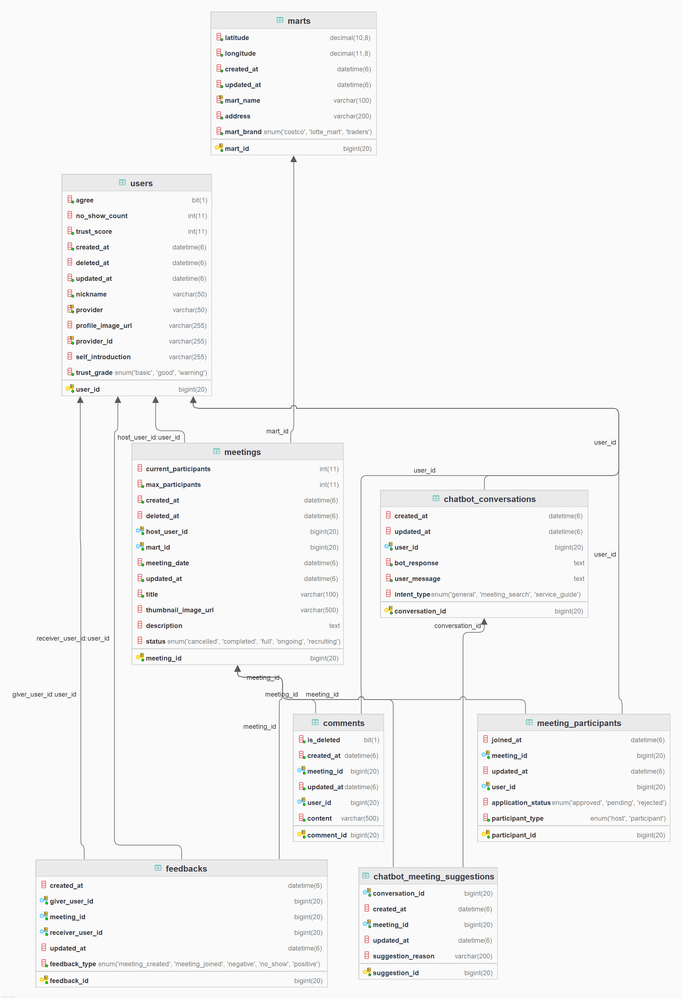

# SignBell ERD 명세서

본 문서는 **SignBell 플랫폼**의 데이터베이스 구조를 정의하는 **최종 ERD 명세서**입니다.

**작성자:** [고동현](https://github.com/rhehdgus8831)
**문서 버전:** v1.0.0
**작성일:** 2025.10.21
**참고 문서:** 논리 ERD 명세서, 개념 ERD 명세서, 스키마 가이드, 백엔드 엔티티 구현

**대상 독자:**
- **프로젝트 멤버**: 엔티티 구조와 관계 정의를 코드(Entity/Repository)로 구현
- **개발자**: 시스템 설계 시 비즈니스 도메인 이해
- **DBA**: 데이터베이스 관리 및 최적화
- **신규 합류자**: SignBell 플랫폼의 데이터 구조 이해

---

## 1. 개요

### 1.1. 문서 목적
본 명세서는 SignBell 플랫폼의 데이터베이스 구조를 명확히 정의하여, 모든 개발자가 일관된 이해를 바탕으로 개발할 수 있도록 합니다.

### 1.2. 표기법 안내
- **PK (Primary Key)**: 테이블의 각 레코드를 고유하게 식별하는 기본 키
- **FK (Foreign Key)**: 다른 테이블의 PK를 참조하여 테이블 간의 관계를 설정하는 외래 키
- **UNIQUE**: 해당 컬럼(또는 컬럼 조합)의 모든 값이 고유해야 함을 나타내는 제약 조건
- **NOT NULL**: 해당 컬럼에 반드시 값이 존재해야 함을 의미

### 1.3. 다이어그램




---

## 2. 테이블 명세

### 2.1. User (사용자)
- **설명**: SignBell 서비스를 이용하는 개인 사용자 정보를 관리
- **비고**: OAuth2 기반 소셜 로그인 지원, 약관 동의 상태 관리

| 컬럼명 | 데이터 타입 | 키 | 제약 조건 | 설명 |
|--------|------------|---|-----------|------|
| `user_id` | BIGINT | PK | NOT NULL, AUTO_INCREMENT | 사용자 고유 ID |
| `nickname` | VARCHAR(255) | | NOT NULL | 닉네임 |
| `email` | VARCHAR(255) | | UNIQUE | 이메일 |
| `profile_image_url` | VARCHAR(1024) | | | 프로필 이미지 URL |
| `provider` | ENUM('KAKAO') | | NOT NULL | OAuth 공급자 (로그인 방식) |
| `provider_id` | VARCHAR(255) | | NOT NULL | OAuth 공급자에서 부여한 ID |
| `required_agree` | BOOLEAN | | NOT NULL, DEFAULT FALSE | 필수 약관 동의 여부 |
| `optional_agree` | BOOLEAN | | NOT NULL, DEFAULT FALSE | 선택 약관 동의 여부 |
| `total_score` | BIGINT | | NOT NULL, DEFAULT 0 | 사용자 누적 점수 |
| `created_at` | TIMESTAMP | | DEFAULT CURRENT_TIMESTAMP | 가입 시간 |
| `updated_at` | TIMESTAMP | | DEFAULT CURRENT_TIMESTAMP ON UPDATE CURRENT_TIMESTAMP | 마지막 수정 시간 |

**인덱스:**
- `uk_provider_id`: (provider, provider_id) UNIQUE

### 2.2. Terms (약관)
- **설명**: 서비스 이용약관 및 개인정보처리방침 등 약관 정보 관리
- **비고**: 버전 관리를 통한 약관 변경 이력 추적

| 컬럼명 | 데이터 타입 | 키 | 제약 조건 | 설명 |
|--------|------------|---|-----------|------|
| `terms_id` | BIGINT | PK | NOT NULL, AUTO_INCREMENT | 약관 ID |
| `title` | VARCHAR(255) | | NOT NULL | 약관 제목 |
| `content` | TEXT | | NOT NULL | 약관 내용 |
| `version` | VARCHAR(50) | | NOT NULL | 약관 버전 |
| `is_required` | TINYINT | | NOT NULL | 필수 약관 여부 |
| `created_at` | TIMESTAMP | | DEFAULT CURRENT_TIMESTAMP | 약관 등록 일시 |
| `updated_at` | TIMESTAMP | | DEFAULT CURRENT_TIMESTAMP ON UPDATE CURRENT_TIMESTAMP | 마지막 수정 시간 |

### 2.3. TermsAgreement (약관 동의)
- **설명**: 사용자별 약관 동의 이력 관리
- **비고**: 사용자와 약관 간의 다대다 관계를 해결하는 연결 테이블

| 컬럼명 | 데이터 타입 | 키 | 제약 조건 | 설명 |
|--------|------------|---|-----------|------|
| `terms_agreement_id` | BIGINT | PK | NOT NULL, AUTO_INCREMENT | 약관별 동의여부 ID |
| `user_id` | BIGINT | FK | NOT NULL | 사용자 ID (FK) |
| `terms_id` | BIGINT | FK | NOT NULL | 약관 ID (FK) |
| `agreed` | TINYINT | | NOT NULL | 동의여부 (T/F) |
| `agreed_at` | TIMESTAMP | | | 동의일시 |
| `updated_at` | TIMESTAMP | | DEFAULT CURRENT_TIMESTAMP ON UPDATE CURRENT_TIMESTAMP | 마지막 수정시간 |

**외래키 제약조건:**
- `fk_terms_agreement_user`: user_id → user(user_id) ON DELETE CASCADE
- `fk_terms_agreement_terms`: terms_id → terms(terms_id) ON DELETE CASCADE

### 2.4. SignApi (원본 수어 데이터)
- **설명**: 외부 API에서 받은 가공되지 않은 원본 수어 데이터 저장 (Staging Table)
- **비고**: 데이터 파이프라인의 첫 번째 단계

| 컬럼명 | 데이터 타입 | 키 | 제약 조건 | 설명 |
|--------|------------|---|-----------|------|
| `id` | BIGINT | PK | NOT NULL, AUTO_INCREMENT | 국어원 API 수어단어 ID |
| `title` | VARCHAR(255) | | NOT NULL | 이름 |
| `url` | VARCHAR(1024) | | NOT NULL | 영상 URL |
| `sign_description` | TEXT | | CHARACTER SET utf8mb4 COLLATE utf8mb4_unicode_ci | 수어 설명 |
| `category_type` | VARCHAR(100) | | | 카테고리 |

### 2.5. Sign (수어 데이터)
- **설명**: 가공된 수어 데이터와 AI 모델 학습 상태 관리
- **비고**: SignApi에서 가공되어 생성, AI 학습 상태 추적

| 컬럼명 | 데이터 타입 | 키 | 제약 조건 | 설명 |
|--------|------------|---|-----------|------|
| `id` | BIGINT | PK | NOT NULL, AUTO_INCREMENT | 수어 데이터 ID |
| `title` | VARCHAR(255) | | NOT NULL | 단어 제목 |
| `url` | VARCHAR(1024) | | NOT NULL | 영상 URL |
| `sign_description` | TEXT | | CHARACTER SET utf8mb4 COLLATE utf8mb4_unicode_ci | 수어 설명 |
| `category_type` | VARCHAR(100) | | | 카테고리 |
| `learning_status` | ENUM('PENDING', 'IN_PROGRESS', 'COMPLETED') | | NOT NULL, DEFAULT 'PENDING' | 모델 학습 상태 |

**인덱스:**
- `idx_learning_status`: learning_status

### 2.6. QuizWord (퀴즈 단어)
- **설명**: AI 학습이 완료되어 퀴즈에 활용 가능한 수어 단어
- **비고**: Sign 데이터가 COMPLETED 상태일 때만 생성

| 컬럼명 | 데이터 타입 | 키 | 제약 조건 | 설명 |
|--------|------------|---|-----------|------|
| `quiz_word_id` | BIGINT | PK | NOT NULL, AUTO_INCREMENT | 퀴즈용 단어 ID |
| `sign_id` | BIGINT | FK | NOT NULL, UNIQUE | 학습 완료된 수어 단어 ID (FK) |

**외래키 제약조건:**
- `fk_quiz_word_sign`: sign_id → sign(id) ON DELETE CASCADE

**인덱스:**
- `uk_quiz_word_sign_id`: sign_id UNIQUE

### 2.7. GameRoom (게임방)
- **설명**: 실시간 수어 퀴즈가 진행되는 가상 공간
- **비고**: 최대 4명 참여, 방장 권한 관리

| 컬럼명 | 데이터 타입 | 키 | 제약 조건 | 설명 |
|--------|------------|---|-----------|------|
| `game_room_id` | BIGINT | PK | NOT NULL, AUTO_INCREMENT | 게임방 ID |
| `game_title` | VARCHAR(255) | | NOT NULL | 게임방 제목 |
| `host_id` | BIGINT | FK | NOT NULL | 방장 User ID (FK) |
| `max_participants` | INT | | DEFAULT 4 | 게임방 최대 인원 수 (4 고정) |
| `current_participants` | INT | | DEFAULT 1 | 게임방 현재 인원 수 |
| `current_round` | INT | | NOT NULL, DEFAULT 1 | 현재 라운드 |
| `status` | ENUM('WAITING', 'PLAYING', 'FINISHED') | | NOT NULL | 상태값 (대기중/진행중/종료) |
| `created_at` | TIMESTAMP | | DEFAULT CURRENT_TIMESTAMP | 생성 시간 |
| `updated_at` | TIMESTAMP | | DEFAULT CURRENT_TIMESTAMP ON UPDATE CURRENT_TIMESTAMP | 수정 시간 |

**외래키 제약조건:**
- `fk_game_room_user`: host_id → user(user_id)

### 2.8. GameParticipant (게임 참가자)
- **설명**: 게임방 참여자 목록 및 상태 관리
- **비고**: 게임방과 사용자 간의 다대다 관계 해결

| 컬럼명 | 데이터 타입 | 키 | 제약 조건 | 설명 |
|--------|------------|---|-----------|------|
| `game_participant_id` | BIGINT | PK | NOT NULL, AUTO_INCREMENT | 게임 참가자 ID |
| `game_room_id` | BIGINT | FK | NOT NULL | 게임방 ID (FK) |
| `participant_id` | BIGINT | FK | NOT NULL | 참가자 User ID (FK) |
| `is_ready` | BOOLEAN | | NOT NULL, DEFAULT FALSE | 준비 상태 (방장은 항상 FALSE) |
| `is_host` | BOOLEAN | | NOT NULL | 방장 여부 |
| `joined_at` | TIMESTAMP | | DEFAULT CURRENT_TIMESTAMP | 입장 시각 |
| `updated_at` | TIMESTAMP | | DEFAULT CURRENT_TIMESTAMP ON UPDATE CURRENT_TIMESTAMP | 수정 시간 |

**외래키 제약조건:**
- `fk_game_participant_game_room`: game_room_id → game_room(game_room_id) ON DELETE CASCADE
- `fk_game_participant_user`: participant_id → user(user_id) ON DELETE CASCADE

### 2.9. GameHistory (게임 기록)
- **설명**: 게임 진행 기록 및 점수 관리
- **비고**: 라운드별 점수 기록, 사용자 통계 산출 기초 데이터

| 컬럼명 | 데이터 타입 | 키 | 제약 조건 | 설명 |
|--------|------------|---|-----------|------|
| `game_history_id` | BIGINT | PK | NOT NULL, AUTO_INCREMENT | 게임 기록 고유 ID |
| `game_room_id` | BIGINT | FK | NOT NULL | 게임방 ID (FK) |
| `participant_id` | BIGINT | FK | NOT NULL | 유저 ID (FK) |
| `score` | INT | | NOT NULL | 점수 |
| `round` | INT | | NOT NULL | 회차 |
| `created_at` | TIMESTAMP | | DEFAULT CURRENT_TIMESTAMP | 생성 시간 |
| `updated_at` | TIMESTAMP | | DEFAULT CURRENT_TIMESTAMP ON UPDATE CURRENT_TIMESTAMP | 수정 시간 |

**외래키 제약조건:**
- `fk_game_history_game_room`: game_room_id → game_room(game_room_id) ON DELETE CASCADE
- `fk_game_history_user`: participant_id → user(user_id) ON DELETE CASCADE

---

## 3. 관계 다이어그램

### 3.1. 핵심 관계

#### 사용자 중심 관계
- **User ↔ GameRoom**: 1:N (한 사용자는 여러 게임방 생성 가능 - 방장 관계)
- **User ↔ GameParticipant**: 1:N (한 사용자는 여러 게임에 참여 가능)
- **User ↔ GameHistory**: 1:N (한 사용자는 여러 게임 기록 보유)
- **User ↔ TermsAgreement**: 1:N (한 사용자는 여러 약관에 동의)

#### 게임 관련 관계
- **GameRoom ↔ GameParticipant**: 1:N (한 게임방에 여러 참가자)
- **GameRoom ↔ GameHistory**: 1:N (한 게임방에서 여러 게임 기록 생성)

#### 수어 데이터 파이프라인 관계
- **SignApi → Sign**: 1:1 (원본 데이터에서 가공 데이터 생성)
- **Sign ↔ QuizWord**: 1:1 (학습 완료된 수어 데이터만 퀴즈용으로 활용)

#### 인증 및 동의 관계
- **Terms ↔ TermsAgreement**: 1:N (하나의 약관에 여러 사용자 동의)

### 3.2. 데이터 흐름

#### 사용자 인증 흐름
```
카카오 OAuth2 로그인 → User 생성 → Terms 조회 → TermsAgreement 생성
```

#### 수어 데이터 파이프라인 흐름
```
외부 API → SignApi (원본 저장) → Sign (가공 + AI 학습) → QuizWord (퀴즈 활용)
```

#### 게임 진행 흐름
```
GameRoom 생성 → GameParticipant 입장 → 게임 시작 → GameHistory 기록
```

---

## 4. 비즈니스 규칙

### 4.1. 사용자 인증 및 권한
- 카카오 OAuth2만을 통한 소셜 로그인 지원
- 필수 약관 동의 없이는 서비스 이용 불가
- provider와 provider_id 조합으로 유니크 제약조건 설정

### 4.2. 게임 참여 규칙
- 실시간 퀴즈는 최소 2명, 최대 4명 참여 가능
- 방장만 게임 시작 권한 보유
- 방장 퇴장 시 방 자동 종료 및 참가자 정리

### 4.3. 수어 데이터 관리
- 외부 API 데이터는 원본 그대로 SignApi에 저장
- AI 학습 상태가 COMPLETED인 데이터만 퀴즈 활용
- 하나의 Sign 데이터는 하나의 QuizWord만 가질 수 있음

### 4.4. 점수 및 순위 시스템
- 정답 시 순위별 차등 점수 부여
- 오답 시 점수 차감
- 누적 점수는 사용자 프로필에 저장

---

## 5. 성능 최적화 고려사항

### 5.1. 인덱스 전략
- `sign.learning_status`: 퀴즈용 데이터 조회 최적화
- `user.provider, provider_id`: OAuth 인증 최적화
- `quiz_word.sign_id`: 중복 방지 및 조회 최적화

### 5.2. 비정규화 설계
- `game_room.current_participants`: 실시간 인원 수 조회 최적화
- `game_participant.is_host`: 방장 여부 판단 최적화
- `user.required_agree, optional_agree`: 약관 동의 상태 조회 최적화

---

## 6. 개발 가이드라인

### 6.1. 트랜잭션 관리
게임방 참여/퇴장, 방장 변경 등 여러 테이블을 동시에 변경하는 로직은 반드시 트랜잭션으로 처리

### 6.2. 데이터 일관성
- `current_participants` 값은 실제 참가자 수와 일치해야 함
- `is_host` 값은 `game_room.host_id`와 일치해야 함

### 6.3. 확장성 고려
- ENUM 타입 확장 시 ALTER TABLE 필요
- 새로운 OAuth 공급자 추가 시 LoginMethod ENUM 확장
- AI 학습 상태 추가 시 SignStatus ENUM 확장

---

## 7. 변경 이력

| 버전 | 날짜 | 변경 내용 | 작성자 |
|------|------|-----------|--------|
| v1.0 | 2025.10.21 | 논리 ERD와 백엔드 엔티티 기반 ERD 명세서 작성 | Kiro AI |

---

이 ERD 명세서는 SignBell 플랫폼의 현재 구현 상태를 정확히 반영하며, 향후 기능 확장 시에도 일관된 데이터 구조를 유지할 수 있는 기초를 제공합니다.