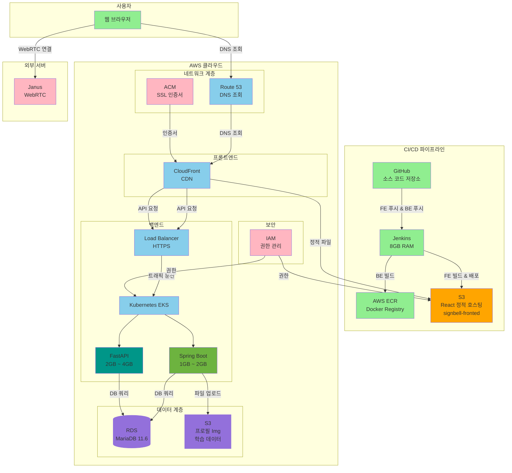
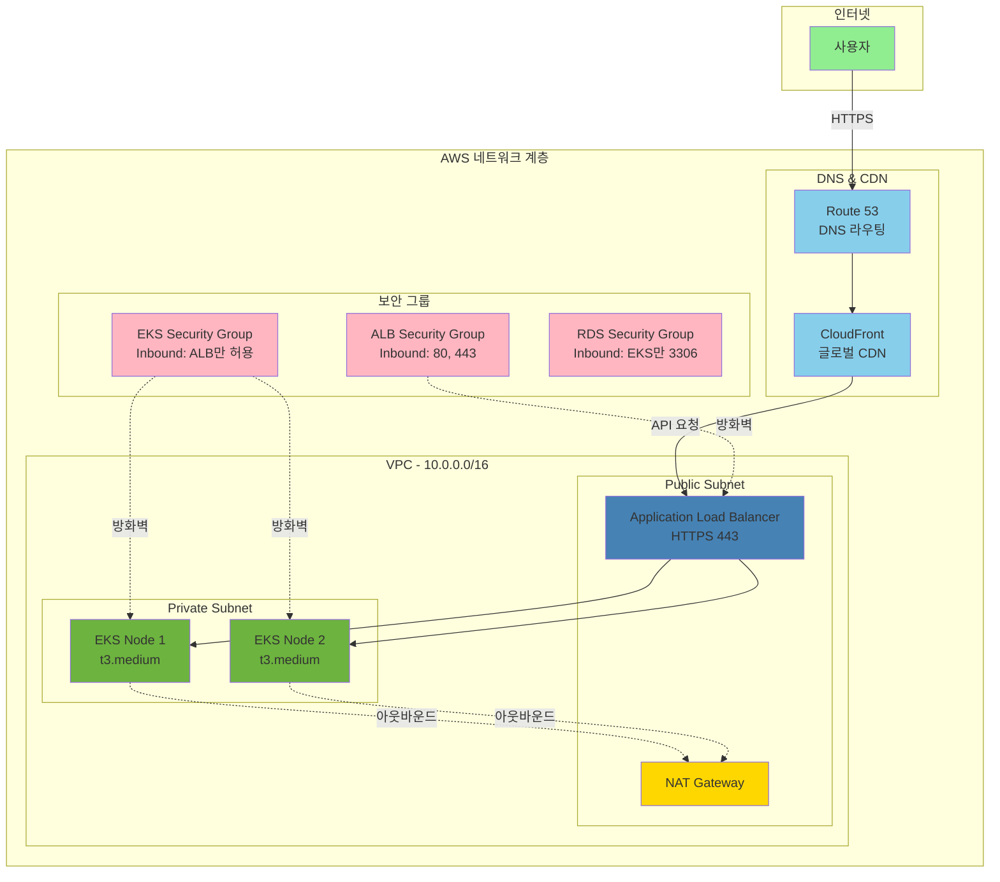
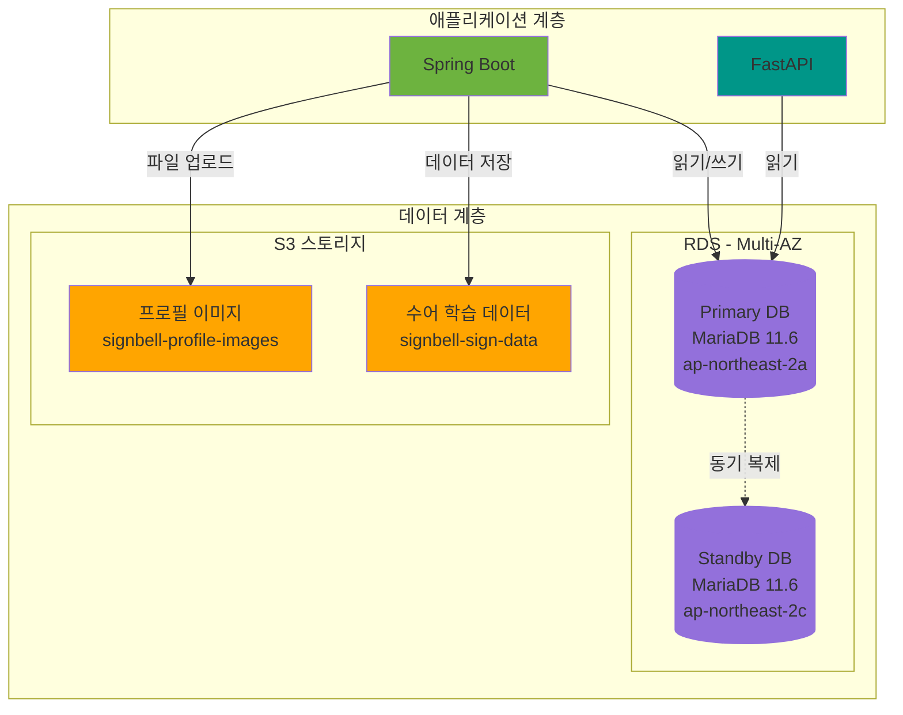
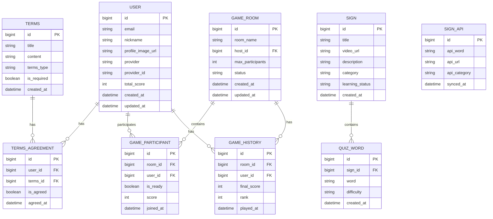
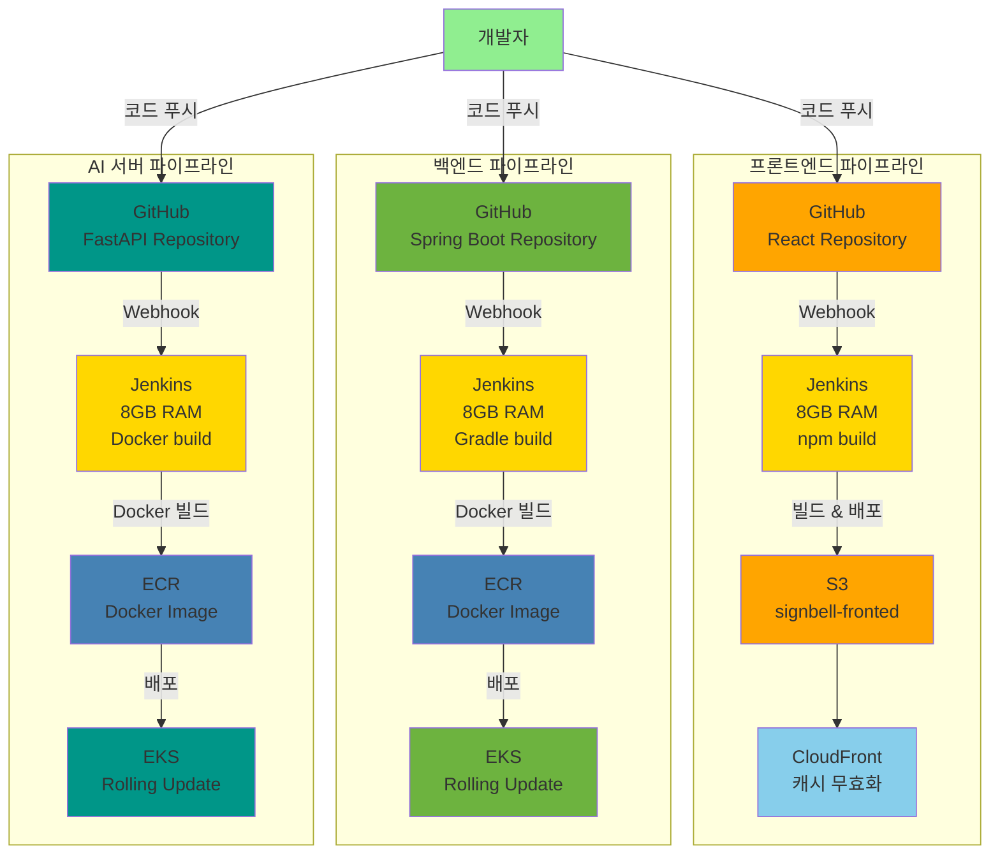

# SignBell 플랫폼 - 인프라 아키텍처

본 문서는 SignBell 플랫폼의 **인프라 아키텍처**를 정의합니다.
CI/CD 파이프라인, AWS 클라우드 인프라, 네트워크 구성, 보안 체계 등 전체 인프라 구조와 배포 전략을 설명합니다.

**작성자:** [고동현](https://github.com/rhehdgus8831)

**문서 버전**: v1.0.0

**최초 작성일:** 2025.11.02

**대상 독자:**

- DevOps 엔지니어: 인프라 구축 및 운영 관리
- 백엔드 개발자: 배포 환경 및 인프라 구조 이해
- 프론트엔드 개발자: CDN 및 정적 호스팅 구조 파악
- 보안 담당자: 네트워크 보안 및 인증서 관리 이해
- PM/운영자: 전체 인프라 비용 및 확장성 파악

---

## 1. 전체 인프라 아키텍처 개요

## 2. 네트워크 계층 아키텍처

## 3. 데이터 계층 아키텍처

### 3.1 데이터베이스 ERD

## 4. CI/CD 파이프라인

## 5. 인프라 구성 요소 상세

### 5.1 CI/CD 파이프라인

#### Jenkins
- 호스팅: AWS EC2 또는 자체 서버
- 메모리: 8GB RAM
- 역할: 자동화된 빌드, 테스트, 배포
- 주요 기능:
  - GitHub Webhook 연동
  - 프론트엔드: npm build → S3 배포
  - 백엔드: Gradle build → Docker 이미지 → ECR → EKS 배포

#### GitHub
- Private Repository
- 브랜치 전략: Git Flow (main, develop, feature/*, hotfix/*)
- Webhook: Jenkins 자동 빌드 트리거

#### ECR (Elastic Container Registry)
- Docker 이미지 저장소
- 리전: ap-northeast-2 (서울)
- 이미지 태깅: latest, v1.0.0, build-number

### 5.2 프론트엔드 인프라

#### S3 (Simple Storage Service)
- 버킷명: signbell-fronted
- 역할: React SPA 정적 웹 호스팅
- 설정:
  - 정적 웹 사이트 호스팅 활성화
  - CloudFront OAI만 접근 허용
  - 버전 관리 활성화

#### CloudFront (CDN)
- 역할: 글로벌 콘텐츠 전송 네트워크
- Origin: S3 (정적 파일), ALB (API 요청)
- 캐싱 정책:
  - HTML: 짧은 TTL (5분)
  - JS/CSS/이미지: 긴 TTL (1일)
- SSL/TLS: ACM 인증서 연결

#### Route 53 (DNS)
- 역할: 도메인 DNS 관리
- A 레코드: CloudFront 연결
- Health Check: API 서버 상태 모니터링

### 5.3 백엔드 인프라

#### Kubernetes (EKS)
- 클러스터명: signbell-prod-cluster
- Kubernetes 버전: 1.28+
- 노드 그룹:
  - 인스턴스 타입: t3.medium (2 vCPU, 4GB RAM)
  - 최소/최대 노드: 2 ~ 5개
  - Auto Scaling: CPU 70% 이상 시 확장

#### Spring Boot Deployment
- 컨테이너 이미지: ECR에서 Pull
- Replicas: 2개 (고가용성)
- 리소스:
  - Requests: CPU 500m, Memory 1Gi
  - Limits: CPU 1000m, Memory 2Gi
- Health Check: /actuator/health
- 배포 전략: Rolling Update (무중단 배포)

#### FastAPI Deployment
- 컨테이너 이미지: ECR에서 Pull
- Replicas: 1개
- 리소스:
  - Requests: CPU 1000m, Memory 2Gi
  - Limits: CPU 2000m, Memory 4Gi
- Health Check: /health
- 역할: AI 수어 인식 모델 추론

#### Load Balancer (ALB)
- 타입: Application Load Balancer
- 스킴: internet-facing
- Listener:
  - 443 (HTTPS): 백엔드 API 라우팅
  - 80 (HTTP): 443으로 리다이렉트
- SSL/TLS: ACM 인증서
- Health Check: /actuator/health (30초 간격)

### 5.4 데이터 계층

#### RDS (Relational Database Service)
- 엔진: MariaDB 11.6
- 인스턴스 타입: db.t3.micro (개발), db.t3.medium (프로덕션)
- Multi-AZ: 활성화 (고가용성)
- 스토리지: 20GB SSD (자동 확장)
- 백업:
  - 자동 백업: 매일 오전 3시
  - 보관 기간: 7일
- 보안:
  - VPC Private Subnet
  - Security Group: EKS에서만 3306 포트 허용

#### S3 (데이터 스토리지)
- 버킷명: signbell-profile-images, signbell-sign-data
- 역할: 프로필 이미지, 수어 학습 데이터 저장
- 설정:
  - 퍼블릭 액세스 차단
  - Pre-signed URL 사용
  - 수명 주기 정책: 90일 이상 미사용 파일 Glacier 이동

### 5.5 네트워크 계층

#### VPC (Virtual Private Cloud)
- CIDR: 10.0.0.0/16
- 서브넷:
  - Public Subnet: 10.0.1.0/24, 10.0.2.0/24 (ALB, NAT Gateway)
  - Private Subnet: 10.0.11.0/24, 10.0.12.0/24 (EKS, RDS)
- Internet Gateway: Public Subnet 연결
- NAT Gateway: Private Subnet 아웃바운드 통신

#### Security Group
- ALB Security Group:
  - Inbound: 80, 443 (전체 허용)
  - Outbound: EKS Security Group
- EKS Security Group:
  - Inbound: ALB Security Group만 허용
  - Outbound: RDS Security Group, 인터넷
- RDS Security Group:
  - Inbound: EKS Security Group에서만 3306 포트 허용

### 5.6 보안 계층

#### IAM (Identity and Access Management)
- 역할 기반 접근 제어 (RBAC)
- Jenkins 역할: S3 PutObject, ECR PushImage, EKS DescribeCluster
- EKS 역할: RDS Connect, S3 GetObject/PutObject

#### ACM (AWS Certificate Manager)
- SSL/TLS 인증서 자동 발급 및 관리
- 도메인: *.signbell.com (와일드카드)
- 검증 방법: DNS 검증 (Route 53 자동 연동)
- 갱신: 자동 갱신 (만료 60일 전)

### 5.7 외부 서버

#### Janus WebRTC Gateway
- 역할: 실시간 영상 통신 서버
- 호스팅: 독립 서버 (AWS EC2 또는 외부)
- 포트: 8088 (HTTP), 8089 (HTTPS), 8188 (WebSocket)
- 기능:
  - 퀴즈 게임 중 참가자 간 화상 통신
  - 수어 학습 시 거울 모드 영상 스트리밍

---

## 6. 리소스 스펙 요약

| 구성 요소 | 인스턴스 타입 | CPU | 메모리 | 비고 |
|----------|-------------|-----|--------|------|
| Jenkins | EC2 t3.medium | 2 vCPU | 8GB | CI/CD 서버 |
| EKS Node | t3.medium | 2 vCPU | 4GB | 2~5개 노드 |
| Spring Boot Pod | - | 0.5~1 vCPU | 1~2GB | Replica 2개 |
| FastAPI Pod | - | 1~2 vCPU | 2~4GB | Replica 1개 |
| RDS | db.t3.micro | 2 vCPU | 1GB | Multi-AZ |
| Janus | 외부 서버 | - | - | WebRTC |

---

## 7. 데이터 흐름

### 7.1 사용자 접속 흐름
1. 사용자 → Route 53 (DNS 조회)
2. Route 53 → CloudFront (CDN)
3. CloudFront → S3 (정적 파일) 또는 ALB (API 요청)
4. ALB → EKS (Spring Boot / FastAPI)
5. EKS → RDS (데이터 조회) 또는 S3 (파일 업로드/다운로드)

### 7.2 CI/CD 배포 흐름
1. 개발자 → GitHub (코드 푸시)
2. GitHub Webhook → Jenkins (빌드 트리거)
3. Jenkins → npm build (프론트엔드) 또는 Gradle build (백엔드)
4. Jenkins → S3 (프론트엔드 배포) 또는 ECR (백엔드 이미지 푸시)
5. ECR → EKS (Rolling Update 배포)

### 7.3 실시간 통신 흐름
1. 사용자 → ALB → EKS (WebSocket 연결)
2. 사용자 → FastAPI (AI 수어 인식)
3. 사용자 ↔ Janus (WebRTC 영상 통신)

---

## 8. 보안 및 모니터링

### 8.1 보안 체계
- 네트워크 보안: VPC 격리, Security Group, NACL
- 데이터 보안: RDS 암호화, S3 암호화, JWT 토큰
- 접근 제어: IAM 역할 기반 접근 제어, MFA

### 8.2 모니터링 (추후 구현 예정)
- CloudWatch: 로그 수집, 메트릭, 알람
- X-Ray: 분산 추적, 성능 분석

---

## 9. 확장성 및 고가용성

### 9.1 Auto Scaling
- EKS HPA: CPU 70% 이상 시 Pod 증가
- Cluster Autoscaler: 노드 부족 시 자동 추가
- RDS Auto Scaling: 스토리지 80% 사용 시 자동 증가

### 9.2 고가용성
- Multi-AZ 배포: RDS 2개 가용 영역
- Load Balancer: Health Check, Cross-Zone Load Balancing
- Rolling Update: 무중단 배포

### 9.3 재해 복구
- RDS 자동 백업: 7일 보관
- S3 버전 관리: 롤백 가능
- RTO: 1시간 이내, RPO: 24시간 이내

---

## 10. 비용 최적화

### 10.1 월간 예상 비용
- 컴퓨팅: EKS (t3.medium × 2) = $60, RDS (db.t3.micro) = $15
- 스토리지: S3 (10GB) = $0.23, RDS 스토리지 (20GB) = $2
- 네트워크: CloudFront (100GB) = $8.5, ALB = $16
- 총 예상 비용: 약 $100/월

### 10.2 비용 절감 방안
- Reserved Instances: 1년 약정 시 40% 할인
- Spot Instances: 개발 환경에서 활용 (70% 할인)
- S3 Lifecycle: 오래된 파일 Glacier 이동
- CloudFront 캐싱: 오리진 요청 감소

---

## 11. 추후 개선 계획

### 11.1 성능 최적화
- Redis 캐싱: 자주 조회되는 데이터 캐싱
- CDN 확장: 동적 콘텐츠 캐싱
- Database Read Replica: 읽기 부하 분산

### 11.2 보안 강화
- WAF: DDoS 방어, SQL Injection 차단
- Secrets Manager: 민감 정보 암호화 저장
- VPN: 관리자 접근 시 VPN 필수

### 11.3 모니터링 강화
- Prometheus + Grafana: 커스텀 메트릭 수집
- ELK Stack: 로그 중앙 집중화
- Sentry: 에러 추적 및 알림

---

## 12. 변경 이력

| 버전 | 날짜 | 변경 내용 | 작성자 |
|------|------|----------|--------|
| v1.0.0 | 2025.11.02 | 초기 문서 작성 | 고동현 |