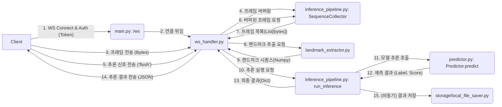

# SignBell 수어 인식서버(FAST API) 기술명세서

본 문서는 수어 학습 및 퀴즈 플랫폼 'SignBell'의 핵심 백엔드 구성 요소인 **'실시간 수어 추론 서버'**의 내부 아키텍처, 핵심 모듈, 데이터 파이프라인을 상세히 기술하는 기술 명세서입니다.

이 문서의 목표는 프로젝트에 참여하는 모든 구성원, 특히 개발팀과 인프라 담당자가 서버의 전체 구조와 실시간 데이터 흐름(WebSocket, 랜드마크 추출, 모델 추론)을 명확하게 이해하고, 일관된 개발 및 운영을 진행하는 것입니다.

각 팀은 본 명세서를 기준으로 백엔드 기능 개발, AI 모델 연동, WebSocket 통신 규약 검증, 성능 테스트 시나리오 작성을 진행합니다. 이를 통해 효율적인 협업과 안정적인 고성능 추론 서비스 구축을 지향합니다.

* **작성자:** [백승현](https://github.com/sirosho)
* **작성일**: 2025-10-28
* **최종 수정일**: 2025-10-28
* **문서 버전:** v1.0.0

**대상 독자:**

- **백엔드 개발자**: WebSocket 핸들러(`ws_handler`), 인증 로직(`jwt_validator`), 비동기 저장 파이프라인(`inference_pipeline`)을 구현·유지보수하는 개발자.
- **AI / 머신러닝 엔지니어**: `predictor.py`의 모델 로직, `landmark_extractor.py`의 전처리 과정을 이해하고 모델을 개선·교체하는 담당자.
- **프론트엔드 개발자**: 본 서버의 WebSocket API와 통신하고, 프레임 스트림을 전송하며, 추론 결과를 수신하는 클라이언트(웹, 앱)를 구현하는 개발자.
- **DevOps / 인프라 엔지니어**: WebSocket 서버(FastAPI/Uvicorn), AI 모델 서빙 환경(PyTorch, MediaPipe), CI/CD 및 보안 설정을 구축·운영하는 담당자.
- **QA / 테스트 엔지니어**: WebSocket 통신, 랜드마크 추출, 모델 추론 정확도 및 부하 테스트 시나리오를 작성하고 검증하는 담당자.
- **기획자 / PM**: 서비스의 핵심 기술인 실시간 추론 파이프라인의 작동 원리와 기술적 제약 사항(예: 프레임 수, 추론 속도)을 이해하는 담당자.
- **신규 합류자**: 추론 서버의 내부 구조와 모듈 간 상호작용, 데이터 흐름을 빠르게 파악해야 하는 팀 신규 인원.


## 1\. 개요

이 프로젝트는 **SignBell 수어 인식**을 위한 FastAPI 기반 실시간 추론 서버입니다.

주요 기능은 클라이언트(웹 브라우저 등)로부터 **WebSocket**을 통해 실시간 비디오 프레임 스트림을 수신하고, 이를 딥러닝 모델로 분석하여 어떤 수어 동작인지 추론하는 것입니다. 추론 결과는 다시 WebSocket을 통해 클라이언트에게 즉시 전송됩니다.

핵심 아키텍처는 다음과 같습니다.

* **FastAPI**: 비동기 웹 서버 및 WebSocket 엔드포인트 제공.
* **WebSocket**: 클라이언트와 서버 간의 실시간 양방향 통신 채널 (프레임 전송 및 추론 결과 수신).
* **MediaPipe**: 비디오 프레임에서 손, 포즈 등의 랜드마크를 추출.
* **PyTorch**: 랜드마크 시퀀스를 입력받아 수어를 분류하는 딥러닝 모델(CNN + BiLSTM + Attention) 실행.

## 2\. 핵심 파이프라인: 실시간 추론 워크플로우

서버의 메인 추론 파이프라인은 클라이언트의 WebSocket 연결부터 추론 결과 반환까지 다음 순서로 진행됩니다.



1.  **연결 및 인증**: 클라이언트가 `main.py`의 `/ws/{session_id}` 엔드포인트로 WebSocket 연결을 시도합니다. `ws_handler.py`는 연결 시도 시 쿠키에 포함된 **JWT 토큰**을 `security/jwt_validator.py`를 통해 검증합니다.
2.  **상태 초기화**: 인증이 성공하면, `main.py`의 전역 `AppState`는 해당 `session_id`를 위한 `SequenceCollector` 인스턴스(`inference_pipeline.py` 소재)를 생성하여 프레임을 수집할 버퍼를 마련합니다.
3.  **메타데이터 및 프레임 수집**:
    * 클라이언트는 `{ "type": "meta", ... }` (단어 ID 등) 메시지를 보내 작업을 설정합니다.
    * 이후 클라이언트는 비디오 프레임을 **바이너리(bytes) 메시지**로 연속 전송합니다. `ws_handler.py`는 수신된 프레임을 `SequenceCollector`에 순서대로 추가합니다.
4.  **추론 신호 (Flush)**: 클라이언트가 수어 동작을 마치고 `{ "type": "flush" }` 텍스트 메시지를 전송합니다.
5.  **랜드마크 추출**: `ws_handler.py`는 `SequenceCollector`에 누적된 모든 프레임(bytes 리스트)을 `processing/landmark_extractor.py`의 `extract_sequence_from_frames` 함수로 전달합니다. 이 함수는 MediaPipe를 사용해 각 프레임을 **147차원 랜드마크 벡터**로 변환하고, 이 벡터들의 시퀀스(Numpy 배열)를 생성하여 반환합니다.
6.  **모델 추론**: `ws_handler.py`는 추출된 랜드마크 시퀀스를 `inference_pipeline.py`의 `run_inference` 함수로 전달합니다. `run_inference`는 서버 시작 시 `main.py`의 `AppState`에 로드된 `processing/predictor.py`의 `Predictor` 인스턴스를 사용합니다.
7.  **결과 반환**: `Predictor.predict()`가 실제 PyTorch 모델 추론을 수행하여 (예측 레이블, 신뢰도)를 반환합니다. `run_inference`는 이 정보를 포함한 최종 `result` 딕셔너리를 생성하여 `ws_handler.py`로 반환합니다.
8.  **결과 전송 및 저장**: `ws_handler.py`는 수신된 `result`를 `{ "type": "inference_result", ... }` JSON 메시지로 클라이언트에게 다시 전송합니다. 동시에 `inference_pipeline.py`의 `schedule_quiz_save` 함수가 비동기적으로 호출되어 추론 결과와 사용된 랜드마크 데이터를 파일 시스템에 저장합니다.

## 3\. 주요 모듈 설명

### `main.py` (FastAPI 진입점)

* **역할**: FastAPI 애플리케이션의 메인 파일. 서버 실행, 전역 상태 관리, WebSocket 엔드포인트 라우팅을 담당합니다.

* **주요 기능**:

    * `lifespan` 함수: FastAPI 앱 시작 시(`@asynccontextmanager`) `AppState`를 초기화하고, `processing.predictor.get_predictor()`를 호출하여 **딥러닝 모델(.pth)을 메모리로 로드**합니다.
    * `AppState` 클래스: `Predictor` 인스턴스와 활성 세션별 `SequenceCollector` 딕셔너리(`collectors`)를 전역 상태로 관리합니다.
    * `@app.websocket("/ws/{session_id}")`: WebSocket 연결의 유일한 진입점. 모든 실제 로직을 `ws_handler.websocket_handler` 함수로 위임합니다.
    * `/health`, `/model/status`: 모델 로드 상태 및 서버 상태를 확인하는 REST API 엔드포인트를 제공합니다.

* **핵심 코드**:

<!-- end list -->

```python
# --- FastAPI 앱 초기화 ---
@asynccontextmanager
async def lifespan(app: FastAPI):
    """앱 수명주기: 시작 시 Predictor 로드 시도."""
    print("[STARTUP] Attempting to load Predictor...")
    # ... (생략) ...
    try:
        # 동적으로 Import 시도
        from processing.predictor import get_predictor as _get_predictor
        predictor_instance = _get_predictor()
        if not getattr(app.state, 'ss', None):
            app.state.ss = AppState()
        app.state.ss.predictor = predictor_instance
        print("[STARTUP] Predictor successfully loaded.")
    except Exception as e:
        # ... (예외 처리) ...
        app.state.ss.predictor = None
    
    yield
    # ... (종료 로직) ...

app = FastAPI(title="SignSense Inference Server", version="0.2.0", lifespan=lifespan)

# ... (AppState 클래스 정의) ...
app.state.ss = AppState()

# ... (REST 엔드포인트들) ...

# === WebSocket 시그널링 엔드포인트 ===
@app.websocket("/ws/{session_id}")
async def websocket_endpoint(websocket: WebSocket, session_id: str):
    """WebSocket 엔드포인트 래퍼: 실제 로직은 `ws_handler.websocket_handler`에 위임합니다."""
    try:
        await websocket_handler(websocket, session_id, app.state.ss)
    except WebSocketDisconnect:
        app.state.ss.collectors.pop(session_id, None)
    except Exception as e:
        # ... (예외 처리) ...
        app.state.ss.collectors.pop(session_id, None)
```

-----

### `ws_handler.py` (WebSocket 핸들러)

* **역할**: WebSocket의 실제 비즈니스 로직을 처리하는 핵심 모듈입니다.

* **주요 기능**:

    * `websocket_handler` 함수:
        1.  **핸드셰이크 및 토큰 검증**: `security.jwt_validator`를 사용해 JWT 토큰을 검증합니다.
        2.  **메시지 수신 루프**: 클라이언트로부터 메시지를 비동기적으로 대기합니다.
        3.  **바이너리(프레임) 처리**: `data["bytes"]`가 수신되면 `AppState`의 `SequenceCollector`에 `add_frame()`을 호출하여 프레임을 누적합니다.
        4.  **텍스트(JSON 신호) 처리**: `data["text"]`가 수신되면 JSON을 파싱하여 `type`에 따라 분기합니다.
            * `"meta"`: `SequenceCollector`의 메타데이터(단어 ID 등)를 설정하고 프레임 버퍼를 비웁니다.
            * `"flush"`: **(추론 실행)** 위 "핵심 파이프라인"의 5\~8단계를 수행합니다.
            * `"save_learning"`: **(학습 데이터 저장)** `flush`와 유사하게 랜드마크를 추출하지만, 추론 대신 `schedule_learning_save`를 호출하여 학습용 데이터를 저장합니다.

* **핵심 코드**:

<!-- end list -->

```python
async def websocket_handler(websocket: WebSocket, session_id: str, app_state: Any):
    # --- 핸드셰이크 및 토큰 검증 로직 시작 ---
    try:
        # ... (토큰 탐색 및 validate_token_and_get_user_id 호출) ...
        user_id = validate_token_and_get_user_id(token)
    except Exception as e:
        await websocket.close(code=status.HTTP_401_UNAUTHORIZED)
        return
    # --- 핸드셰이크 및 토큰 검증 로직 끝 ---

    await websocket.accept()
    collector = app_state.collectors.get(session_id) or app_state.new_collector(session_id)

    try:
        while True:
            data = await websocket.receive()

            if isinstance(data, dict) and data.get("type") == "websocket.disconnect":
                raise WebSocketDisconnect(code=data.get("code"))

            # 바이너리 프레임 수신
            if "bytes" in data and data.get("bytes") is not None:
                frame_bytes = data["bytes"]
                try:
                    collector.add_frame(frame_bytes)
                except Exception as e:
                    print(f"[WS][WARN] Failed to add frame: {e}")
                continue # 다음 메시지 기다림

            # 텍스트(JSON) 신호 처리
            if "text" in data and data.get("text") is not None:
                # ... (JSON 파싱) ...
                msg = json.loads(data["text"])
                mtype = msg.get("type")

                if mtype == "meta":
                    # ... (메타 정보 설정, collector.frames = []) ...
                    await websocket.send_text(json.dumps({"type": "meta_ack"}))
                
                elif mtype == "save_learning":
                    frames = getattr(collector, "frames", [])
                    # ... (landmark_sequence = extract_sequence_from_frames(...)) ...
                    if landmark_sequence is None:
                        # ... (실패 전송) ...
                    else:
                        asyncio.create_task(
                            schedule_learning_save(landmark_sequence=landmark_sequence, ...)
                        )
                        await websocket.send_text(json.dumps({"type": "learning_ack", "status": "accepted"}))
                    # ... (프레임 비우기) ...

                elif mtype == "flush":
                    predictor = app_state.predictor
                    frames = getattr(collector, "frames", [])
                    # ... (landmark_sequence = extract_sequence_from_frames(...)) ...
                    
                    result = run_inference(predictor, landmark_sequence)
                    
                    asyncio.create_task(
                        schedule_quiz_save(landmark_sequence=landmark_sequence, inference_result=result, ...)
                    )
                    await websocket.send_text(json.dumps({"type": "inference_result", "result": result}))
                    # ... (프레임 비우기) ...
    
    except WebSocketDisconnect:
        app_state.collectors.pop(session_id, None)
    except Exception as e:
        # ... (최종 예외 처리) ...
        app_state.collectors.pop(session_id, None)
```

-----

### `processing/predictor.py` (모델 로드 및 추론기)

* **역할**: PyTorch 딥러닝 모델의 아키텍처를 정의하고, 학습된 체크포인트(`.pth`)를 로드하여 실제 추론을 수행합니다.

* **주요 기능**:

    * `CNN_BiLSTM_Attention` 클래스: 학습 스크립트와 동일한 모델 구조를 정의합니다.
    * `Predictor` 클래스:
        * `__init__`: 모델 경로(`model_path`)를 받아 `torch.load()`로 체크포인트를 로드합니다. 체크포인트 내 `label_encoder` 정보를 읽어 클래스(수어 단어) 레이블을 복원합니다.
        * `predict(landmark_sequence)`:
            1.  입력받은 랜드마크 시퀀스(Numpy 배열)를 `settings.MAX_FRAMES_TO_COLLECT` 길이에 맞게 \*\*패딩(Padding) 또는 절단(Truncation)\*\*합니다.
            2.  데이터를 PyTorch 텐서로 변환합니다.
            3.  `model(input_tensor)`를 호출하여 추론을 실행합니다.
            4.  출력값에 `torch.softmax()`를 적용하여 확률을 계산하고, 가장 높은 확률의 (레이블, 신뢰도 점수)를 반환합니다.

* **핵심 코드**:

<!-- end list -->

```python
class Predictor:
    def __init__(self, model_path, sequence_length: Optional[int] = None, input_size=147):
        self.device = torch.device("cuda" if torch.cuda.is_available() else "cpu")
        self.sequence_length = sequence_length if sequence_length is not None else settings.MAX_FRAMES_TO_COLLECT

        # 1. 체크포인트를 먼저 로드하여 모델의 설정을 확인합니다.
        checkpoint = torch.load(model_path, map_location=self.device)

        # 2. 체크포인트에서 클래스 개수와 레이블 정보를 가져옵니다.
        if 'label_encoder' in checkpoint:
            self.label_encoder = checkpoint['label_encoder']
            num_classes = len(self.label_encoder.classes_)
            self.class_labels = {i: label for i, label in enumerate(self.label_encoder.classes_)}
        else:
            # ... (레이블 정보 없을 시 추론) ...
            num_classes = ...
            self.class_labels = ...

        # 3. 확인된 클래스 개수로 모델 구조를 정의합니다.
        self.model = CNN_BiLSTM_Attention(
            input_size=input_size,
            num_classes=num_classes,
            ...
        ).to(self.device)

        # 4. 모델 가중치를 로드합니다.
        state_dict = checkpoint.get('model_state_dict', checkpoint)
        self.model.load_state_dict(state_dict)
        self.model.eval()  # 추론 모드로 설정

    def predict(self, landmark_sequence: np.ndarray) -> tuple[str, float]:
        if landmark_sequence is None or landmark_sequence.size == 0:
            return "랜드마크 데이터가 없습니다.", 0.0

        landmarks_np = landmark_sequence.astype(np.float32)

        # 입력 데이터 크기 조절 (패딩/자르기)
        num_frames = landmarks_np.shape[0]
        max_frames = int(self.sequence_length) # settings.MAX_FRAMES_TO_COLLECT
        if num_frames < max_frames:
            pad_size = max_frames - num_frames
            landmarks_np = np.vstack([
                landmarks_np,
                np.zeros((pad_size, landmarks_np.shape[1]), dtype=np.float32)
            ])
        elif num_frames > max_frames:
            landmarks_np = landmarks_np[:max_frames]

        # 모델 입력 형태에 맞게 텐서로 변환 (batch_size=1)
        input_tensor = torch.from_numpy(landmarks_np).unsqueeze(0).to(self.device)

        with torch.no_grad():
            outputs = self.model(input_tensor)
            probabilities = torch.softmax(outputs, dim=1)
            score, predicted_idx = torch.max(probabilities, 1)

        predicted_label = self.class_labels.get(predicted_idx.item(), "알 수 없는 기호")
        return predicted_label, score.item()
```

-----

### `processing/landmark_extractor.py` (랜드마크 추출기)

* **역할**: MediaPipe 라이브러리를 사용해 원본 비디오 프레임(bytes)에서 랜드마크 특징 벡터를 추출합니다.

* **주요 기능**:

    * `RealtimeLandmarkExtractor` 클래스: MediaPipe의 `Holistic` 솔루션을 래핑합니다.
    * `extract(frame_bytes)`:
        1.  `frame_bytes`를 `cv2` 를 사용해 RGB 이미지(Numpy 배열)로 디코딩합니다.
        2.  `_holistic.process(rgb)`를 호출하여 랜드마크(포즈, 왼손, 오른손)를 감지합니다.
        3.  감지된 랜드마크 중 필요한 관절(상체 6개, 양손 각 21개) 좌표를 추출합니다.
        4.  코와 어깨 중심점을 기준으로 좌표를 \*\*정규화(Normalization)\*\*하여 위치 변화에 강인한 특징을 만듭니다.
        5.  모든 특징을 결합하여 \*\*147차원 (49 \* 3)\*\*의 벡터(Numpy 배열)를 생성하여 반환합니다. (랜드마크 감지 실패 시 0으로 채워진 벡터 반환).
    * `extract_sequence_from_frames`: 프레임 목록을 받아 `extract`를 반복 호출하고, 결과 벡터들을 `np.stack`하여 `(N, 147)` 형태의 시퀀스 배열을 만듭니다.

* **핵심 코드**:

<!-- end list -->

```python
# (Mediapipe import 및 상수 정의)

def _decode_frame(frame_bytes: bytes):
    # ... (bytes -> cv2/PIL -> RGB numpy array) ...
    pass

@dataclass
class RealtimeLandmarkExtractor:
    # ... (설정값) ...
    _holistic: Optional[Any] = field(init=False, default=None)

    def __post_init__(self):
        try:
            self._holistic = mp.solutions.holistic.Holistic(...)
            self._ok = True
        except Exception:
            self._ok = False

    def extract(self, frame_bytes: bytes) -> Optional["np.ndarray"]:
        if not self.available():
            return None

        rgb = _decode_frame(frame_bytes)
        if rgb is None:
            return None

        try:
            results = self._holistic.process(rgb)
        except Exception as e:
            return None

        if (not hasattr(results, "pose_landmarks") or results.pose_landmarks is None):
            # ... (포즈 감지 실패 시 0벡터 반환 또는 None 반환) ...
            return np.zeros((FRAME_FEATURE_DIM,), dtype=np.float32)

        # --- 정규화 기준점 계산 ---
        pose_lm = results.pose_landmarks.landmark
        nose = pose_lm[0]
        # ... (shoulder_center_x, y, z 및 stable_center_x, y, z 계산) ...
        
        feats: List[float] = []

        def _rel(v, cx, cy, cz, scale, damp=1.0):
            # (좌표 정규화 함수)
            return ((v.x - cx) / scale, (v.y - cy) / scale, ((v.z - cz) / scale) * damp)

        # --- 특징 추출 ---
        # 1. Pose 6 joints
        try:
            for idx in POSE_INDICES:
                v = pose_lm[idx]
                rx, ry, rz = _rel(v, stable_center_x, stable_center_y, stable_center_z, NORMALIZATION_SCALE, POSE_Z_DAMPING)
                feats.extend([rx, ry, rz])
        except Exception:
            feats.extend([0.0] * (len(POSE_INDICES) * 3))

        # 2. Left hand (21 landmarks)
        try:
            if hasattr(results, "left_hand_landmarks") and results.left_hand_landmarks:
                # ... (lms 순회하며 feats.extend(...)) ...
            else:
                feats.extend([0.0] * (HAND_LANDMARK_COUNT * 3))
        except Exception:
            feats.extend([0.0] * (HAND_LANDMARK_COUNT * 3))

        # 3. Right hand (21 landmarks)
        # ... (Left hand와 동일한 로직) ...

        # 4. Hand distance vector (3 features)
        # ... (left_wrist_pos와 right_wrist_pos가 있으면 거리 벡터 계산) ...

        arr = np.asarray(feats, dtype=np.float32)
        # ... (최종 차원(147) 보정) ...
        return arr
```

-----

### `inference_pipeline.py` (추론 파이프라인 유틸)

* **역할**: `ws_handler`와 `predictor` 사이의 로직을 조율하고, 프레임 수집 및 비동기 저장을 관리합니다.

* **주요 기능**:

    * `SequenceCollector` 클래스: 세션별 프레임 버퍼. `frames: List[bytes]` 리스트를 관리하며, `MAX_FRAMES_TO_COLLECT` 설정값까지만 프레임을 수집합니다.
    * `run_inference(predictor, landmark_sequence)`:
        1.  `predictor.predict()`를 호출하여 추론을 수행합니다.
        2.  랜드마크가 없거나(`None`) `predictor`가 로드되지 않은 경우, 적절한 오류 메시지를 생성합니다.
        3.  추론 시간, 사용된 프레임 수 등을 포함한 표준화된 `result` 딕셔너리를 반환합니다.
    * `schedule_quiz_save`, `schedule_learning_save`: `storage.local_file_saver` 모듈의 저장 함수를 `asyncio.create_task`로 호출하여, WebSocket 핸들러의 메인 루프를 차단하지 않고 **비동기적으로 데이터를 저장**합니다.

* **핵심 코드**:

<!-- end list -->

```python
# (settings 및 heavy imports)

def run_inference(predictor: "Predictor", landmark_sequence: Optional[Any]) -> Dict[str, Any]:
    start = time.time()
    predicted_label = "오류: 추론 실패"
    score = 0.0

    try:
        # ... (landmark_sequence가 None이거나 비어있는지 확인) ...
        if landmark_sequence is None or empty_seq:
            predicted_label = "오류: 랜드마크를 감지하지 못했습니다."
        else:
            # ... (모든 값이 0인지 확인) ...
            if predictor is None:
                raise RuntimeError("Predictor not available...")
            
            # Predictor.predict 호출
            predicted_label, score = predictor.predict(landmark_sequence.astype(np.float32))

    except Exception as e:
        # ... (예외 처리) ...
        pass
    
    end = time.time()
    # ... (frames_used 계산) ...
    
    return {
        "predicted": predicted_label,
        "score": score,
        "inference_ms": int((end - start) * 1000),
        "frames_used": frames_used,
        ...
    }

@dataclass
class SequenceCollector:
    """세션별 프레임 수집기."""
    frames: List[bytes] = field(default_factory=list)

    def add_frame(self, data: bytes):
        """최대 프레임 수를 초과하지 않은 경우에만 프레임을 추가합니다."""
        if not self.is_full():
            if len(self.frames) < MAX_FRAMES_TO_COLLECT:
                self.frames.append(data)

    def is_full(self) -> bool:
        return len(self.frames) >= MAX_FRAMES_TO_COLLECT

# ... (storage.local_file_saver import 시도) ...

async def schedule_quiz_save(...):
    """(비동기) 퀴즈 결과 및 랜드마크를 저장소에 저장합니다."""
    try:
        # 위에서 import한 save_quiz 함수 호출
        result = await save_quiz(
            landmark_sequence=seq_np,
            ...
        )
    except Exception as e:
        ...

async def schedule_learning_save(...):
    """(비동기) 학습 데이터(랜드마크)를 저장소에 저장합니다."""
    # ... (save_learning 호출) ...
```

-----

### `security/jwt_validator.py` (JWT 검증)

* **역할**: JWT(JSON Web Token)의 유효성을 검증하고 토큰에서 사용자 ID를 추출합니다.

* **주요 기능**:

    * `_decode_jwt(token)`: `configs.settings`의 `JWT_SECRET_KEY`와 `JWT_ALGORITHM`을 사용하여 토큰을 디코딩합니다. `python-jose` 또는 `pyjwt` 라이브러리를 사용합니다.
    * `validate_token_and_get_user_id(token)`: **(WebSocket용)** 원시(raw) 토큰 문자열을 직접 받아 검증하고 `user_id` 또는 `sub` 클레임을 반환합니다.
    * `get_current_user_id(request)`: **(REST API용)** FastAPI 의존성(`Depends`) 함수로, `Authorization: Bearer` 헤더 또는 쿠키에서 토큰을 추출하여 검증합니다.

* **핵심 코드**:

<!-- end list -->

```python
# (jose 또는 PyJWT import 시도)
from configs import settings

def _decode_jwt(token: str) -> dict[str, Any]:
    """Decode and verify a JWT using project settings."""
    try:
        payload = jwt.decode(token, settings.JWT_SECRET_KEY, algorithms=[settings.JWT_ALGORITHM])
        return payload
    except Exception as first_exc:
        # ... (Base64 디코딩 시도 등 폴백 로직) ...
        
        # Unified HTTPException
        raise HTTPException(
            status_code=status.HTTP_401_UNAUTHORIZED,
            detail=f"Could not validate credentials: {str(first_exc)}",
            headers={"WWW-Authenticate": "Bearer"},
        ) from first_exc

def _extract_user_id_from_payload(payload: dict[str, Any]) -> Any:
    """Normalize user id extraction from JWT payload (sub or user_id)."""
    return payload.get("sub") or payload.get("user_id")

def validate_token_and_get_user_id(token: str) -> Any:
    """Utility for WebSocket handlers: validate raw token and return user id."""
    payload = _decode_jwt(token)
    user_id = _extract_user_id_from_payload(payload)
    if user_id is None:
        raise HTTPException(
            status_code=status.HTTP_401_UNAUTHORIZED,
            detail="Token missing required user identifier",
        )
    return user_id
```

-----

### `configs/settings.py` (설정 관리)

* **역할**: 환경 변수(`.env` 파일 포함)에서 애플리케이션 설정을 로드합니다.

* **주요 기능**:

    * `pydantic` 라이브러리에 의존하지 않는 간단한 `Settings` 클래스를 제공합니다.
    * `JWT_SECRET_KEY`, `MAX_FRAMES_TO_COLLECT`, `SSL_CERT_PATH` 등 주요 설정값을 환경 변수에서 읽어옵니다.
    * `get_settings()` 함수는 설정을 캐시(`@lru_cache`)하여 싱글톤으로 제공합니다.

* **핵심 코드**:

<!-- end list -->

```python
from functools import lru_cache
import os
from pathlib import Path

# ... (dotenv load 시도) ...

class Settings:
    def __init__(self):
        # JWT
        self.JWT_SECRET_KEY: str = os.getenv("JWT_SECRET_KEY", "")
        self.JWT_ALGORITHM: str = os.getenv("JWT_ALGORITHM", "HS256")

        # Inference / collector tuning
        self.TARGET_FRAME_COUNT: int = int(os.getenv("TARGET_FRAME_COUNT", "24"))
        self.COLLECTION_DURATION_SECONDS: float = float(os.getenv("COLLECTION_DURATION_SECONDS", "1.0"))
        self.MAX_FRAMES_TO_COLLECT: int = int(os.getenv("MAX_FRAMES_TO_COLLECT", "1024"))

        # ... (SSL 및 Cookie 설정) ...

@lru_cache()
def get_settings() -> Settings:
    """캐시된 Settings 인스턴스를 반환합니다."""
    return Settings()

# Module-level 편의 별칭
_settings = get_settings()
MAX_FRAMES_TO_COLLECT = _settings.MAX_FRAMES_TO_COLLECT
# ... (다른 설정값들도 별칭으로 제공) ...
```

-----

### `routers/` (기타 라우터)

* `diagnostics.py`: `/api/diagnostics/status` 등 서버 상태를 점검하기 위한 간단한 헬스 체크 엔드포인트를 제공합니다.

* **핵심 코드 (diagnostics.py)**:

<!-- end list -->

```python
from fastapi import APIRouter
from typing import Any

router = APIRouter(prefix="/api/diagnostics", tags=["diagnostics"])

@router.get("/status")
async def diagnostics_status() -> Any:
    return {"ok": True, "message": "diagnostics router alive"}

@router.post("/echo")
async def diagnostics_echo(payload: dict) -> Any:
    """Simple echo endpoint used in smoke tests."""
    return {"echo": payload}
```