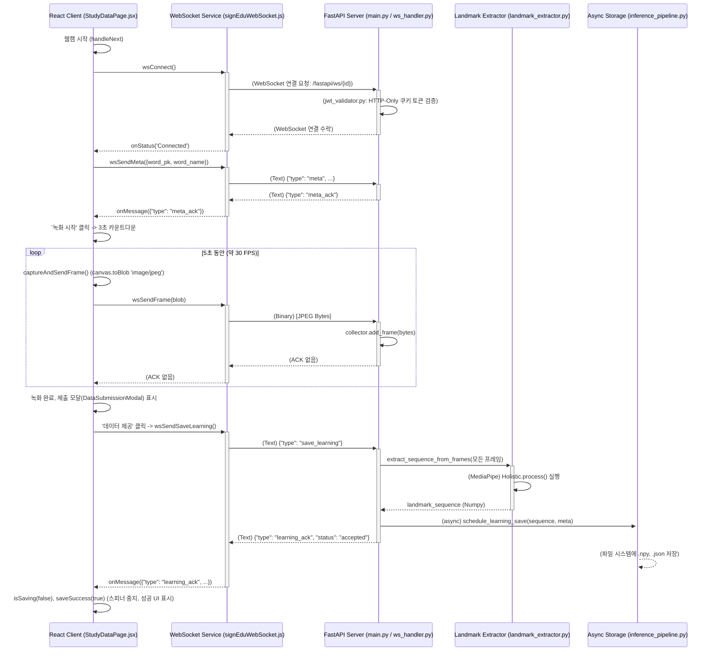
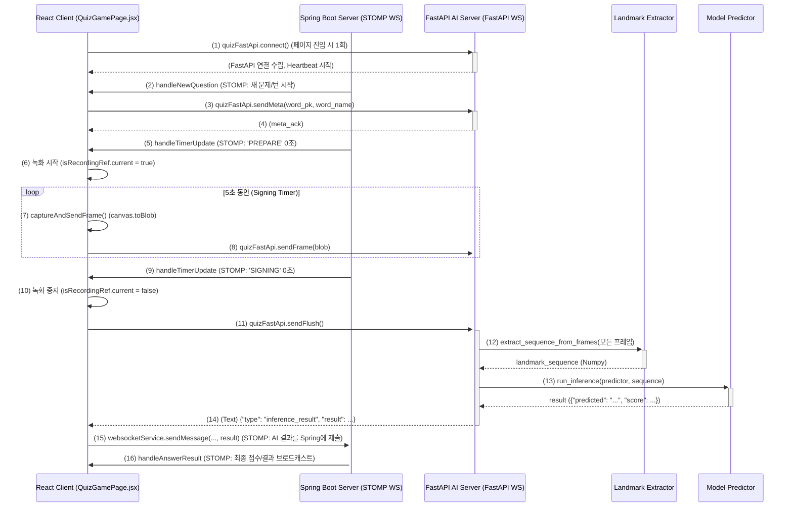

# **SignBell 클라이언트-서버 파이프라인 명세서 (React & FastAPI)**

본 문서는 수어 학습 플랫폼 'SignBell'의 클라이언트(React)와 추론 서버(FastAPI) 간의 실시간 데이터 통신 파이프라인을 기술하는 명세서입니다.

이 문서의 목표는 프론트엔드와 백엔드 개발자가 **WebSocket** 기반의 실시간 상호작용(인증, 프레임 전송, 데이터 처리)을 명확하게 이해하고, 일관된 사용자 경험을 구현하는 것입니다.

* **작성자:** [백승현](https://github.com/sirosho)
* **작성일**: 2025-10-28
* **최종 수정일**: 2025-10-28
* **문서 버전:** v1.0.0

**대상 독자:**

  - **프론트엔드 개발자**: WebSocket 연결, 웹캠 프레임 캡처, 서버 메시지 처리를 구현하는 개발자.
  - **백엔드 개발자**: WebSocket 핸들러, 인증 로직, 비동기 데이터 처리를 구현하는 개발자.
  - **QA / 테스트 엔지니어**: 클라이언트-서버 간 시나리오별 E2E 테스트 케이스를 작성하는 담당자.
  - **신규 합류자**: 'SignBell' 서비스의 핵심 실시간 통신 구조를 파악해야 하는 팀 신규 인원.

-----

## 1\. 개요

이 파이프라인은 클라이언트(React)의 웹캠에서 실시간으로 캡처된 비디오 프레임을 FastAPI 서버로 스트리밍하고, 서버가 이를 처리(랜드마크 추출, 모델 추론, 저장)한 뒤 클라이언트에게 응답을 반환하는 전 과정을 다룹니다.

* **클라이언트 (React)**: 웹캠을 제어하고, `signEduWebSocket.js` 또는 `quizFastApiWebSocket.js` 서비스를 통해 WebSocket 통신을 관리합니다.
* **서버 (FastAPI)**: `main.py`가 WebSocket 엔드포인트를 제공하고, `ws_handler.py`가 실제 통신 로직을, `landmark_extractor.py`가 랜드마크 추출을, `predictor.py`가 모델 추론을 담당합니다.

-----

## 2\. 파이프라인 1: 학습 데이터 제공 (StudyDataPage)

`StudyDataPage.jsx`에서 사용자가 수어 연습 영상을 녹화하고 '데이터 제공' 버튼을 누르는 시점의 전체 시퀀스입니다.

### 파이프라인 상세 설명

1.  **연결 및 인증**: `StudyDataPage` 진입 및 웹캠 시작 시 `wsConnect()`가 호출됩니다. 서버는 `/fastapi/ws/{id}` 경로로 요청을 받아 쿠키의 JWT를 `jwt_validator.py`로 검증합니다.
2.  **메타데이터 전송**: 연결 직후 `wsSendMeta()`를 호출하여 `{type: "meta", ...}` JSON을 전송합니다. 서버는 `meta_ack`로 응답하고 프레임 버퍼를 초기화합니다.
3.  **프레임 스트리밍**: '녹화 시작' 시 `captureAndSendFrame` 루프가 시작됩니다. `canvas.toBlob`으로 생성된 JPEG `Blob`이 `wsSendFrame(blob)`을 통해 WebSocket **바이너리 메시지**로 서버에 전송됩니다. 서버는 `if "bytes" in data:` 블록에서 이를 수신하여 `collector.add_frame`으로 누적합니다.
4.  **저장 요청**: 5초 녹화 완료 후 '데이터 제공' 버튼을 클릭하면 `wsSendSaveLearning()`이 호출되어 `{type: "save_learning"}` JSON을 전송합니다.
5.  **서버 처리 (학습)**: 서버 `ws_handler.py`는 `mtype == "save_learning"` 블록에서 누적된 프레임을 `landmark_extractor.py`로 전달해 랜드마크를 추출합니다. 이후 `schedule_learning_save`를 비동기로 호출하고, **즉시** `{"type": "learning_ack", "status": "accepted"}`를 클라이언트에 전송합니다.
6.  **UI 갱신**: 클라이언트는 `learning_ack`를 받아 로딩 스피너를 중지하고 성공 UI를 표시합니다.

-----

## 3\. 파이프라인 2: 실시간 퀴즈 (QuizGamePage)

`QuizGamePage.jsx`의 파이프라인은 더 복잡하며, **3개의 서버**와 통신합니다.

1.  **Spring Boot 서버 (STOMP WebSocket)**: `websocketService`를 통해 게임 상태(문제 출제, 턴 넘김, 점수 집계)를 관리합니다.
2.  **Janus 서버 (WebRTC)**: `useJanus` 훅을 통해 참가자 간의 P2P 비디오 스트림을 중계합니다.
3.  **FastAPI 서버 (AI WebSocket)**: `quizFastApiWebSocket.js`를 통해 **AI 수어 인식** 기능만 전담합니다.

본 문서는 이 중 **FastAPI AI 추론 파이프라인**에 초점을 맞춥니다.

### 파이프라인 상세 설명

1.  **연결 (FastAPI)**: `QuizGamePage` 마운트 시, `useEffect` 훅이 `quizFastApi.connect()`를 **단 한 번 호출**하여 AI 서버와 영구적인 WebSocket 연결을 수립합니다. 이 연결은 페이지를 나갈 때까지 유지되며, `quizFastApiWebSocket.js`에 의해 **자동 재연결** 및 \*\*하트비트(ping/pong)\*\*가 관리됩니다.
2.  **게임 상태 수신 (Spring)**: 클라이언트는 Spring Boot 서버로부터 STOMP WebSocket을 통해 `handleNewQuestion` 메시지를 받아 새 퀴즈와 턴 시작을 인지합니다.
3.  **메타데이터 전송 (FastAPI)**: `gamePhase`가 'myTurn'이 되면, `quizFastApi.sendMeta()`를 호출하여 AI 서버에 `{type: "meta", ...}` JSON을 전송합니다.
4.  **프레임 스트리밍 (FastAPI)**: Spring Boot 서버로부터 `handleTimerUpdate` 메시지를 받아 'PREPARE' 시간이 0초가 되면, `captureAndSendFrame` 루프가 시작됩니다. `mainVideoRef`의 영상을 캔버스에 그려 `Blob`으로 만들고, `quizFastApi.sendFrame(blob)`을 통해 FastAPI 서버로 **바이너리 메시지**를 전송합니다.
5.  **추론 요청 (FastAPI)**: 'SIGNING' 타이머가 0초가 되면 프레임 전송 루프가 중지되고, `quizFastApi.sendFlush()`가 호출되어 `{type: "flush"}` JSON을 FastAPI 서버로 전송합니다.
6.  **서버 처리 (FastAPI)**: 서버 `ws_handler.py`는 `mtype == "flush"` 블록에서 랜드마크 추출 및 `predictor.py`를 통한 모델 추론을 **즉시 실행**합니다.
7.  **추론 결과 수신 (FastAPI)**: FastAPI 서버는 `{"type": "inference_result", "result": ...}` JSON을 클라이언트로 전송합니다. `QuizGamePage`의 `onMessage` 리스너가 이 결과를 수신합니다.
8.  **최종 답안 제출 (Spring)**: 클라이언트는 FastAPI로부터 받은 `predictedWord`와 `confidenceScore`를 **Spring Boot 서버**의 `/app/room/.../answer` 엔드포인트로 **STOMP WebSocket 메시지**를 보내 최종 제출합니다.
9.  **최종 결과 수신 (Spring)**: Spring Boot 서버가 채점을 완료하고, `handleAnswerResult` 메시지를 모든 클라이언트에게 브로드캐스트하여 턴이 종료됩니다.

-----

## 4\. FastAPI WebSocket 통신 규약 (API Contract)

### 4.1. 클라이언트 ➔ 서버 (C2S)

| 타입 | 메시지 | `quizFastApiWebSocket.js` 함수 | `ws_handler.py` 처리 | 사용 시나리오 |
| :--- | :--- | :--- | :--- | :--- |
| **Text** | `{"type": "meta", "word_pk": ..., "word_name": ...}` | `sendMeta(wordPk, wordName)` | `mtype == "meta"` | 퀴즈 / 학습 |
| **Binary** | `[JPEG Blob Bytes]` | `sendFrame(blob)` | `if "bytes" in data:` | 퀴즈 / 학습 |
| **Text** | `{"type": "save_learning"}` | `sendSaveLearning()` | `mtype == "save_learning"` | **학습** |
| **Text** | `{"type": "flush"}` | `sendFlush()` | `mtype == "flush"` | **퀴즈** |
| **Text** | `{"type": "ping"}` | `startHeartbeat()` (내부) | (서버/인프라 레벨) | 퀴즈 (연결 유지) |

### 4.2. 서버 ➔ 클라이언트 (S2C)

| 타입 | 메시지 | `ws_handler.py` 전송 시점 | `QuizGamePage.jsx` 처리 | 사용 시나리오 |
| :--- | :--- | :--- | :--- | :--- |
| **Text** | `{"type": "meta_ack"}` | `meta` 메시지 수신 직후 | `onMessage` (콘솔 로그) | 퀴즈 / 학습 |
| **Text** | `{"type": "learning_ack", ...}` | `save_learning` 처리 직후 | (`StudyDataPage.jsx`에서 처리) | **학습** |
| **Text** | `{"type": "inference_result", "result": ...}` | `flush` 처리 및 추론 완료 후 | `onMessage` -\> `result` 파싱 -\> Spring 서버로 전송 | **퀴즈** |
| **Text** | `{"type": "pong"}` | (서버/인프라 레벨 응답) | `onMessage` (콘솔 로그) | 퀴즈 (연결 유지) |