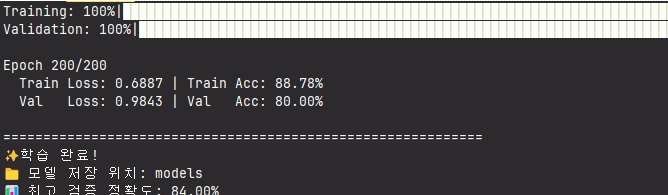

## 트러블슈팅: 모델의 높은 검증 정확도와 실제 테스트 성능의 불일치 문제

* **작성자:** [고동현](https://github.com/rhehdgus8831)

-----

### 1\. 문제 현상 (Problem)

> 모델 튜닝을 통해 높은 검증 정확도를 달성했으나, 학습에 사용되지 않은 새로운 영상을 테스트했을 때 성능이 현저히 떨어지는 문제가 발생했습니다.

* **문제 1**: 데이터 증강, 모델 경량화 등 다양한 튜닝을 통해 **최고 검증 정확도 84%를 달성**했습니다.
* **문제 2**: '기쁨', '인사'와 같이 학습 데이터와 유사한 일부 테스트 영상에서는 **정답을 예측**하는 등 긍정적인 가능성을 보였습니다.
* **문제 3**: 하지만 대부분의 새로운 테스트 영상에서는 **'미국', '인사' 등 특정 단어로만 예측**하는 일반화(Generalization) 실패 문제가 지속적으로 나타났습니다.

<br>

**[문제 상황 스크린샷 및 로그]**
> 데이터 증강, 모델 경량화 등 다양한 튜닝을 통해 **최고 검증 정확도 84%를 달성 로그



> 아래 로그와 같이 '수학(math\_test)' 영상은 '미국'으로, '미국(america\_test)' 영상은 '인사'로 잘못 예측하는 등 대부분의 테스트에서 실패했습니다.

```bash
# 'math_test.mp4' 테스트 결과
==================================================
 수어 인식 결과 (유사도 순위)
==================================================
1. 미국 | ███████████ 38.0%
2. 인사 | █████████ 32.9%
3. 안녕 | ███████ 23.9%
...
==================================================

# 'america_test.mp4' 테스트 결과
==================================================
 수어 인식 결과 (유사도 순위)
==================================================
1. 인사 | ████████████ 41.8%
2. 미국 | ███████ 25.0%
3. 안녕 | ███████ 23.7%
...
==================================================
```

-----

### 2\. 원인 분석 (Analysis)

> 높은 검증 정확도에도 불구하고 실제 성능이 낮은 원인은 모델 자체의 문제가 아닌 **학습 데이터의 문제**일 가능성이 높다고 판단했습니다.

* **원인 1: 데이터의 양과 다양성 부족으로 인한 과적합(Overfitting)**

    * 모델이 수어의 핵심 동작 패턴을 학습한 것이 아니라, **적은 양의 학습 데이터에만 존재하는 특정인의 손 모양, 촬영 각도, 속도 등 피상적인 특징에 과적합**된 상태였습니다. 결과적으로 84%라는 검증 정확도는 학습 데이터와 매우 유사한 패턴을 가진 검증 데이터셋에만 국한된 \*\*'가짜 정확도'\*\*였습니다.

* **원인 2: 데이터 처리 파이프라인의 부가적인 오류 확인**

    * 분석 과정에서 2D 좌표를 3D로 전환하며 `ValueError`를 발견했습니다. 이는 3D 좌표 정규화 시 기준점을 2D 벡터로 잘못 설정한 코드 문제였으며, 3D 벡터 `np.array([0.0, 0.0, 0.0])`로 수정하여 해결했습니다.
    * 이 과정을 통해 **데이터 처리 로직 자체에는 문제가 없음**을 최종적으로 확인했고, 원인이 순수하게 데이터의 질과 양에 있음을 확신하게 되었습니다.

-----

### 3\. 해결 방안 (Solution)

> 모델 튜닝만으로는 일반화 성능을 개선할 수 없다고 판단하고, 문제의 근본 원인인 '데이터'에 집중하는 방향으로 전략을 완전히 전환했습니다.

* **전략 변경**: '모델 중심(Model-centric)' 접근에서 **'데이터 중심(Data-centric)' 접근으로 전략을 전환**했습니다.
* **체계적인 오류 분석**: 단순히 테스트를 반복하는 대신, 어떤 단어를 어떤 단어로 잘못 예측하는지 표로 정리하는 **'오답노트(Confusion Matrix)'를 작성**하여 모델의 취약점을 명확하게 분석하기로 했습니다.
* **목표 지향적 데이터 수집**: 분석된 취약점을 바탕으로, 모델이 특히 **자주 혼동하는 단어들을 위주**로, **다양한 사람과 환경**에서 촬영한 데이터를 추가 수집하여 데이터셋의 양과 질을 높이는 것을 최종 해결책으로 결정했습니다.

-----

### 4\. 교훈 (Lessons Learned)

> 이번 경험을 통해 얻은 핵심 교훈은 다음과 같습니다.

* **검증 지표의 한계**: 높은 검증 정확도(Validation Accuracy)가 실제 환경에서의 모델 성능을 보장하지 않습니다. 특히 검증 데이터셋이 학습 데이터셋과 유사할 경우, 지표는 과장될 수 있습니다.
* **데이터 중심 접근의 중요성**: 모델의 일반화 실패 문제는 코드나 하이퍼파라미터 튜닝이 아닌, 학습 데이터의 절대적인 양과 다양성 부족에서 비롯될 수 있습니다.
* **문제 해결의 방향성**: 성공적인 AI 프로젝트를 위해서는 '어떻게 모델을 만들 것인가'를 넘어, '어떤 데이터로 학습시킬 것인가'에 대한 고민이 필수적입니다. 문제의 원인이 코드 바깥에 있을 수 있음을 항상 인지해야 합니다.