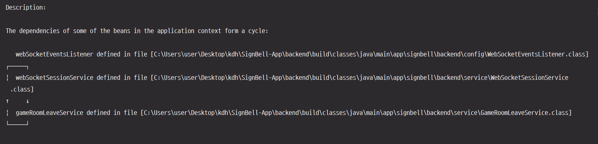

## 트러블슈팅: WebSocket 서비스 간 순환 참조로 인한 애플리케이션 실행 실패

* **작성자:** [강관주](https://github.com/Kanggwanju)

---

### 1. 문제 현상 (Problem)

> Spring Boot 애플리케이션 실행 시 Bean 생성 단계에서 순환 참조가 발생하여 서버 구동 불가

* **문제 1**: 로컬 개발 환경에서 애플리케이션 실행 시 `UnsatisfiedDependencyException` 발생하며 서버가 구동되지 않음
* **문제 2**: `WebSocketSessionService`와 `GameRoomLeaveService` 간 양방향 의존성으로 인해 Spring 컨테이너가 Bean 생성 순서를 결정하지 못함
* **문제 3**: Bean 생성 실패로 인해 모든 기능 테스트 및 개발 진행 불가

<br>

**[문제 상황 스크린샷 및 로그]**

> Bean 생성 시 순환 참조 발생으로 애플리케이션 실행 실패



**로그 분석:**
```
The dependencies of some of the beans in the application context form a cycle:

   webSocketEventsListener
   ↓
   webSocketSessionService
   ↓
   gameRoomLeaveService
   ↓
   (순환 참조)
```

- `WebSocketSessionService`가 `GameRoomLeaveService`에 의존
- `GameRoomLeaveService`가 다시 `WebSocketSessionService`에 의존
- Spring이 어느 Bean을 먼저 생성해야 할지 결정할 수 없어 애플리케이션 실행 실패

-----

### 2. 원인 분석 (Analysis)

> 두 서비스가 서로를 직접 참조하는 양방향 의존성 구조로 인한 순환 참조 발생

* **원인 1: WebSocketSessionService와 GameRoomLeaveService 간 양방향 의존성**

  * **WebSocketSessionService → GameRoomLeaveService**: 사용자 연결 종료 시 방 퇴장 처리를 위해 `GameRoomLeaveService.leaveCurrentRoomByUser()` 호출
  * **GameRoomLeaveService → WebSocketSessionService**: 방장 퇴장으로 방 종료 시 남은 참가자들의 세션 정리를 위해 `WebSocketSessionService.cleanupMultipleSessions()` 호출
  * 두 서비스가 서로를 필요로 하여 Bean 생성 시 무한 루프 발생

    ```java
    // WebSocketSessionService.java
    @Service
    @RequiredArgsConstructor
    public class WebSocketSessionService {
        private final GameRoomLeaveService leaveService;  // ← 의존
        
        private void handleRoomLeave(Long userId) {
            leaveService.leaveCurrentRoomByUser(userId);
        }
    }
    
    // GameRoomLeaveService.java
    @Service
    @RequiredArgsConstructor
    public class GameRoomLeaveService {
        private final WebSocketSessionService sessionService;  // ← 역방향 의존
        
        private void handleHostLeave(...) {
            sessionService.cleanupMultipleSessions(...);
        }
    }
    ```

* **원인 2: 책임 분리 부족으로 인한 강한 결합**

  * **WebSocketSessionService의 역할 혼재**: 세션 관리 + 방 퇴장 로직 호출
  * **GameRoomLeaveService의 역할 혼재**: 방 퇴장 처리 + 세션 정리 호출
  * 각 서비스의 책임이 명확히 분리되지 않아 서로 직접 호출하는 구조
  * 이는 두 클래스가 서로 강하게 결합되어 있다는 설계 문제의 신호
  * Spring의 의존성 주입 원칙상 Bean 간 의존성은 단방향이어야 하나, 양방향 의존성으로 인해 생성 시점에 교착 상태 발생

-----

### 3. 해결 방안 (Solution)

> 1차로 @Lazy를 사용한 긴급 대응 후, 2차로 Spring Events를 활용하여 근본적으로 순환 참조 제거

* **해결 방안 1: @Lazy 어노테이션을 사용한 긴급 대응 (임시 해결)**

  * `@Lazy` 어노테이션을 사용하여 의존성 주입 시점을 지연시켜 순환 고리를 끊음
  * Bean 생성 시점을 지연시켜 애플리케이션이 실행되도록 긴급 대응
  * `@RequiredArgsConstructor` 대신 명시적 생성자를 작성하여 `@Lazy` 적용

    ```java
    // GameRoomLeaveService.java
    @Service
    public class GameRoomLeaveService {
        private final WebSocketSessionService sessionService;
        
        public GameRoomLeaveService(
            GameParticipantRepository participantRepository,
            GameRoomRepository gameRoomRepository,
            @Lazy WebSocketSessionService sessionService,  // ← @Lazy 추가
            QuizStateCache quizStateCache
        ) {
            this.sessionService = sessionService;
            // ...
        }
    }
    ```

  * **결과**: ✅ 애플리케이션 정상 실행, 기존 기능 정상 동작
  * **한계**: ⚠️ 순환 참조 자체는 여전히 존재하여 기술 부채로 남음

* **해결 방안 2: Spring Events를 활용한 근본적 해결 (권장)**

  * Spring의 이벤트 기반 아키텍처를 활용하여 양방향 의존성을 단방향으로 전환
  * `GameRoomLeaveService`는 방 종료 시 `RoomClosedEvent` 이벤트를 발행
  * `WebSocketSessionService`는 이벤트를 수신하여 세션 정리 수행
  * 두 서비스 간 직접적인 의존 관계 제거로 순환 참조 완전 해결

  **Step 1: 이벤트 클래스 생성**
    ```java
    @Getter
    @RequiredArgsConstructor
    public class RoomClosedEvent {
        private final Long roomId;
        private final List<Long> remainingUserIds;
    }
    ```

  **Step 2: GameRoomLeaveService에서 이벤트 발행**
    ```java
    @Service
    public class GameRoomLeaveService {
        private final ApplicationEventPublisher eventPublisher;  // ← 이벤트 발행자
        
        public GameRoomLeaveService(
            GameParticipantRepository participantRepository,
            GameRoomRepository gameRoomRepository,
            QuizStateCache quizStateCache,
            ApplicationEventPublisher eventPublisher  // ← @Lazy 제거!
        ) {
            this.eventPublisher = eventPublisher;
            // ...
        }
        
        private ParticipantEventResponse handleHostLeave(...) {
            // 방 종료 처리
            // ...
            
            // 이벤트 발행 (기존: sessionService 직접 호출)
            eventPublisher.publishEvent(new RoomClosedEvent(roomId, userIds));
            return response;
        }
    }
    ```

  **Step 3: WebSocketSessionService에서 이벤트 수신**
    ```java
    @Service
    public class WebSocketSessionService {
        // GameRoomLeaveService 의존성은 그대로 유지
        private final GameRoomLeaveService leaveService;
        
        @EventListener
        public void handleRoomClosedEvent(RoomClosedEvent event) {
            log.info("방 종료 이벤트 수신 - roomId: {}", event.getRoomId());
            cleanupMultipleSessions(event.getRemainingUserIds(), event.getRoomId());
        }
    }
    ```

* **해결 방안 3: 개선 효과 및 비교**

  | 구분 | 원본 (순환 참조) | 1차 해결 (@Lazy) | 2차 해결 (Events) |
      |------|-----------------|------------------|-------------------|
  | **실행 가능** | ❌ | ✅ | ✅ |
  | **순환 참조** | ❌ 존재 | ⚠️ 존재 (회피) | ✅ 제거 |
  | **의존성 방향** | 양방향 | 양방향 | 단방향 |
  | **결합도** | 높음 | 높음 | **낮음** |
  | **테스트 용이성** | 어려움 | 어려움 | **쉬움** |
  | **확장성** | 낮음 | 낮음 | **높음** |

  * `@Lazy`는 증상 완화일 뿐 근본 치료가 아님
  * 이벤트 기반 아키텍처로 발행자와 구독자를 완전히 분리
  * 새로운 이벤트 리스너 추가가 쉬워 확장성 향상 (예: 로깅, 알림 등)

-----

### 4. 교훈 (Lessons Learned)

> 순환 참조는 설계 문제의 신호이며, 이벤트 기반 아키텍처로 느슨한 결합을 만들 수 있음

* **교훈 1: 순환 참조는 책임 분리 부족의 신호**
  * 두 클래스가 서로를 직접 참조한다면, 단일 책임 원칙(SRP)이 제대로 지켜지지 않았을 가능성이 높음
  * `@Lazy`는 긴급 상황에서 유용하지만, 순환 참조 자체를 해결하는 근본적인 방법이 아님
  * 순환 참조가 발견되면 클래스 간 책임과 의존성 방향을 다시 검토해야 함

* **교훈 2: 이벤트 기반 아키텍처의 장점을 활용하라**
  * **강한 결합 (Before)**: `sessionService.cleanupMultipleSessions()` 직접 호출
  * **느슨한 결합 (After)**: `eventPublisher.publishEvent(new RoomClosedEvent())` 이벤트 발행
  * 발행자는 구독자를 알 필요가 없어 결합도가 낮아짐
  * 새로운 리스너 추가가 쉬워 기능 확장성이 향상됨
  * 테스트 시 각 컴포넌트를 독립적으로 검증 가능

* **교훈 3: 점진적 개선과 기술 부채 관리의 중요성**
  * **1단계 - 긴급 대응**: `@Lazy`로 빠르게 서비스 복구하여 개발 차단 해제
  * **2단계 - 근본 해결**: 시간을 갖고 이벤트 기반으로 리팩토링하여 설계 개선
  * **3단계 - 부채 관리**: 임시 해결책을 방치하지 않고 지속적으로 개선
  * 빠른 대응과 근본적인 해결 사이의 균형을 맞추는 것이 중요