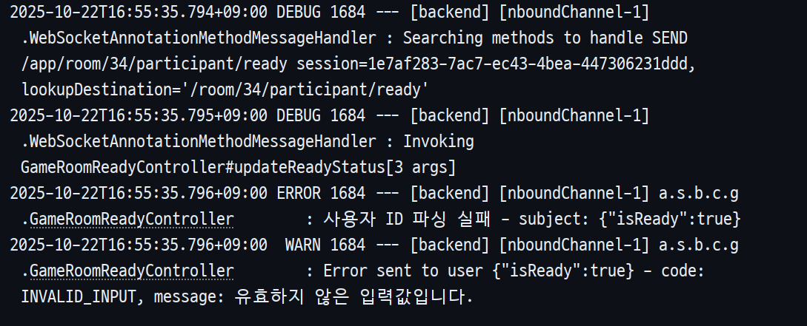

## 트러블슈팅: WebSocket에서 @AuthenticationPrincipal이 null로 주입되는 문제

* **작성자:** [강관주](https://github.com/Kanggwanju)

-----

### 1. 문제 현상 (Problem)

> WebSocket 메시지 핸들러에서 @AuthenticationPrincipal을 사용했지만 인증 정보가 null로 주입되어 사용자 ID 파싱 실패

* **문제 1**: `@MessageMapping` 컨트롤러에서 `@AuthenticationPrincipal CustomUserDetails user` 파라미터가 항상 `null`로 주입됨
* **문제 2**: JWT 인증이 정상적으로 이루어진 상태(Handshake 성공)에서도 `Authentication` 객체가 비어 있어 사용자 ID를 가져올 수 없음
* **문제 3**: 사용자 ID 파싱 실패로 인해 `INVALID_INPUT` 에러가 발생하고 모든 WebSocket 메시지 처리가 실패함

<br>

**[문제 상황 로그 및 스크린샷]**

> @AuthenticationPrincipal이 null이어서 사용자 ID 파싱에 실패하고, 예외 처리 과정에서 잘못된 변수가 로깅됨



**로그 분석:**
- `GameRoomReadyController#updateReadyStatus[3 args]` 메서드 호출
- `사용자 ID 파싱 실패 - subject: {"isReady":true}` ← @AuthenticationPrincipal이 null이어서 발생
- `Error sent to user {"isReady":true}` ← INVALID_INPUT 에러 전송
- **subject가 `{"isReady":true}`로 출력된 이유**: `@AuthenticationPrincipal`이 null이라 예외 처리 과정에서 `request` 객체(요청 본문)가 잘못 로깅된 것으로 추정됨. 이는 인증 정보 주입 실패를 명확히 보여주는 증거

-----

### 2. 원인 분석 (Analysis)

> WebSocket 메시지 처리 시 Spring Security의 필터 체인을 거치지 않아 SecurityContextHolder가 비어 있음

* **원인 1: WebSocket의 인증 처리 흐름과 @AuthenticationPrincipal의 불일치**

  * **WebSocket 인증 흐름**: 최초 Handshake 시점에 `CookieAuthHandshakeInterceptor`에서 쿠키의 JWT를 검증하고 `Principal` 객체를 세션에 등록 (1회만 수행)
  * **이후 메시지 처리**: STOMP 메시지(`SEND` → `@MessageMapping`)는 Spring Security의 필터 체인을 거치지 않음
  * **@AuthenticationPrincipal의 동작 방식**: `SecurityContextHolder.getContext().getAuthentication()`을 통해 인증 객체를 조회
  * **문제 발생**: WebSocket 메시지 수신 시점에는 `SecurityContextHolder`가 비어 있어 `@AuthenticationPrincipal`이 참조할 인증 정보가 존재하지 않음

* **원인 2: HTTP 요청과 WebSocket 메시지의 인증 처리 메커니즘 차이**

  | 구분 | HTTP 요청 (REST API) | WebSocket 메시지 (STOMP) |
      |------|----------------------|--------------------------|
  | **인증 시점** | 매 요청마다 JWT 필터를 통해 수행 | 최초 Handshake 1회만 수행 |
  | **Principal 저장 위치** | `SecurityContextHolder` | `StompHeaderAccessor.getUser()` |
  | **@AuthenticationPrincipal** | ✅ 정상 작동 | ❌ SecurityContext 없음 |
  | **Principal principal** | ✅ 가능 | ✅ 가능 (세션 유지됨) |

  * REST API는 매 요청마다 `JwtAuthenticationFilter`를 거쳐 `SecurityContextHolder`에 인증 정보가 주입됨
  * WebSocket은 Handshake 이후 `Principal`만 세션에 저장되고 `SecurityContextHolder`에는 주입되지 않음
  * `CookieAuthHandshakeInterceptor`는 `Principal`만 세션에 등록하고 `SecurityContextHolder`에는 인증 객체를 주입하지 않음

-----

### 3. 해결 방안 (Solution)

> @AuthenticationPrincipal 대신 Principal 파라미터를 직접 주입받아 사용

* **해결 방안 1: Principal 파라미터 사용으로 변경 (권장)**

  * WebSocket 메시지 컨트롤러에서는 `Principal`을 직접 주입받아 사용
  * STOMP 내부적으로 `Principal`은 Handshake 시 설정된 사용자 정보를 유지
  * `CookieAuthHandshakeInterceptor`에서 주입한 값이 그대로 전달되므로 안정적

    ```java
    // ✅ 변경 후: Principal 사용
    @MessageMapping("/room/{roomId}/participant/ready")
    public void updateReadyStatus(@DestinationVariable Long roomId,
                                  Principal principal,
                                  @Payload ReadyStatusRequest request) {
        Long userId = Long.valueOf(principal.getName());
        readyService.updateReadyStatus(roomId, userId, request.isReady());
    }
    ```

* **해결 방안 2: 모든 WebSocket 컨트롤러에서 일관되게 Principal 사용**

  * `@AuthenticationPrincipal`을 사용하던 기존 컨트롤러들을 모두 `Principal`로 통일
  * 인증 정보 추출 로직 일관성 확보: `Long userId = Long.valueOf(principal.getName())`
  * 코드 가독성 및 유지보수성 향상

    ```java
    // GameRoomJoinController
    public void joinRoom(@DestinationVariable Long gameRoomId,
                        Principal principal,
                        @Payload JoinRoomRequest request) {
        Long userId = Long.valueOf(principal.getName());
        // ...
    }
    
    // GameRoomReadyController  
    public void updateReadyStatus(@DestinationVariable Long roomId,
                                  Principal principal,
                                  @Payload ReadyStatusRequest request) {
        Long userId = Long.valueOf(principal.getName());
        // ...
    }
    ```

* **해결 방안 3: ChannelInterceptor를 통한 SecurityContext 수동 세팅 (비권장)**

  * `@AuthenticationPrincipal`을 계속 사용하고 싶은 경우, `ChannelInterceptor`에서 메시지 수신 시마다 `SecurityContextHolder`에 인증 객체를 수동으로 세팅
  * 하지만 이 방식은 유지보수가 어렵고 스레드 간 컨텍스트 전파 이슈가 발생할 수 있어 실시간 서비스에는 비권장

    ```java
    // 비권장: 추가 복잡도를 야기함
    @Override
    public Message<?> preSend(Message<?> message, MessageChannel channel) {
        StompHeaderAccessor accessor = MessageHeaderAccessor.getAccessor(message, StompHeaderAccessor.class);
        if (accessor != null && accessor.getUser() != null) {
            SecurityContext context = SecurityContextHolder.createEmptyContext();
            context.setAuthentication(new UsernamePasswordAuthenticationToken(accessor.getUser(), null, List.of()));
            SecurityContextHolder.setContext(context);
        }
        return message;
    }
    ```

-----

### 4. 교훈 (Lessons Learned)

> WebSocket은 HTTP와 다른 인증 처리 메커니즘을 가지므로, 각 프로토콜에 맞는 적절한 방법을 사용해야 함

* **교훈 1: @AuthenticationPrincipal은 HTTP 필터 체인을 전제로 작동한다**
  * `@AuthenticationPrincipal`은 Spring Security의 HTTP 필터 체인을 통해 설정된 `SecurityContextHolder`를 참조
  * WebSocket에서는 Handshake 이후 메시지 처리 시 필터 체인을 거치지 않으므로 `SecurityContextHolder`가 비어 있음
  * 따라서 WebSocket 환경에서 `@AuthenticationPrincipal`은 동작하지 않으며, `Principal` 파라미터를 사용해야 함

* **교훈 2: 프로토콜의 특성에 맞는 인증 방식을 선택해야 한다**
  * REST API: 매 요청마다 인증 → `@AuthenticationPrincipal` 사용
  * WebSocket: Handshake 시 1회 인증 후 세션 유지 → `Principal` 사용
  * 프로토콜 간 일관성보다는 각 프로토콜의 특성에 맞는 최적의 방법을 선택하는 것이 중요

* **교훈 3: 단순하고 안정적인 해결책이 최선이다**
  * `ChannelInterceptor`로 SecurityContext를 수동 세팅하는 방법도 가능하지만, 추가 복잡도와 스레드 안전성 이슈 발생
  * `Principal`을 직접 사용하는 것이 WebSocket의 자연스러운 방식이며, 가장 단순하고 안정적
  * "프레임워크가 제공하는 기본 방식"을 먼저 고려하고, 복잡한 커스터마이징은 최후의 수단으로 남겨둘 것