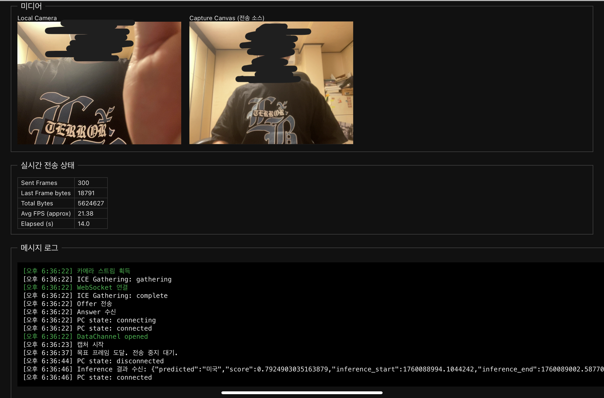
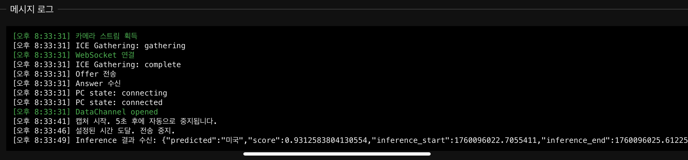
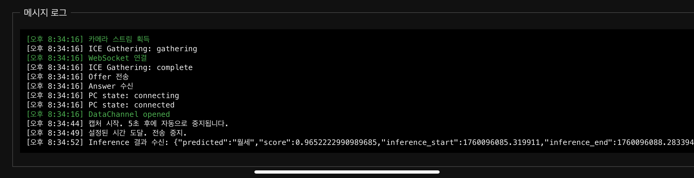
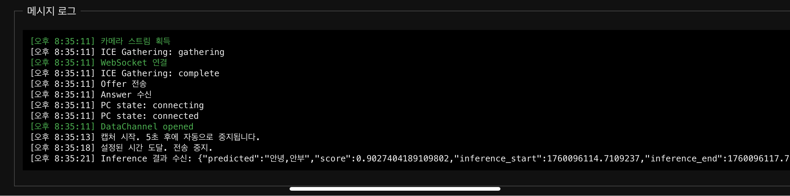
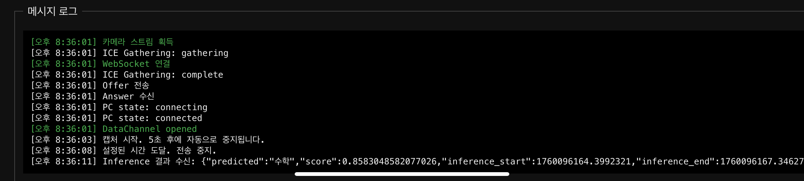
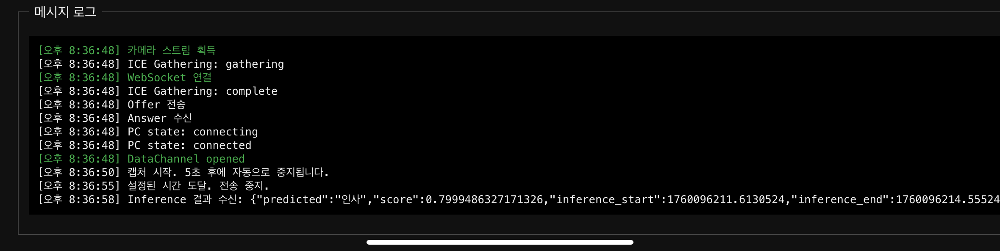
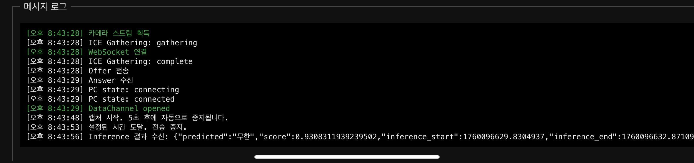
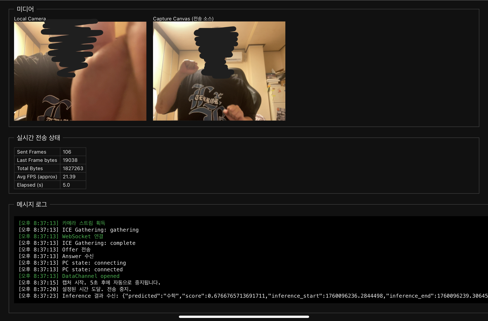

# 수어 인식 통합 모델 개발 과정 요약: CNN-BiLSTM-Attention-PE

본 문서는 초기 데이터 한계 극복을 위한 **'데이터 중심' 전략 전환**과, 복잡한 수어 동작의 **시간 순서 관계** 학습을 위한 **$\text{Positional Encoding}$ 기반**의 **$\text{CNN-BiLSTM-Attention}$ 복합 모델**로의 통합 개발 과정을 정리합니다.

* **작성자:** [백승현](https://github.com/sirosho)
* **작성일**: 2025-10-09
* **최종 수정일**: 2025-10-09
* **문서 버전:** v1.0.0
---

## 1. 프로젝트 초기 목표 및 데이터 전략 전환 (10월 1일 ~ 10월 4일)

### 초기 문제 진단 및 데이터 수집
| 구분 | 내용 | 초기 이슈 및 난제 | 핵심 결정 |
| :--- | :--- | :--- | :--- |
| **핵심 목표** | 수어 학습/퀴즈 기능 구현, **실제 테스트 정확도 75% 이상** 확보. | **공공 API 데이터의 현저한 부족** (단어당 1개 영상)으로 신뢰도 있는 모델 학습 불가. | **팀원 자체 촬영 데이터셋 구축**으로 전환 (5개 단어, 단어당 25개 영상). |
| **초기 아키텍처** | 단순 $\text{LSTM}$ 또는 $\text{Bi-LSTM} + \text{Attention}$ | 좌표 노이즈에 취약, **'미국'**과 **'무한'** 단어 간의 혼동 문제 심각. | **$\text{MediaPipe}$ 랜드마크 추출** 및 전처리 파이프라인 확정. |

---

## 2. 데이터셋 및 특징 공학 전략 개선 (Data-centric 전환)

초기 모델 튜닝의 실패를 교훈 삼아, 모델의 일반화 성능 확보를 위한 **데이터 중심 ($\text{Data-centric}$) 전략**과 **특징 공학**이 핵심이 되었습니다.

### 2.1. 데이터셋 변동 및 일반화 문제 
| 날짜 | 주요 변경 사항 | 결과 및 교훈 (일반화 실패) |
| :--- | :--- | :--- |
| **10월 4일** | 5개 단어 자체 촬영 데이터셋 (**'미국', '무한', '수학', '월세', '일요일'**) 확보. | **강관주 (v3):** $\text{Test}$ 정확도 $\text{100\%}$도 **신뢰할 수 없음**을 확인. **실제 테스트 $\text{40\%}$** 저조. |
| **10월 6일** | 학습 문제 단어 **'기쁨', '인사', '안녕'** 3개 단어 추가. **총 8개 단어**로 재구성 결정. | **고동현:** $\text{Transformer}$ 모델 **검증 정확도 $\text{84\%}$**가 **배경/손모양에 과적합된 '가짜 정확도'**임을 증명. |
| **10월 7일** | $\text{Positional Encoding}$ 기반의 $\text{CNN-BiLSTM-Attention}$ 모델로 초기 모델 기준 달성 | **백승현:** 평균 예측 신뢰도 92% 이상, 정확도 66.7% 모델 학습. 프로젝트 MVP 개발을 진행하며 추가 데이터 확보를 통해 정확도 75% 이상 목표 설정

### 2.2. 특징 추출 (Feature Engineering) 표준화
| 특징 | 내용 | 개선 효과 및 전략 |
| :--- | :--- | :--- |
| **좌표계 변환** | 절대 좌표 $\to$ **계층적 상대 좌표** (어깨/손목 기준) | **사용자 위치, 각도 변화에 대한 강건성** 극대화. |
| **차원/깊이** | $\text{2D} \to \mathbf{3\text{D}}$ ($\mathbf{Z}$축) 정보 복원 및 **$\mathbf{Z}$축 감쇠/평활화** | **입체적인 동작 학습 안정화** 및 $\text{Z}$축 노이즈 감소. |
| **노이즈 제거** | $\text{15}$개 $\text{Pose}$ 랜드마크 $\to$ $\mathbf{6}$개 ($\text{어깨, 팔꿈치, 손목}$)로 축소. | 수어와 무관한 **몸통 잡음 제거** 및 특징 차원 축소. |
| **속도 특징 ($\Delta X$)** | **운영 효율성** 및 $\text{MVP}$ 단계의 **추론 속도 최우선**을 위해 **최종 제외** 결정. |

---

## 3. 모델 아키텍처 및 학습 전략 변천사 (최종 모델 통합)

각 팀원의 시행착오를 바탕으로 **$\text{CNN-BiLSTM-Attention-PE}$ 구조**를 최종 통합 모델로 확정하고, 학습 전략을 표준화했습니다.

### 3.1. 최종 모델 구조 및 핵심 전략

| 특징 | 내용 | 도입 효과 |
| :--- | :--- | :--- |
| **$\text{1D-CNN}$ 도입** | $\text{Bi-LSTM}$ 이전에 좌표 시퀀스의 **로컬 패턴 추출** 기능 추가. | 잡음에 강건하고, 특징 표현력 향상. |
| **$\text{Positional Encoding (PE)}$ 도입** | $\text{Attention}$과 $\text{LSTM}$만으로 어려운 **시간 순서 관계**를 명시적으로 부여. | **'미국', '무한'**처럼 **뒷동작**이 중요한 단어의 혼동 문제 개선 (정확도 $\mathbf{0\% \sim 20\% \to 40\%}$로 유의미한 개선). |
| **$\text{Multi-Head Attention}$ 유지** | **핵심 동작 프레임에 집중**하도록 $\text{Change Detector}$와 통합. | 중요한 동작 시퀀스에 대한 집중력 극대화. |
| **최종 아키텍처** | $\mathbf{\text{1D-CNN}} \to \mathbf{\text{Bi-LSTM}} \to \mathbf{\text{PE}} \to \mathbf{\text{Multi-Head Attention}} \to \mathbf{\text{Classification}}$ |

### 3.2. 팀원별 학습 전략 변천사

- [팀원 강관주 모델개발과정](./팀원별_ML모델개발과정/강관주_모델개발과정.md)
- [팀원 백승현 모델개발과정](./팀원별_ML모델개발과정/백승현_모델개발과정.md)
- [팀원 고동현 모델개발과정](./팀원별_ML모델개발과정/고동현_모델개발과정.md)

---

## 4. 최종 결과 및 주요 교훈 요약

### 4.1. 최종 모델 성능 목표 및 결과 (10월 7일 기준)

* **평균 예측 신뢰도**: $\mathbf{85\%}$ 이상
* **최종 정확도**: $\mathbf{66.7\%}$ (MVP 개발 간에 추가 개선 필요)
* **WebRTC 응답 목표**: 영상 전송 후 응답 시간 **3초 이내** (현재 4~5초에서 개선 필요).

### 4.2. Web RTC 연동 후 테스트 결과

*이미지와 같은 테스트용 웹페이지 생성 후 아이패드 + Safari 로 테스트*

미국 예측 신뢰도 93%

월세 예측 신뢰도 96%

안녕,안부 예측 신뢰도 90%

수학 예측 신뢰도 85%

인사 예측 신뢰도 79%

무한 예측 신뢰도 93%

학습되지 않은 동작 실행

수학으로 예측 (신뢰도 67%)

### 4.3. 통합 개발 과정에서 얻은 주요 교훈

1.  **'가짜 정확도'와 일반화의 격차 ($\text{고동현, 강관주}$):** $\text{84\%}$ (고동현) 또는 $\text{82\%}$ ($\text{K-Fold}$에서 강관주)의 높은 학습 단계 정확도가 **실제 테스트 $\text{40\%}$** (강관주)로 급락하는 현상을 겪으며, **원본 데이터의 양과 질, 그리고 훈련 데이터와 실제 환경 분포의 차이**가 모델의 일반화에 미치는 절대적인 영향력을 깨달았습니다.
2.  **시간적 특징 명시의 필요성 ($\text{백승현}$):** $\text{LSTM}$이나 $\text{Attention}$만으로는 **뒷부분 동작 순서**가 중요한 수어 단어(예: '미국', '무한')를 구분하기 어려웠으며, $\mathbf{\text{Positional Encoding}}$을 통해 **시간적 위치 정보를 명시적으로** 제공하는 것이 필수적인 해결책임을 확인했습니다.
3.  **체계적 오류 분석의 중요성 ($\text{고동현}$):** 무작정 튜닝하는 대신 **'오답노트'** 를 작성하여 모델의 취약점(자주 혼동하는 단어들)을 명확히 파악하는 **'데이터 중심' 접근 방식**이 프로젝트의 방향을 설정하는 핵심 이정표가 되었습니다.